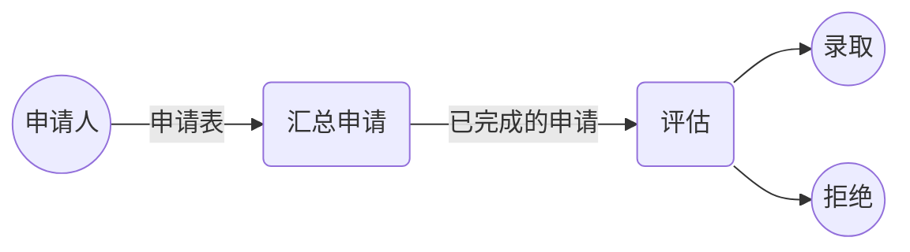
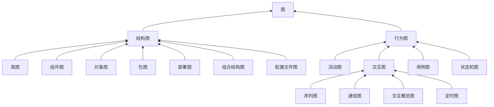
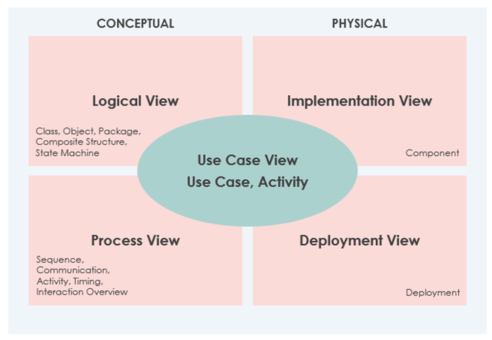

# 软件工程

## 第一课

---

### 简介及教学大纲

---

* **课程名称：** 软件工程
* **课程目标：** 全面介绍软件工程的各个方面。
* 课程结构：
  * **01 - 介绍：** 涵盖过程、术语和工具。
  * **02 - 需求：** 涉及分析和建模。
  * **03 - 设计：** 包括用户界面（UI）、系统和程序设计。
  * **04 - 测试：** 专注于单元测试和集成测试。
  * **05 - 管理：** 涉及法律、风险和质量保证（QA）。
* 参考资料：
  * [1] 陈越等，《软件工程》，浙江大学，https://www.bilibili.com/video/BV16g411M712?p=1
  * [2] Curran Muhlberger等，《软件工程》，康奈尔大学，https://www.cs.cornell.edu/courses/cs5150/2022sp/
  * [3] 伊恩·萨默维尔，《软件工程》（第10版），机械工业出版社。
* **课程特点：** 理论与实践相结合，涉及软件开发的各个关键阶段。

---

#### **课程的总体目标**

* 培养优秀的软件开发工程师 (SDE):
  * 仅仅是优秀的编码员、数学家或竞争者，并不一定能成为优秀的软件开发工程师。
* 具备持续学习和思考的意识:
  * 课程所学内容有限，很快就会过时。
  * 要具备全局观，进行聪明且非技术性的思考。
  * 做有意义的事情。
* 肩负重大的责任和光荣的使命:
  * 迎接第四次工业革命。
  * 在中国创造伟大的产品。
  * 将我们的IT产品和服务出口到世界各地。

---

### 课程总览

---

#### 术语：利益相关者

* **利益相关者：** 参与项目中的角色。
* 客户（甲方，项目经理）：
  * 提供资源以换取软件。
  * 承担项目失败的风险。
  * 设定需求和优先级。
  * 客户满意度是衡量项目成功的主要标准。
* 开发人员（程序员）：
  * 应被视为利益相关者（但不是最重要的一个）。
  * 也是一种昂贵的资源。
  * 具有能力、保密性和合规性的责任。
* 顾客（顾客）：
  * 购买软件或选择软件供组织使用。
* 用户（用户）：
  * 实际使用（与...交互）软件。

---

#### 软件开发过程

* 主要阶段：
  * **可行性与规划：** 评估项目的可行性和制定计划。
  * **需求：** 收集和分析用户需求。
  * **用户界面/体验设计：** 设计用户友好的界面。
  * **系统设计：** 设计软件的整体架构。
  * **程序开发（编码部分）：** 编写代码实现功能。
  * **验收与发布：** 测试软件并交付给用户。
  * **运营与维护：** 维护软件的正常运行。
* 注意事项：
  * **迭代：** 需求等阶段可能在开发周期中重复进行。
  * **区分：** 需要区分各个阶段的职责和任务。
* 课程关联：
  * 这些是课程的主要内容，并将在项目报告中呈现。

---

#### 可行性分析

* **定义：** 在决定开始一个项目之前进行的可行性研究。
* 研究内容：
  * 拟议项目的范围是什么？
  * 项目在技术上是否可行？
  * 预计的收益是什么？
  * 成本是多少？
  * 资源是否可用？
  * 风险是什么以及如何管理？
* 研究结果：
  * 可行性研究得出“开始”或“不开始”的决策。

---

#### 需求

* **定义：** 从客户的角度定义系统的功能。
* **目标：** 通过与客户、顾客和用户协商，确定系统的功能、约束和目标。
* 阶段划分：
  * 需求分析：
    * **目的：** 理解和澄清所需内容。
    * **详细程度：** 总体、概念性。
    * **受众：** 业务分析师、利益相关者。
  * 需求定义：
    * **目的：** 以清晰且结构化的方式记录用户需求。
    * **详细程度：** 高级、非技术性。
    * **受众：** 业务用户、产品负责人。
  * 需求规格说明：
    * **目的：** 提供详细、结构化的技术描述。
    * **详细程度：** 精确、形式化。
    * **受众：** 开发人员、测试人员。
* **开发方式：** 需求可以在独立的研究中制定，也可以逐步产生。
* **重要性：** 未能就需求达成一致并充分定义需求是软件项目失败的最大原因之一。

---

#### 用户界面/体验 (UI/UX)

* 可用性的重要性：
  * 在许多现代应用和软件系统中，可用性非常重要。
  * 需要良好的用户界面设计。
* 用户测试与迭代开发：
  * 用户界面需要通过用户进行评估。
  * 这需要迭代开发：
    * 设计用户界面。
    * 与用户进行测试。
    * 修改用户界面。
    * 重复。
* 产品驱动，而非技术驱动：
  * 产品失败的原因有很多，但丑陋的产品肯定会失败。

---

#### 系统设计

* **视角：** 从软件开发人员的角度描述系统。
* 内容：
  * **系统架构：** 建立一个满足需求的硬件和软件系统架构。
  * **关键要素：** 安全性和性能是系统设计的组成部分。
* 模型：
  * **用途：** 模型通常用于表示需求、系统设计和程序设计。
  * **UML：** 本课程讲授统一建模语言（UML）的基本概念。
* **鼓励：** 你应该得意忘形！（此处“得意忘形”应理解为积极鼓励，不要过于谦虚）

---

#### 程序开发

* **目标：** 利用系统设计和用户界面设计，构建满足需求的程序。

* 内容：

  * **程序设计（设计模式）：** 应用设计模式来组织和构建程序。

  * 实现（编写代码）：

     编写代码实现程序功能。

    * **基本要求：** 代码无错误（bug free）。
    * 进阶要求：
      * 注重代码性能（performance），运用数据结构和算法，实现高效功能。
      * 重视代码安全性，避免安全漏洞，防止系统被攻击和劫持。
      * 遵循代码规范，包括变量命名规则、代码风格等，确保代码的可读性和可维护性。
      * 技术发展：
        * LLM 可以根据指令或需求生成代码，提高编码效率。
        * 开发人员的职责：
          * 判断 LLM 生成代码的正确性和可用性。
          * 确保代码符合规范。

  * 测试：

     对程序进行测试，确保其正确性和可靠性。

    * **重要性：** 测试是软件开发过程中至关重要的环节，有助于发现和修复错误，保证软件质量。
    * **测试意识：** 开发人员应具备测试意识，重视测试工作。
    * 测试标准：
      * 测试代码量：高质量的测试代码量通常不低于正常工程代码量。
      * 测试用例：覆盖各种场景和边界情况，确保测试的全面性。
    * 测试工具：
      * AI 生成测试用例：利用 AI 提高测试用例生成的效率。
      * 测试人员的职责:
        * 人工审核AI生成的测试用例，确定测试的边界条件。

---

#### 测试

* 用户测试（User Testing）：
  * **内容：** 用户测试用户界面的各个版本，围绕 UI 展开。
  * **目的：** 通过用户体验发现界面问题，为需求或设计变更提供依据。
  * **方式：** 让用户实际操作原型，观察用户反馈。
* 程序测试（Program Testing）：
  * **内容：** 开发团队（主要是后端程序员）进行单元测试、系统测试和集成测试，运行代码以发现潜在问题。
  * 指标：
    * **代码覆盖率（Coverage）：** 要求覆盖所有代码行，甚至每个逻辑分支。
    * **第三方测试：** 大型企业通常有独立的第三方测试团队，模拟各种极端情况进行测试，以找出代码缺陷。
  * 开发人员职责：
    * 编写用例测试程序，确保代码质量。
    * 认真负责地编写代码，尽量避免错误，减少第三方测试团队发现问题的可能性。
  * **目的：** 保证代码的健壮性和稳定性。
* 验收测试（Acceptance Testing）：
  * **内容：** 客户根据需求分析阶段确定的需求，对整个产品进行测试。
  * **目的：** 验证产品是否满足客户需求，确认产品是否可以交付。
  * **意义：** 通过验收测试，表明整个测试流程完成。

---

#### 验收与发布

* 验收测试（Acceptance Testing）：
  * **内容：** 客户根据需求对系统进行测试。
  * 重要性：
    * 需求工程的重要性：验收测试的结果直接反映了需求工程的质量。
    * 避免“抓马”情况：由于需求不明确或客户变卦，可能出现戏剧性的情况，导致验收测试失败。
    * 关注需求而非技术：验收测试失败往往是需求问题，而非技术问题。
  * 结果：
    * 通过：进入交付与发布阶段。
    * 不通过：产品可能需要推倒重来。
* 交付与发布（Delivery and Release）：
  * **内容：** 验收测试成功后，系统交付给客户并发布到生产环境或面向市场。
  * **意义：** 产品正式投放市场，供用户使用。

**总结：**

验收测试是验证产品是否满足客户需求的关键环节，需求工程的质量直接影响验收测试的结果。交付与发布标志着产品正式投放市场。

---

#### 运营与维护

* 运营（Operation）：
  * **内容：** 系统正式上线，投入实际生产环境，接受市场检验。
  * 挑战：
    * 上线初期可能出现大量错误（errors）和问题（problems）。
    * 需要及时修复，保证系统稳定运行。
    * 可能出现由于用户量增长，或者被恶意用户找到系统设计缺陷，从而产生新的问题。
  * 应急机制：
    * 大厂通常实行“on call”制度，即安排专人 24 小时待命，随时解决突发问题。
    * “on call”频率因公司文化而异。
* 维护（Maintenance）：
  * **内容：** 识别并修复运营过程中出现的错误和问题。
  * 特点：
    * 可能需要连夜加班修复紧急问题。
    * 需要应对各种意想不到的“奇葩”情况。
* 演进（Evolution）：
  * **内容：** 根据用户需求和市场变化，增加新功能或改进现有功能，实现系统迭代升级。
  * 驱动力：
    * 用户提出新需求。
    * 市场竞争需要。
    * 设计模式的意义：
      * 设计模式能够很好的帮助系统进行迭代更新。
* 淘汰（Phase out）：
  * **内容：** 系统因各种原因停止服务，退出市场。
  * 原因：
    * 产品失去竞争力。
    * 技术更新换代。
    * 意义：
      * 标志着软件生命周期（Software Life Cycle）结束。
      * 意味着产品的终结。

---

### 拓展知识

---

#### 多样性

* 软件用途的多样性：
  * 软件必须服务于多种不同的目的，在许多不同的环境中，为许多不同的人服务。
* 项目多样性对开发人员的要求：
  * 项目多样性要求开发人员具有多才多艺的能力。
* 软件开发方式的多样性：
  * 在所有情况下，都没有“最佳”的软件创建方式。
  * 功能、时间、成本是需要权衡的因素。
  * 软件开发与算法的区别：
    * 算法追求“state of the art”（最先进），软件开发则追求“最合适的软件”。
    * “最合适的软件”：在有限的时间和成本内，最大程度地实现功能。
* 软件工程师的技能要求：
  * 软件工程师必须掌握各种方法、工具和技术。
  * 持续学习：
    * 需要不断接触新知识、新技术，适应技术发展趋势。
    * 例如：掌握 AI 工具的使用，提高编码效率。
  * 如果不能够掌握新的技术，那么就很有可能会被行业淘汰。

---

#### 风险

* 项目困境：
  * 许多（可能大多数）软件开发项目都会遇到困难。
  * 深求（DeepSeek）与ChatGPT的对比：
    * 市场变化带来的风险：DeepSeek的出现打破了ChatGPT在大模型领域的垄断地位，导致其估值大幅下降。
    * 这说明即使技术领先，也可能因市场因素面临巨大风险。
* 问题：
  * 无法按预期运行（功能）。
  * 预算超支（成本）。
  * 交付延迟（时间）。
* 竞争目标：
  * 每个软件项目都在功能、成本和时间之间进行权衡。
  * 额外的功能会增加开发、测试、维护等的额外成本。
  * 不同阶段的侧重点：
    * 初创阶段：时间优先，快速抢占市场。
    * 发展阶段：功能优先，满足用户需求。
    * 成熟阶段：成本优先，降本增效。
* 后果：
  * 失败的项目可能导致公司破产。
    * 例如：ChatGPT估值因市场变化而大幅缩水。
  * 管理者可能会失去工作。
    * 公司进入成熟阶段，为降低成本可能裁员。
  * 用户和社会可能会受到伤害。
    * 例如：新能源汽车厂商倒闭，导致用户无法正常使用车辆。

**总结：**

软件开发面临多重风险，不仅包括技术风险，还包括市场风险。在不同阶段，项目对功能、成本和时间的侧重点不同。软件开发人员需要充分认识到这些风险，并采取措施加以应对。

---

#### 最小化风险：沟通

* 软件使用率低：
  * 多达一半的交付软件从未被使用。
  * 开发人员构建了“错误的软件”，不符合客户的需求。
* 软件开发团队的职责：
  * 了解客户对软件的期望。
    * 避免“想当然”：理解客户的真实需求，避免误解。
  * 了解客户的组织对客户的期望。
    * 从公司层面考虑：产品是否符合客户公司的商业模式和发展趋势。
    * 案例：DeepSeek 的出现导致许多公司裁减自研大模型团队。
  * 了解客户和用户对软件的期望。
    * 用户视角：产品是否满足用户和顾客的期待。
    * 避免开发“没有意义”的产品。
* 开发人员的价值：
  * 开发人员可以增加技术见解，但客户满意度是衡量项目成功的标准。
  * 产品驱动，而非技术驱动！
  * 培养产品意识：从产品角度审视开发，而非仅关注技术。

---

#### 最小化风险的具体方法：

* 可行性研究：

   确定项目是否值得开始。

  * 谨慎选择：不要盲目接受需求，评估项目可行性。

* 分离需求和设计：

   确保客户的需求得到清晰的理解，并与开发人员如何实现这些需求相分离。

  * 阶段划分：严格区分需求分析、架构设计、程序设计和测试阶段。
  * 降低风险：避免因需求变更导致整个项目推倒重来。

* 里程碑和发布：

   向客户报告或演示进展情况。

  * 频繁沟通：及时向客户展示可工作版本，保持需求同步。
  * 避免后期返工：防止最终交付的产品与客户预期不符。

* 验收和用户测试：

   客户测试软件是否符合要求。

  * 充分了解客户：了解客户的测试方式和设备环境。
  * 客户教育：必要时像“幼儿园老师”一样指导客户使用和测试。

* 交接：

   确保客户收到可以在长时间内运营和维护的软件包。

  * 可维护性：保证交付的产品易于运维和维护。
  * 长期支持：确保产品在版本迭代后仍能有效维护。

---

#### 最小化风险：可见性

* 责任人的知情权：
  * 承担责任的人必须知道正在发生的事情。
* 决策者的评估依据：
  * 决定你的晋升或离职的人必须知道你的贡献。
* 管理者：
  * 必须依靠他人提供进度或困难的报告。
* 软件开发人员：
  * 难以评估进度。
  * 通常对成就保持谦逊。
  * 认为报告是浪费时间。
  * 行动迅速，言语谨慎。（“敏于行而讷于言”）

---

#### 最小化风险：短开发周期

* 风险最小化：
  * 通过每周而不是每月频繁交付可工作的软件来最小化风险。
* 好处：
  * 客户、顾客和用户可以评估开发人员的工作。
    * 尽早发现问题：每次发布后，客户都能及时评估，尽早发现并解决问题。
  * 有机会适应不断变化的环境。
    * 及时调整：根据用户反馈和需求变化，及时调整产品方向。
* 敏捷开发原则：
  * 这是敏捷软件开发的基本原则之一。
    * 核心思想：快速迭代，频繁发布，及时反馈。
    * 及时发布：即使是不完美或功能不完整的版本，只要能工作，就尽快发布。
    * 用户反馈驱动：根据用户反馈调整产品，降低最终产品失败的风险。

**详细解释：**

* 缩短开发周期：
  * 将发布周期从数月缩短到数周甚至数天。
  * 快速迭代：频繁发布新版本，快速迭代产品。
* 用户评估：
  * 及时反馈：用户能及时评估新版本，提出问题和建议。
  * 尽早纠正：开发者能尽早发现并纠正问题，避免后期返工。
* 敏捷开发：
  * 适应变化：敏捷开发能更好地适应需求和环境的变化。
  * 持续集成：敏捷开发强调持续集成和持续交付，确保及时发布。
  * 用户参与：敏捷开发鼓励用户参与，确保产品符合用户需求。

---

#### 规模

* 系统方面：

  * **差异性：** 大型和超大型系统在功能、成本和时间上可能完全不同。
  * **需求变化：** 需求已经多次更改。

* 人力资源方面：

  * **规模：** 可能包含100到10,000+人/年。

  * 复杂性：

     没有人能理解整个项目。

    * 软件工程本质：管理科学，管理人的学科。
    * 组织协调：将不同背景、能力的人组织在一起，交付产品。
    * 管理难度：团队规模扩大，管理难度呈非线性增长。
    * 规模效应：初期规模扩大带来明显收益，后期收益趋于平缓。
    * 大公司病：团队规模扩大，出现内耗、斗争等管理问题。

  * **人员流动：** 人员频繁流动。

* 贡献者列表：

  * （此处省略了长长的贡献者列表，但您可以根据需要查看PPT上的完整列表）

* 补充内容：

  * 小团队的优势：
    * 精悍的小团队可能比臃肿的大团队更高效。
    * 案例：DeepSeek 团队规模较小，却在技术上超越了大型团队。
  * 规模与管理：
    * 软件开发中，规模扩大带来管理上的挑战。
    * 需要有效的管理策略，避免“大公司病”。
  * 核心思想：
    * 软件工程不仅关注技术，更关注人的管理。
    * 团队规模应与项目需求相匹配，避免盲目扩张。

---

#### 管理

* 项目管理：

  * 进度跟踪：

     跟踪项目进度与计划是否一致。

    * 协调时间表：制定并协调项目时间表。

  * 任务优先级：

     确定任务的优先级。

    * 任务分配：根据优先级分配任务。

* 人员管理：

  * 资源分配：

     在正确的时间分配具有正确技能的合适数量的开发人员。

    * 合理分配：分配适当数量、技能的开发人员，以及合适的工具和时间。
    * 避免过度：时间过短可能导致工作质量下降，时间过长可能导致效率低下。

  * 工作环境：

     确保开发人员拥有高效的工作环境。

    * 生产环境：提供高效的生产环境。

* 合规建议：

  * 环境理解：

     了解法律、法规和经济环境。

    * 法律意识：具备法律意识，了解市场动态。

* 开发流程：

  * 最佳实践：

     实施最佳实践，以在不过度增加开销的情况下最小化风险。

    * 流程管理：采用最佳实践，降低风险，提高效率。

**详细解释：**

* 项目管理：
  * 制定详细的项目计划，并定期跟踪进度，确保项目按时完成。
  * 根据任务的重要性和紧急程度，合理分配优先级，确保关键任务优先完成。
* 人员管理：
  * 根据项目需求和人员技能，合理分配开发人员，避免人员冗余或不足。
  * 提供必要的工具和资源，确保开发人员能够高效工作。
  * 营造良好的工作氛围，提高团队凝聚力和工作效率。
* 合规建议：
  * 了解相关的法律法规和行业标准，确保项目合规性。
  * 关注市场动态和技术趋势，及时调整项目方向。
* 开发流程：
  * 采用成熟的开发流程和最佳实践，提高开发效率和代码质量。
  * 持续改进开发流程，不断优化团队协作和项目管理。

---

#### 好的流程

* 好的软件：
  * 好的流程带来好的软件。
* 风险降低：
  * 好的流程降低风险。
* 可见性增强：
  * 好的流程增强可见性。
* 团队合作：
  * 好的流程促进团队合作。

---

## 第二课

---

### 软件开发过程

---

#### 过程的顺序

第一讲介绍了几个过程步骤：

* 需求
* 用户界面设计
* 系统设计
* 程序开发（设计和编码）
* 验收和发布

每个软件项目都会以某种形式包含这些基本步骤，但是：

* 这些步骤可以是正式的或非正式的。
* 这些步骤可以以各种顺序执行。

软件开发过程或方法论是一种系统化的方式，将这些步骤组合起来以构建软件系统。

---

#### 软件开发过程

##### 瀑布模型

在开始下一个步骤之前完成每个过程步骤。

##### 迭代优化

快速完成所有步骤以创建一个粗略的系统，然后重复这些步骤以改进系统。

##### 螺旋模型

迭代优化的变体，其中新的和更新的组件在完成后被添加到开发中的系统中。

##### 敏捷开发

在一系列迭代（sprint）中开发小增量软件，每个迭代都创建可部署的代码。

---

#### 重量级和轻量级软件开发

在**重量级过程**中，目标是完全完成每个步骤，并在之后尽量减少变更和修订。每个步骤在开始下一个步骤之前都要进行完整的文档记录。

示例：修改后的瀑布模型

在**轻量级过程**中，开发团队的中间文档很少。期望根据经验进行更改，并且只记录最终系统。

示例：敏捷软件开发

---

#### 重量级和轻量级方法论

| 重量级 |  | 轻量级 |
|---|---|---|
| 过程和工具 | v.s. | 个体和交互 |
| 面面俱到的文档 | v.s. | 可以工作的软件 |
| 遵循计划 | v.s. | 响应变化 |
| 合同谈判 | v.s. | 客户合作 |

---

#### 历史

软件工程作为一个学科，可以追溯到 20 世纪 70 年代早期。

在那个时候：

* 大多数计算机系统都是对以前手动完成的系统进行转换，例如，工资、账单、机票预订。需求都得到了很好的理解。
* 许多系统都遵循相同的架构，主文件更新。系统设计得到了很好的理解。
* 编码很繁琐，没有现代语言和工具。因此，在开始编码之前，有一个好的程序设计非常重要。

这些因素导致了软件开发的瀑布模型。

---

#### 瀑布模型


这个基本模型存在问题，在实践中很少使用。

---

瀑布模型是一个**重量级过程**，每个过程步骤都有完整的文档记录。

**优点：**

* 任务分离
* 过程可见性
* 每个步骤的质量控制
* 每个步骤的成本监控

**缺点：**

* 在实践中，过程的每个阶段都会揭示对先前阶段的新理解，这通常需要对早期阶段进行修订。
* 瀑布模型不够灵活。

---

纯粹的顺序模型是不可能的。

计划必须允许某种形式的迭代。

**示例：**

* 在对需求和初步设计进行初步研究之前，可行性研究无法创建拟议的预算和时间表。
* 详细设计和实现揭示了需求规范中的差距。
* 需求和/或技术可能在开发过程中发生变化。

计划赶不上变化！

---

#### 修改后的瀑布模型


带有反馈的瀑布模型

这样更好

---

#### 何时使用修改后的瀑布模型

当需求被充分理解且设计简单明了时，修改后的瀑布模型效果最佳，例如：

* 转换需求被充分理解的手动数据处理系统（例如，电费账单）。
* 功能与早期产品密切相关的新版本系统（例如，汽车自动刹车系统）。
* 大型系统中某些组件的需求明确，且与系统其余部分明确分离的部分。

---

#### 迭代优化

**概念**

* 在有一个可运行的系统之前，需求很难理解，特别是用户界面。
* 系统和程序设计可以从原型中获益。

**过程**

* 在开发过程的早期创建一个原型系统。
* 与客户一起审查原型，并与用户一起测试它，以提高对需求的理解并阐明设计。
* 在一系列迭代中优化原型。

---

#### 迭代优化：一个例子

**问题：** 向编程环境添加图形包

**需求**

* 客户不确定几个重要的需求，例如，如何管理跨不同对象的坐标的语法。

**过程**

* 使用预处理器和初步运行时包构建原型版本。
* 进行几次迭代。对于每次迭代：
  * 与用户一起测试系统
  * 进行修改
  * 重复，直到用户对功能满意为止
* 作为最终迭代，替换预处理器并消除运行时包中的补丁和快捷方式。

这是一个迭代优化的例子。

---


---

#### 迭代优化讨论

这是一个**中等重量级**的过程，在过程中创建文档。

迭代优化使用各种技术，使客户能够在开发早期审查计划中的系统：

* 用户界面模型
* 抛弃式软件组件
* 虚拟模块
* 快速原型
* 连续优化

尽快让一些东西运行起来，供客户和用户评估，但不要发布。

**假装直到你成功**

---

#### 螺旋开发

**示例**

开发新版本的操作系统（微软）。

**螺旋开发**

通过螺旋开发，总会有一个经过全面测试的系统，但功能不完整。

* 创建一个具有最终产品整体结构的基本系统，并为缺失的组件提供虚拟存根。
* 对于每个已完成的组件，创建一套全面的测试用例。
* 开发团队构建新的或改进的组件，每个组件都有一套测试用例。将这些组件添加到源代码库中。
* 在每日周期中，测试人员从源代码库构建整个系统，并运行完整的测试用例集。

---


---

#### 螺旋开发讨论

螺旋开发广泛用于开发大型系统的新版本：

* 整体系统架构已被充分理解。
* 大型组件可以单独开发和测试。
* 系统的重要性证明了设置一套全面的自动化测试所带来的开销是合理的。

**挑战**

* 难以对架构进行重大更改。
* 难以进行影响许多组件的更改。

---

#### 在线系统的增量发布

小团队正确开发小型系统比协调有许多分支的大型项目更容易。

对于网站和其他在线软件，通常可以发布一个非常基本的系统，并在后续的短迭代中添加额外的功能。

**示例：**

从商店向家庭配送的初创公司。

**优点**

* 投资回报很快开始。
* 在后续迭代的开发中，需求更容易理解——最大限度地减少浪费的精力。
* 来自客户和客户的反馈可以纳入后续阶段。

---

#### 敏捷方法

术语“敏捷”用于各种方法。

**一般原则：**

* 大型项目被分成称为**迭代**的小增量。
* 开发由 4 到 9 人的小团队进行。
* 进度安排被分成固定的**时间盒**，可能是 2 到 4 周。
* 每个迭代都是一个时间盒，团队在此期间完成软件项目的一部分。单个迭代将经历几个过程步骤，例如需求、设计、编码和测试。
* 每个迭代都以完全测试好的代码结束，准备投入生产。
* 这是一个**轻量级过程**，在过程中创建最少的文档，但最终版本需要完整的文档以供将来维护。

---

#### 敏捷开发


每次迭代后，代码可以：

* 发布（原始敏捷方法）
* 与来自其他迭代的代码组合，用于后续发布
* 合并到更大的代码库中（螺旋开发）

---

#### 敏捷：发布代码

**敏捷的版本**

原始版本的敏捷要求每个迭代都以发布的代码结束。这在实践中很少可行。

在本课程中，我们将迭代定义为创建生产质量的代码。

有些人使用术语“迭代”来涵盖任何短期活动，但这超出了敏捷的精神。

---

#### 敏捷开发：返工

**敏捷开发的挑战**

* 敏捷方法非常适合在既定架构内开发或持续增强系统。
* 高级团队必须建立整体架构并协调迭代。

**返工**

* 通过敏捷开发，整体系统的需求和设计会逐步显现。
* 不可避免地，一些早期迭代的部分需要返工。
* 这需要更改已经过全面测试并可能已经发布的代码。这总是很棘手。

如果返工量很大，不完全润色每个组件，而是使用迭代优化来最小化返工量会更有效。

---

#### 混合流程

在实践中，许多大型项目使用的流程混合了四种软件流程的各个方面。

**示例**

* 需求明确的项目可能会使用修改后的瀑布方法来指定需求和系统设计，然后使用一系列敏捷迭代。
* 需求模糊的项目可能会使用迭代优化来阐明需求，然后使用修改后的瀑布模型来构建最终版本。
* 通过螺旋开发，新的组件可以作为一系列迭代来开发。
* 用户界面必须与用户一起测试。这迫使迭代开发，无论系统的其余部分使用什么流程。

---

#### 混合流程：分阶段开发

将一个大型项目分成两个或多个阶段。

* 具有基本功能的系统的第一个版本很快投入生产（第一阶段）。
* 后续阶段基于从先前阶段用户获得的经验。

**优点**

* 投资回报很快开始。
* 在开发后续阶段时，需求更容易理解。
* 成本可以分摊到更长的时间段内。

---

#### 关于软件流程的观察

已完成的项目应该包含所有基本的过程步骤，但是……开发过程始终是部分演进的。

**通过以下方式降低风险：**

* **原型化** 关键组件
* 频繁**发布**，或将大型项目分成**阶段**
* 与**用户**和**客户**进行早期和重复的测试
* 遵循**可见的**软件流程

在没有修订准备的情况下，永远不可能完成每个步骤。

---

#### 选择软件流程

软件开发过程中的变更代价很高。

* 如果需求理解不透彻或预计会发生变化，请选择保持灵活性的流程。迭代优化、敏捷迭代、分阶段实施。
* 如果一个大型软件系统有许多相互关联的组件，请避免在开发过程中对系统设计进行重大更改。修改后的瀑布模型。
* 如果软件的市场理解不透彻，请使用尽快将可运行的软件展示给客户的流程。敏捷迭代。

---

#### 企业流程

大型软件开发组织有自己内部的流程，这些流程是为他们的需求而设计的。例如：

* 亚马逊（互联网商务）是使用敏捷方法的先驱。大多数软件开发都分为大约四周的迭代。

  快速行动，打破常规

* 洛克希德·马丁（政府承包商）遵循修改后的瀑布模型，该模型符合美国政府管理软件合同的方式。

* 微软（PC 软件）非常重视使用各种设备和向后兼容性进行测试。大部分开发都使用螺旋流程。

---

#### 时尚和流行词

每隔几年，一种新的软件方法论就会受到广泛宣传。

最近的例子包括英雄式编程、敏捷、Scrum、DevOps、Jenkins 管道等。

都声称是对以前的软件开发方式的巨大改进。

大多数都包含一些好的想法，但其他一些只是旧概念的简单重新表述。

每种新方法论都会发明新的流行词。

不要被营销所迷惑。

没有适用于所有类型软件的开发流程。

即使是最好的流程也需要熟练的开发人员来创建良好、安全、可靠的系统。

---

#### 期末项目要求

1. 描述你的项目中使用的流程，并解释原因

---

### 可行性研究

---

#### 可行性研究

可行性研究是在承诺项目之前进行的研究。

可行性研究会得出以下决定：

* 继续进行
* 不继续进行

在生产项目中，可行性研究通常会导致预算请求。

可行性研究可以提案的形式呈现。

---

#### 为什么可行性研究很困难？

**不确定性**

* 客户可能不确定项目的范围。
* 收益通常很难量化。
* 方法通常定义不明确。资源和时间表的估计非常粗略。
* 可能需要组织变革。

因此，可行性研究在很大程度上依赖于有经验的人的判断。

在项目开始时犯的错误是最难纠正的。

---

**倡导**

需要倡导来激发对项目的热情：说服组织承担一项昂贵、复杂且风险众多的项目。

热情是好的，但热衷者通常强调潜在的好处，而淡化风险。

进行可行性研究和做出决定的人通常对项目的进行有既得利益，例如，经济利益、职业发展。

---

#### 决策者的观点

可行性研究提出建议。

客户组织的资深成员决定是否开始一个大型软件项目。他们需要哪些信息？

* **客户：** 这个项目是为谁准备的？
* **范围：** 项目的边界是什么？
* **收益：** 有什么收益？可以量化吗？如果软件是一个产品，可能的销售预测是什么？
* **技术：** 项目是否可行？是否有至少一种技术方法来执行项目？
* **资源：** 对人员、时间、设备等的估计是多少？
* **替代方案：** 如果项目不做，有哪些选择？

---

#### 风险在哪里？可以最小化吗？

**技术风险**

必须有一个包含粗略时间表和人员分配的概要计划。

该计划必须为意外情况留有很大的余地。（项目通常需要可行性计划中设想的两倍的人员和/或时间。）

**外部**

每个系统都与其他系统交互。其他系统是否致力于必要的努力（例如，潜在用户和客户）？

外部压力和障碍在哪里？

---

#### 组织可行性

一个主要的计算机系统对组织提出要求：

* 组织是否具有管理专业知识？
* 组织是否具有技术专业知识？即使工作由承包商执行，组织也需要专业知识来监督工作。
* 组织是否致力于人员、工作流程等的变更？

**示例**

版权存款系统：文书工作流程。

---

#### 可行性研究：范围

范围表达了系统的边界：

* 它将有一个包含功能的列表
* 它将有一个排除功能的列表
* 它将有一个依赖项列表
* 它将有一个要替换的当前系统列表

对范围的混淆是客户对系统不满意的常见原因。

“这就是你计划做的一切吗？”“但我以为你会做 xyz。”“没有 abc 我就不能使用这个系统。”

---

#### 可行性研究：收益

为什么提议这个项目？你能量化这些收益吗？

**组织收益**

* 创建适销对路的产品
* 提高组织效率（例如，节省员工）
* 控制一个复杂到无法手动控制的系统
* 新的或改进的服务（例如，更快地响应客户）
* 安全或安保

专业收益不是做项目的原因

---

#### 可行性研究：技术

可行性研究需要证明拟议的系统在技术上是可行的。

这需要：

* 需求概要
* 可能的系统设计（例如，数据库、分布式等）
* 要获取或开发的软件的可能选择
* 用户、数据、事务等的数量估计

这些粗略的数字是用于估计人员配备、时间表、设备需求等的临时计划的一部分。

实际采用的技术方法可能会有很大不同。

---

#### 可行性研究：规划和资源

可行性研究必须包含概要计划：

* 估计人员配备和设备需求，以及初步时间表
* 确定主要里程碑和决策点
* 确定与外部系统的交互和依赖关系
* 提供可交付成果和交付日期的初步列表

关于项目管理有单独的讲座。

---

#### 可行性研究：替代方案和风险

可行性研究应识别风险和替代方案。

**风险**

* 什么可能会出错？
* 如何监控进度并识别问题（可见性）？
* 后备方案是什么？

**替代方案**

* 继续使用当前系统、增强它，还是创建新系统？
* 内部开发还是外包？（如何管理合同？）
* 交付阶段和修改计划的可能点。

---

#### 可行性研究的技术

最高优先级是确保客户和开发团队对系统的目标有相同的理解。

为了让开发团队理解目标：

* 与客户和客户组织员工面谈
* 审查现有系统（包括竞争对手的）

为了让客户理解拟议的系统：

* 演示关键功能或类似系统
* 用户界面模型
* 浏览典型事务或交互

---

**预算概要：**

* n 人 m 个月，每月 x 美元 (**具体数字需详细列出，确保预算清晰透明**)
* 设备、建筑物等。(**详细列出所需设备和办公场所，并注明费用**)
* 应急费用（至少需要 50%，**实际工作中建议预留 100% 冗余，即一个月的工作量预估两个月**)

**阶段/里程碑：**

* 指定可交付成果和大概日期 (**精确到具体日期，让决策者清晰了解项目进度**)
* 计划发布 (**明确各版本发布时间，制定详细的开发规划**)

---

#### 可行性研究：决策

不同的组织和高级经理有不同的可行性研究风格，例如，一些决策者：

* 监控团队和流程
* 依赖于详细阅读书面报告
* 依赖于面对面询问知识渊博的人

**但他们必须理解这个决定。**

**音频重点补充：**

* 不同决策者对可行性分析的偏好各不相同，有的注重团队过程，有的依赖报告内容，有的则更倾向于咨询专家。
* 无论决策者偏好如何，**最终目的都是确保他们能够真正理解并信任可行性分析报告的内容**。
* 因此，在进行可行性分析时，需要充分考虑决策者的风格，并以清晰、易懂的方式呈现信息，确保他们能够做出正确的决策。

---

#### 可行性报告

可行性研究应有一份书面报告。

**它应该是一份书写良好、展示良好的文档。**

* 针对一般受众：客户、财务管理、技术管理等。
* 足够短，每个人都能阅读。
* 足够长，没有遗漏重要主题。
* 详细信息可以包含在支持性文档中。

**一份没有被阅读和理解的报告是无用的。**

**音频重点补充：**

* 可行性分析报告应以书面形式呈现，并注重排版和展示效果。
* 报告应面向不同背景的读者，避免使用过于专业的技术术语，确保易于理解。
* 报告内容应简洁明了，突出重点，避免冗长。
* 如果需要展示详细信息，可以将其放在附加文件中，但正文报告应保持精炼。
* 编写报告的目的是为了让决策者理解并做出正确的决策，因此，一份无法被理解的报告是毫无价值的。
* 要像对待毕业设计开题报告一样重视可行性报告。

---

#### 期末项目要求

2. 在你的最终报告中包含可行性报告（假设评分者是决策者）

---

### 项目管理

---

#### 项目管理的目标

完成一个项目：

* 按时
* 按预算
* 具备所需功能
* 令客户满意
* 不使团队疲惫

**提供项目进度可见性**

**及早发出问题警告，以便进行纠正**

**音频重点补充：**

* 项目管理的目标是确保项目在规定的时间、预算内完成，实现所有预定功能，并让客户满意。
* 同时，项目管理也需要保障团队成员的工作状态，避免过度劳累。
* 通过项目管理，需要能够清晰地展示项目进度，并及时发现潜在问题，以便尽早采取纠正措施。

---

#### 项目管理的挑战

**客户希望知道：**

* 系统是否会实现承诺的功能？
* 何时交付？如果迟到，会迟到多久？
* 成本与预算相比如何？

**通常，软件是更大的活动的一部分**

* 如果系统是产品，则必须将营销和开发相结合（例如，Microsoft Office）
* 如果系统必须与其他系统一起工作，则必须协调开发（例如，汽车中的嵌入式系统）

**但是：**

* 每个软件系统都是不同的。
* 大多数系统没有得到很好的规范，或者需求在开发过程中发生变化。
* 即使系统被很好地理解，估计时间和精力也充满了错误。

**音频重点补充：**

* **客户关注点：** 客户主要关注系统的功能实现、交付时间和成本控制。
* 软件与更大活动的关联：
  * 当软件作为产品时，需要将市场营销和开发相结合。
  * 当软件作为子系统时，需要与其他系统进行协调。
* 项目管理面临的挑战：
  * 每个软件系统都是独特的，难以预测所有情况。
  * 需求可能在开发过程中发生变化，导致项目范围变更。
  * 时间和精力的估计可能存在误差，影响项目进度。
  * 在开发过程中，会遇到各种不可控的问题。

---

#### 项目管理的各个方面

**规划**

* 可行性研究期间的进度概要
* 项目每个部分的更完整进度（例如，每个过程步骤、迭代或迭代）

**应急计划**

* 预测可能出现的问题（风险管理）

**进度跟踪**

* 定期将进度与计划进行比较
* 定期修改计划
* 客户和开发人员共同进行范围变更等

**最终分析**

* 分析项目，以便在下一个项目中进行改进

**音频重点补充：**

* **详细进度规划：** 在项目管理过程中，需要制定更详细的进度计划，包括每个步骤、迭代或 sprint 的具体任务和时间安排。
* **风险管理：** 预见项目中可能出现的问题，并制定相应的应急计划，进行风险管理。
* 进度跟踪与调整：
  * 定期将实际进度与计划进行比较，确保项目按计划进行。
  * 根据实际情况，及时调整项目计划。
  * 在进行范围变更时，需要与客户和开发人员充分沟通。
* 项目复盘：
  * 项目完成后，进行复盘分析，总结经验教训。
  * 找出项目中做得好的地方和存在的问题，以便在下一个项目中改进。
  * 复盘是提升个人和团队能力的重要途径。

---

#### 术语

* 可交付成果 (Deliverable):
  * 提供给客户的工作产品（模型、演示、原型、报告、演示文稿、文档、代码等）
  * 向客户和用户发布系统或子系统
  * **音频重点补充：** 指的是可以提供给客户直接使用的产品形态，例如已经成型的产品、可以发版的系统或子系统。
* 里程碑 (Milestone):
  * 完成一组指定的活动（例如，交付可交付成果、完成过程步骤、迭代结束）
  * **音频重点补充：** 指的是完成一系列活动后取得的重大进展，例如实现了一组重要功能。
* 活动 (Activity):
  * 随着时间推移的项目的一部分（也称为任务）
  * **音频重点补充：** 指的是占用一定时间来完成的项目任务，例如开发一个具体功能。
* 事件 (Event):
  * 一组活动的结束，例如，各方就预算和计划达成一致
  * **音频重点补充：** 指的是一组活动的集合，是比活动更大的概念。
* 依赖关系 (Dependency):
  * 在达到某个事件之前无法开始的活动
  * **音频重点补充：** 指的是活动之间的先后顺序，例如某个活动必须在前序活动完成后才能开始。
* 资源 (Resource):
  * 活动所需的人员时间、设备或其他有限资源
  * **音频重点补充：** 指的是完成项目所需的各种资源，包括人力、时间、设备等。

**音频重点补充：**

* 强调了“可交付成果”指的是已经成型的、可以直接交付给客户使用的产品。
* 解释了“里程碑”是项目进展中的重要节点，代表着一组重要功能的完成。
* 详细解释了“活动”、“事件”、“依赖关系”和“资源”等术语在项目管理中的具体含义，并结合实际例子帮助理解。
* 提到了使用项目管理软件(飞书，jira，onprocess等)来帮助开发项目，并且建议学生在课程作业中使用。

---

#### 标准项目管理方法

* 项目的范围在过程早期确定。
* 开发分为任务和里程碑。
* 估算每个任务所需的时间和资源。
* 将估算值组合起来，创建进度表和计划。
* 持续审查进度与计划的对比情况，可能每周一次。
* 通过范围、时间、资源等的变更来修改计划。

通常，计划由单独的项目管理团队管理，而不是由软件开发人员管理。

**与修改后的瀑布模型和迭代优化一起使用。**

**音频重点补充：**

* **项目范围的早期确定：** 在项目开始前，明确定义项目范围，为后续开发奠定基础。
* **任务和里程碑的划分：** 将开发过程分解为具体的任务和里程碑，便于跟踪进度和管理风险。
* **时间和资源的估算：** 估算每个任务所需的时间和资源，为项目计划提供依据。
* **进度表和计划的制定：** 将估算值整合，制定详细的进度表和项目计划。
* 进度审查与调整：
  * 定期审查实际进度与计划的偏差，及时发现问题。
  * 根据实际情况和变化，灵活调整项目计划。
  * 范围、时间、资源等变更都需要及时反映在计划中。
* **项目管理团队的独立性：** 项目计划通常由专门的项目管理团队负责，确保计划的客观性和全局性。
* **计划变更的集中管理：** 任何计划变更都需要汇总到项目经理处，由其统一决策，确保计划的一致性。

---

#### 敏捷项目管理方法

* 规划分为高层次的发布预测和低层次的详细规划。
* 发布规划是对一系列时间盒内可以实现的目标的最佳猜测和高层次视图。
* 发布计划不断修改，可能是每天修改。
* 客户和开发人员共同控制发布计划和迭代的选择。
* 对于每个时间盒，团队计划它可以实现的目标。团队可以使用甘特图或其他传统规划工具。

**音频重点补充：**

* 规划分层：

   敏捷项目管理将规划分为高层次的发布预测和低层次的详细规划。

  * 发布预测是对整体项目目标和时间线的粗略估计。
  * 详细规划则关注每个迭代（sprint）的具体任务和目标。

* 发布计划的动态性：

   发布计划不是一成不变的，而是随着项目进展和需求变化不断调整的。

  * 由于敏捷开发的迭代特性，发布计划可能需要频繁修改，甚至每天更新。
  * 高层次的发布计划更易于修改，以适应变化。

* **共同控制：** 客户和开发团队共同参与发布计划和迭代的选择，确保项目目标与客户期望保持一致。

* 迭代计划：

   在每个时间盒（迭代）开始时，团队会详细规划可以完成的工作。

  * 团队可以使用甘特图等工具进行迭代计划。

* **核心理念：** 敏捷项目管理强调灵活性和适应性，通过迭代开发和持续反馈，确保项目能够及时响应变化，最终交付满足客户需求的产品。

---

#### 估计活动所需时间

对于经验丰富的员工，估计完成单个任务的实际时间通常相当准确，但是……

小细节被低估了。

* 从几乎“完成”到完全“完成”的时间比预期的要长得多。（只需要整理一件事。我需要把注释整理得更好。我真的应该去掉那个补丁。）
* 没有计划应对干扰。（我的系统崩溃了，我决定升级软件。我孩子的学校因下雪而关闭。我花了一天时间面试求职者。）
* 有些事情必须做两次。

**音频重点补充：**

* **经验丰富的员工的估计：** 对于经验丰富的员工，估计完成单个任务的时间通常比较准确。
* 被低估的细节：
  * **“几乎完成”到“完全完成”：** 从“几乎完成”到“完全完成”的时间往往比预期更长，因为一些小细节（如整理注释、修复补丁）容易被忽略。
  * **干扰因素：** 员工可能会受到各种干扰（如系统崩溃、家庭事务、面试等），这些干扰会影响工作进度。
  * **重复工作：** 有些任务可能需要重复进行，这也会增加所需时间。
* 规划中的注意事项：
  * **避免使用模糊词汇：** 在评估进度时，避免使用模糊词汇（如“快完成了”），要求员工提供精确的估计。
  * **考虑干扰因素：** 在规划时间时，要考虑到可能出现的干扰因素，并预留一定的缓冲时间。
  * **预估重复工作：** 如果某些任务可能需要重复进行，要在时间估算中考虑到这一点。
  * **文化差异：** 注意不同文化背景下员工对“完成”的理解可能存在差异，避免因文化差异导致误解。

---

#### 团队估算

敏捷项目管理方法

* 不同的团队以不同的速度工作。
* 团队最了解它在单个时间盒或迭代中可以实现的目标。
* 团队致力于迭代的成果。
* 在时间盒内，团队必须有一个内部计划。

**在你的项目中，你需要致力于成果，并有一个计划来管理你的进度。**

**音频重点补充：**

* **团队速度差异：** 敏捷开发中，不同的团队工作效率不同，因此需要团队自行评估工作量。
* **团队自主性：** 团队最了解自身能力，能够准确评估在单个迭代（时间盒）内可以完成的工作。
* **团队承诺：** 团队需要对每个迭代的成果负责，确保按时交付。
* **内部计划：** 在每个迭代内，团队需要制定详细的内部计划，合理分配任务和时间。
* **项目经理的职责：** 作为项目经理，需要确保团队对成果负责，并协助团队制定合理的进度计划。
* **团队的责任和规划：** 敏捷项目管理强调团队的自主性和责任感，团队需要对迭代成果负责，并制定内部计划来管理进度。

---

#### 启动时间

在一个大型项目中，启动时间通常为三到六个月：

* 人员必须完成以前的项目（疲劳）或被招聘。
* 必须获取和安装硬件和软件。
* 员工必须学习新的领域和软件（学习时速度较慢）。
* 客户可能没有准备好。

新公司有特别的困难，因为他们可能必须雇用员工、寻找办公空间等。

**音频重点补充：**

* **启动时间的重要性：** 大型项目启动前需要充分准备，启动时间可能长达3-6个月。
* 影响启动时间的因素：
  * **人员因素：** 人员可能需要完成之前的项目、招聘新员工等。
  * **硬件和软件：** 需要采购、安装硬件和软件，耗费时间。
  * **员工学习：** 员工需要学习新的领域和软件，存在学习曲线。
  * **客户准备：** 客户可能没有准备好启动项目，例如资金、决策等问题。
* **新公司的挑战：** 新公司可能需要额外的时间来招聘员工、寻找办公场所等。
* **提前规划：** 项目管理者需要提前规划，考虑到启动时间的影响，确保项目顺利启动。

---

#### 项目规划工具

关键路径法、甘特图等。

* 从活动数据构建工作计划。
* 以图形或表格形式显示工作计划。

项目规划软件（例如，PingCode、飞书、Jira）

* 维护活动和相关数据的数据库
* 计算和显示进度表
* 管理进度报告

**音频重点补充：**

* **项目规划工具的重要性：** 在软件规划和项目管理中，使用合适的工具可以显著提高效率和准确性。
* 规划方法：
  * **关键路径法和甘特图：** 常用于识别关键时间节点和路径，帮助优化项目进度。
* 项目管理软件：
  * **PingCode、飞书、Jira等：** 这些软件对于大型软件开发项目至关重要，能够有效管理任务、进度和资源。
  * **功能：** 维护活动数据、计算和显示进度表、管理进度报告等。
* 实际应用：
  * **学生案例：** 提到去年有学生团队使用飞书进行项目管理，展示了清晰的任务分配和进度跟踪，取得了优秀成绩。
  * **建议：** 鼓励学生尽早熟悉和使用项目管理软件，为未来的工作做好准备。
* **工作场景：** 提醒学生，在工作岗位上，项目管理软件将成为日常工作的一部分。

---

#### 简单的甘特图


---

#### 甘特图

用于小型项目、单个时间盒和迭代

* 日期沿顶部运行（天、周或月）。
* 每行代表一项活动。活动可以是顺序的、并行的或重叠的。
* 活动的进度是一个水平条。左端标记任务的计划开始。右端标记预期结束日期。
* 通过将每个活动填充到与已完成工作成比例的长度来更新图表。这通常很困难。
* 通过在当前日期在图表中绘制一条垂直线，可以将迄今为止的进度与计划进行比较。

---

#### 活动图

强调依赖关系的调度技术组

* **实线箭头：** 活动（任务）
* **虚线箭头：** 虚拟活动（依赖关系）
* **空心圆圈：** 事件
* **空心方框：** 里程碑

---

示例：带有时间估计的活动图


---

#### 最早事件日期和最早开始日期

**最早开始日期：** 可以开始一项活动的最早日期。

**最早事件日期：** 假设每个活动都从其最早开始日期开始，则在该节点结束的所有活动都将完成的日期。

**最早项目完成日期：** 假设每个活动都从其最早开始日期开始，则项目完成的日期。

这些计算都取决于活动图表示的依赖关系以及执行各个任务的时间估计的准确性。

---


---

#### 最晚事件日期和最晚开始日期

**最晚开始日期：** 可以开始一项活动且仍能在最早项目完成日期之前完成项目的最晚日期。

**最晚事件日期：** 为了在最早项目完成日期之前完成项目，在该节点结束的所有活动必须完成的最晚日期。

---

每个事件都必须在所示日期前完成，否则将无法达到最终日期。


---

#### 关键路径

* 关键路径上的事件的最早事件日期等于最晚事件日期。
* 关键路径上的每个活动都必须从最早开始日期开始。


---

#### 浮动时间

* 不在关键路径上的活动有浮动时间。


* 此活动的最早开始日期是 17。它必须在第 23 周之前完成。由于其持续时间为 3 周，因此可以在第 17 周到第 20 周之间的任何时间开始。这给出了 3 周的浮动时间。

---

#### 浮动时间和关键路径

**浮动时间：** 活动的最晚开始日期和最早开始日期之间的差异

最晚开始日期 = （最晚事件）结束 - （时间估计）

最早开始日期 = （最早事件）开始

浮动时间 = （最晚事件）结束 - （最早事件）开始 - （时间估计）

**关键路径：** 图中每个活动浮动时间都为零的路径

如果关键路径上的活动未在其最早开始日期开始或完成时间长于预测时间，则项目完成日期将延迟。

---

#### 使用关键路径法识别问题

问题被发现得越早，就越容易解决。

**示例**

比预期更早地购买关键设备。

---

#### 在活动图或甘特图中添加资源

每个活动都标有资源，例如：

* 人员数量（例如，2 名 Java 程序员）
* 关键人员（例如，首席系统架构师）
* 设备（例如，3 台装有指定软件的服务器）
* 设施（例如，视频会议中心）

每个资源都标有可用性，例如：

* 招聘和培训
* 休假
* 设备可用性

---

#### 使用活动图进行资源管理

假设每个活动都从最早开始日期开始：

在每个时间段内，计算：

* 所需资源
* 可用资源

识别资源短缺/盈余

调整进度

* 聘用额外人员（例如，顾问）
* 重新安排进度（例如，更改休假）
* 更改活动执行顺序

---

#### 关键人员：《人月神话》

在计算机领域，并非所有人都是平等的

* 有些人效率更高（例如，更有经验）。
* 有些任务对每个人来说都太难了。

增加更多人员会增加沟通的复杂性

* 有些活动需要一个人的思考。
* 有时，活动的经过时间无法缩短。
* 增加更多人员可能会增加完成项目的时间。

如果关键人物生病或辞职，项目会发生什么？

> 关键词解释：
>
> 人月：一个程序员一个月的工作量
>
> 人月神话：如果一个项目需要10人月，那么10个人一个月就能完成，或者1个人10个月也能完成。这种线性推论在软件开发中是错误的。
>
> 即，不能因为进度落后就盲目加人，也不能为了节省成本盲目减人。

---

#### 管理进度

进度可以由团队成员或外部项目经理管理。

* 创建和维护进度。
* 跟踪进度与进度的对比情况。
* 检查进度中的浮动时间（最小化风险）。
* 不断进行调整：
  * 在上一个活动完成之前开始活动
  * 分包活动
  * 重新协商可交付成果
* 让高层管理人员了解情况（可见性）。

需要团队成员的信任。

---

#### 期末项目要求

3. 在你的最终报告中描述你的项目计划/进度，并使用本部分介绍的技术和组成部分

## 第三课

---

### 需求分析

---

#### 需求

**需求从客户的角度描述系统的功能。**

* 需求确立了系统的功能、约束和目标。
* 客户和开发人员都必须理解需求。

**开发团队和客户需要密切合作来定义需求。**

**音频重点补充：**

* 需求分析的本质：
  * 需求分析是从客户（甲方）的角度出发，描述系统应具备的功能。
  * 它明确了系统的功能、约束条件和最终目标。
* 理解的重要性：
  * 客户和开发人员必须对需求有透彻的理解，这是项目成功的基础。
* 密切合作：
  * 开发团队和客户需要紧密合作，共同定义需求，确保需求的准确性和完整性。
* 沟通的挑战：
  * 在实际工作中，客户的背景可能千差万别，开发人员需要具备良好的沟通能力，像对待幼儿园小孩一样，耐心细致地与客户沟通，明确所有细节。
* 避免误区：
  * 不要因为开发人员与客户很熟悉，而忽略了沟通的重要性。

---

#### 为什么需求很重要？

| **失败的软件项目的原因** | **百分比** |
| ------------------------ | ---------- |
| **不完整需求**           | **13.1%**  |
| **缺乏用户参与**         | **12.4%**  |
| 缺乏资源                 | 10.6%      |
| **不切实际的期望**       | **9.9%**   |
| 缺乏高层支持             | 9.3%       |
| **需求和规范变更**       | **8.8%**   |
| 缺乏规划                 | 8.1%       |
| **系统不再需要**         | **7.5%**   |

未能理解需求导致开发人员构建了错误的系统。

**音频重点补充：**

* 需求分析的重要性：
  * 统计数据显示，软件项目失败的主要原因与需求分析密切相关。
  * “不完整需求”、“缺乏用户参与”、“不切实际的期望”、“需求和规范变更”、“系统不再需要”等都是导致项目失败的重要因素。
* 失败原因分析：
  * **不完整需求：** 需求不完整导致开发出的软件与客户期望不符，或遗漏重要功能。
  * **缺乏用户参与：** 开发出的功能没有实际用户使用，导致项目失败。
  * **不切实际的期望：** 客户对软件功能有不切实际的期望，导致软件无法满足其需求。
  * 结论：
    * 在软件开发初期，必须充分重视需求分析，确保需求的准确性和完整性。
    * 许多项目失败的种子在需求分析阶段就已经埋下，因此必须在该阶段做好充分准备。

---

#### 需求的困境

定义需求可以分为几个步骤：

* **分析**：通过与客户、顾客和用户协商来确定功能。
* **建模**：以系统化和易于理解的方式组织需求。
* **定义**、记录和沟通需求。

重量级过程在开始设计之前，针对整个系统完成这些步骤。

使用轻量级过程，这些步骤针对每个迭代分别完成。

**音频重点补充：**

* 需求工程的三个步骤：
  * **分析：** 与客户、用户协商，明确他们希望系统实现的功能。
  * **建模：** 将分析阶段得到的需求系统化地组织起来，用框架图等方式呈现。
  * **定义：** 明确每个模块的具体实现方式和逻辑，以及模块之间的联系。
* 重量级与轻量级过程的差异：
  * **重量级过程：** 在系统设计开始前，完成所有需求的分析、建模和定义。
  * **轻量级过程：** 在每个迭代中，针对部分需求重复进行分析、建模和定义。
* 沟通与合作：
  * 需求分析需要与用户和甲方进行深入沟通，了解他们的真实需求。
  * 建模是将需求可视化的过程，有助于更好地理解和沟通。
  * 定义是明确具体实现细节的过程，确保开发团队能够正确理解需求。
* 迭代的重要性：
  * 轻量级过程通过迭代的方式，逐步完善需求，确保最终产品符合用户期望。

---

#### 需求步骤


**音频重点总结：**

* 需求工程的流程：
  * 在软件工程开始前，进行可行性分析，并生成可行性分析报告。
  * 若项目可行，则进入需求工程阶段。
  * 需求工程包括三个部分：需求分析、需求建模和需求定义。
* 需求分析：
  * 与客户（甲方）进行深入沟通，了解其需求。
  * 形成对需求的描述或报告，该描述应通俗易懂。
* 需求建模：
  * 将需求以系统化的方式组织起来，例如使用框图进行可视化呈现。
* 需求定义：
  * 细化需求的每个模块，明确其背后的逻辑和实现方式。

---

#### 需求的困境

除非你知道系统需要做什么，否则你无法构建系统。

**但是……**

客户可能只对需求有部分了解。

* 当他们看到系统时，他们会要求新的功能。
* 他们经常要求进行重大更改。
* 这些更改可能会迫使你重做系统的很大一部分。这些对于**重量级**和轻量级过程都是问题。
* OOP（面向对象编程）能救你的命！

**音频重点补充：**

* 面向对象编程 (OOP) 的作用：
  * **应对需求变更：** OOP 通过模块化设计，降低了需求变更对整个系统的影响。
  * **解耦：** 将功能解耦成独立的模块，修改某个模块时，不会影响其他模块。
  * **减少重构：** 当客户提出需求变更时，只需修改相关模块，无需重构整个系统。
  * **提高代码可维护性：** OOP 使代码更易于理解和维护，降低了维护成本。
* 程序员的挑战：
  * 客户频繁变更需求是常见现象，程序员需要保持耐心和良好的沟通能力。
  * OOP 能够有效应对需求变更，减轻程序员的工作负担。

---

#### 重量级过程：修改后的瀑布模型


**音频重点总结：**

* 修改后的瀑布模型与需求工程：
  * 在修改后的瀑布模型中，需求工程是在可行性分析之后进行的。
  * 与传统的瀑布模型不同，修改后的模型允许反馈和迭代。
  * 如果发现需求未能满足客户的期望，可以返回需求工程阶段重新进行。

---

#### 重量级过程中的需求

重量级过程需要详细的规范

* 详细说明每个需求的书面文件。
* 经过客户和开发人员的仔细检查。
* 可能是合同文件。
* 将用于验收测试。

困难

* 规范的创建耗时且困难。
* 规范难以维护。
* 检查详细的规范很繁琐。
* 客户很少理解其含义。

创建和维护详细的需求规范的困难是许多组织偏爱轻量级开发过程的原因之一。

**音频重点补充：**

* 重量级过程的需求特点：
  * 强调在项目初期明确所有需求细节。
  * 需要创建详细的书面规范，包括每个需求的详细说明。
  * 规范需要经过客户和开发人员的仔细检查和确认。
  * 规范可能作为合同文件，具有法律效力。
  * 规范将作为验收测试的依据。
* 重量级过程的需求困境：
  * **创建困难：** 详细规范的创建非常耗时且困难，因为客户可能对需求理解不清晰。
  * **维护困难：** 随着项目进展，需求可能发生变化，导致规范难以维护。
  * **检查繁琐：** 详细规范的检查非常繁琐，且客户可能难以理解技术细节。
  * **客户理解：** 客户通常缺乏技术背景，难以理解详细规范的含义。
* 轻量级过程的优势：
  * 由于创建和维护详细需求规范的困难，许多组织更倾向于采用轻量级开发过程。
  * 互联网行业发展迅速，重量级开发过程很难适应。

---

#### 轻量级过程：敏捷开发


每个sprint都有自己的一组需求。

> 术语解释：
>
> sprint：短开发周期

---

#### 轻量级过程中的需求

轻量级过程以sprint为单位，每个sprint只开发一部分需求。

* 工作代码用于检查需求。
* 客户和开发人员共同处理需求。
* 迭代期间创建最少的文档。
* 需要为未来的维护人员提供更完整的文档，但细节在代码中提供。

**困难**

* 有些需求是系统范围的，无法在单个迭代中定义

例如，数据库、安全架构、整体用户界面设计。

* 未来迭代的需求可能会导致早期迭代的重大返工。

**音频重点补充：**

* 轻量级过程的需求特点：
  * 以迭代（sprint）为单位，每个迭代只开发部分需求。
  * 使用可工作的代码原型来验证需求是否满足客户期望，而非仅依赖文档。
  * 强调客户与开发人员的紧密合作，共同完成需求工程。
  * 迭代期间尽量减少文档工作量，但并非完全没有。
  * 最终产品完成后，需要提供完整的文档，但细节应体现在代码注释中。
* 困难与挑战：
  * 系统级需求（如数据库架构、安全设计、整体UI设计）无法在单个迭代中完成。
  * 未来迭代的需求变更可能导致早期迭代的重大返工。
* 代码注释的重要性：
  * 强调代码注释的重要性，尤其是在大型项目中。
  * 鼓励养成良好的代码注释习惯，提高代码可读性和可维护性。
  * 推荐参考优秀的开源项目，学习其代码注释规范。
  * 强调代码注释是轻量化开发中，对未来维护的重要文档。

---

#### 中量级过程：迭代优化


每个迭代都会修改需求。

---

#### 中量级过程中的需求

**中量级过程迭代地开发需求。**

* 第一次迭代有主要需求的概述。
* 每次迭代都会完善概述并添加细节。
* 未来的维护人员需要文档，但细节在代码中提供。

**困难**

* 每次迭代都可能需要对以前的工作进行重大返工。
* 开发人员经常将新需求修补到以前的迭代中。

**音频重点补充：**

* 中量级过程的需求特点：
  * 以迭代的方式逐步完善需求。
  * 第一次迭代提供主要需求的概述，后续迭代逐步完善并添加细节。
  * 强调文档的必要性，但鼓励将细节体现在代码注释中。
  * 为未来的维护人员提供必要的文档。
* 困难与挑战：
  * 每次迭代都可能需要对之前的工作进行重大返工。
  * 开发人员可能倾向于将新需求直接修补到之前的迭代中，导致代码混乱。

---

#### 哪个更好？

**对于大型系统，你必须灵活。重量级过程和轻量级过程都有问题。**

但是……

**如果使用得当，两种类型的过程都能很好地工作。**

* 当使用重量级过程（如修改后的瀑布模型）时，以适度的细节指定需求，但要为修订做好准备。一些细节可以留到过程的后期。
* 当使用轻量级过程（如敏捷）时，在过程的早期（可能在开始常规迭代之前）开发系统范围的需求和整体系统架构。

**音频重点补充：**

* 没有绝对的优劣：
  * 软件开发没有“最好”的模式，只有“最合适”的模式。
  * 重量级和轻量级过程在需求工程方面都存在各自的问题。
* 灵活运用：
  * 关键在于理解两种过程的优缺点，并灵活运用。
  * 避免照搬照抄，根据实际情况进行调整。
* 重量级过程的调整：
  * 在重量级过程中，需求定义不必过于详细，为后续修订预留空间。
  * 部分细节可以推迟到项目后期确定。
  * 为需求变更做好心理准备。
* 轻量级过程的调整：
  * 在轻量级过程中，需要在项目初期明确系统级需求和整体架构。
  * 系统架构应在早期明确，因为其难以在迭代过程中轻易更改。
  * 确保全局要素不被敏捷开发的局部性所忽略。
* 核心要点：
  * 根据项目规模、复杂度和团队特点选择合适的开发模式。
  * 在任何模式下，都需要充分考虑需求变更的可能性，并做好应对准备。

---

#### 需求目标

**以适当的细节理解需求。**

**确保客户和开发人员理解需求及其含义。**

以**对客户清晰**的方式定义需求。这可以是书面规范、原型系统或其他形式的沟通。

以**对将要设计、实现和维护系统的人员清晰**的方式定义需求。

“我们对您需求的理解是……”

---

#### 需求分析：客户访谈

客户访谈是需求分析的核心

客户可能只对需求有一个模糊的概念

* 留出充足的时间。
* 在与客户会面之前做好准备。
* 做完整的笔记。
* 如果你不明白，要反复深入探究。
* 重复你听到的内容。

小组会议通常最有效

---

#### 需求分析：理解需求

**深入理解需求**

* 领域理解：不断学习新知识
* **示例：** 制造灯泡
* 理解术语
* 客户经常使用专业术语。如果你不明白，请要求解释，“我们没有钱”（We don't have no money）
* 理解所有利益相关者的真实需求
* 客户可能对他们需要什么没有清晰的想法，或者他们可能没有清楚地表达需求。

不断提问，“你为什么这样做？”“这是必要的吗？”“有什么替代方案？”

“你认为人工智能是怎样的 vs. 人工智能的真实情况”

---

#### 需求分析：新旧系统

客户常常对旧系统过于熟悉，以至于他们没有意识到新系统中不需要某些功能。

**替换**系统是指构建一个系统来替换现有系统。

**遗留**系统是指未被替换，而是被扩展或必须与新系统连接的现有系统。

问题：我们是否还需要保留这个旧功能？

案例分析：特斯拉

在需求分析中，区分以下几点非常重要：

* 新系统中需要哪些旧系统的功能
* 新系统中不需要哪些旧系统的功能
* 提议的新功能

---

#### 需求分析：未言明的需求

发现未言明的需求通常是制定需求中最困难的部分。

**示例：**

* 抵制变革
* 部门摩擦（例如，人员调动）
* 管理层的优势和劣势

---

#### 利益相关者分析

识别利益相关者（谁会受到该系统的影响？）

* 客户
* 顾客
* 用户（多种类别）
* 高层管理人员
* 管理员
* 计算人员

**示例：**

网络购物网站（购物者、管理、财务、仓库）

---

#### 观点分析

**观点分析**

分析每个利益相关者群体所看到的需求。

**示例：大学招生系统**

* 申请者
* 大学行政部门
  * 招生办公室
  * 助学金办公室
  * 特殊办公室（例如，体育、发展）
* 学术部门
* 计算人员
* 运营和维护

---

#### 特殊研究

理解需求可能需要研究：

**技术评估**

* 实验、原型等。
* **示例：** Windows XP 启动更快

**市场调研**

* 焦点小组、调查、竞争分析等。
* **示例：** 微信支付、拍摄

使用数据驱动的方法，它们通常会结合在一起


---

#### 指定需求：现实性和可验证性

需求必须是**现实的**，即必须能够满足它们。

**错误：** 系统必须能够执行 x（如果目前没有已知的计算机系统能够以合理的成本执行 x）。

* 关于 LLM 的错觉

需求必须是**可验证的**，即，由于需求是**验收测试**的基础，因此必须能够测试是否满足了需求。

**错误：** 系统必须易于使用。

**正确：** 经过一天的培训，操作员应该能够每小时处理 50 笔交易。

* 量化你的影响和 KPI！

---

#### 敏捷：发布代码

使用重量级过程，需求由完整的规范定义。使用轻量级过程，规范涵盖可能存在不确定性的选定部分。

**目标：**

**记录客户和开发人员之间的协议**

* 为验收测试提供基础
* 提供可见性
* 作为系统和程序设计的基础
* 与可能在该系统或子系统上工作或依赖该系统或子系统的其他团队沟通
* 通知未来的维护人员

---

#### 轻量级过程

使用轻量级过程，需要经验和判断力来区分可以留到开发过程后期处理的细节，以及必须在过程早期与客户达成一致的关键需求。

通常需要详细规范的示例

* 业务规则（例如，参考会计准则）
* 法律约束（例如，数据保留、隐私方面的法律）
* 数据流（例如，数据源、数据验证）

一个常见的错误是遗漏关键细节。这会导致客户和开发人员之间的误解。轻量级过程的全部目的是拥有最少的中间文档，但你需要一些文档。

---

轻量级过程使用概要规范 + 其他工具

* 以适当的细节描述关键需求的文档。
* 由客户和开发人员审查。

详细信息由补充工具提供，例如，

* 用户界面模型或演示。
* 模型，例如，数据库模式、状态机等。

客户比规范更能理解原型和模型

* 迭代或增量（敏捷）开发过程允许客户了解最终系统将做什么。

---

#### 功能需求

功能需求描述了系统必须执行的功能。它们包括以下主题：

* 事务
* 数据
* 用户界面

---

#### 非功能需求

与系统必须执行的功能没有直接关系的需求

* 产品需求：性能、可靠性、可移植性等……
* 组织需求：交付、培训、标准等……
* 外部需求：法律、互操作性等……
* 市场营销和公共关系

---

#### 非功能需求示例

**示例：图书馆**

使用客户员工熟悉的科技：

* 硬件和软件系统（IBM/Unix）
* 数据库系统（Oracle）
* 编程语言（C 和 C++）

认识到客户是联邦图书馆

* 涵盖政府系统的法规，例如，残疾人无障碍设施
* 开发一个受其他主要图书馆尊重的系统的重要性

---

#### 需求：与客户协商

有时，客户会要求实现非常昂贵或不可能实现的功能。或者两个需求可能相互矛盾。

这需要协商。

与客户讨论需求。为什么需要它？是否有等效的替代方案？

解释你担忧背后的原因。解释技术、组织和成本方面的影响。

乐于接受建议。你的理解是否存在差距？也许第二个意见可能会提出其他方法。

客户和开发团队必须解决这些问题。

**示例**

国家科学基金会拨款系统，客户要求支持多种格式。经过协商，同意第一阶段仅支持 PDF。

---

#### 需求与系统设计

技术决策

需求分析应对系统设计做出最少的假设。但是，需求定义必须与计算技术和可用资源保持一致。

在实践中，分析和设计是相互交织的。然而：

1. 不要让对设计的假设影响需求分析。
2. 不要让需求分析预先判断系统设计。

---

#### 期末项目要求

**4. 在你的最终报告中列出所有需求（功能和非功能），并解释你是如何识别这些需求的**

你可以参考提供的示例需求

[示例一](https://www.dropbox.com/s/61a7hg7tbw4p0nx/Mentcare requirements document.pdf?e=1&dl=0)

[示例二](https://www.dropbox.com/s/grgaaxtdas4oj1i/InsulinPumpRequirements.pdf?e=1&dl=0)

---

### 场景和用例

---

#### 需求与系统设计

**场景**

场景是一个场景，它说明了与拟议系统的某些交互。

场景是在需求分析期间使用的一种工具，用于描述拟议系统的特定用途。场景通过具体示例捕获从外部（例如，用户）看到的系统。

**术语说明**

一些作者限制使用“场景”一词来指代用户与系统的**整体交互**。

其他作者使用“场景”一词来指代交互的**部分内容**。

在本课程中，该术语具有这两种含义。

---

#### 描述场景

一些组织对于描述场景有复杂的文档标准。

至少，描述应包括：

* **场景目的**的陈述
* 选择**视角**
* 通过场景跟踪的个人**用户或交易**
* 关于**设备或软件**的假设
* 场景的**步骤**

在敏捷开发中，场景被描述为用户故事

---

#### 敏捷：用户故事

敏捷“用户故事” - 具有适度细节的叙述性场景

* 通常写在卡片上
* 开发人员分解成任务以估计工作量
* 客户优先考虑包含在迭代中
* 推迟的故事可能会以最少的返工进行修订


---

#### 与客户一起开发场景

**与客户一起开发场景的示例**

* 正在为一个系统开发需求，该系统将使大学生能够使用网络浏览器在自己的房间里在线参加考试。

为典型学生如何与系统交互创建一个场景

在接下来的几张幻灯片中，红色问题是在开发场景时向客户提出的典型问题。

---

#### 与客户一起开发场景：典型学生

**目的：**

描述代表性学生使用在线考试系统的场景 **[此场景基于哪个视角？]**

**个人：**

**[谁是典型学生？]** 学生 A，计算机科学专业。 **[学生可以在哪里？其他大学有区别吗？]**

**设备：**

任何带有受支持浏览器的计算机。 **[是否有受支持浏览器的列表？是否有任何网络限制？]**

**场景：**

1. 学生 A 进行身份验证。 **[大学生如何进行身份验证？]**
2. 学生 A 启动浏览器并输入考试系统的 URL。 **[学生如何知道 URL？]**
3. 考试系统显示选项列表。 **[列表是否针对个人用户量身定制？]**
4. 学生 A 选择考试 1。
5. 显示问题列表，每个问题都标记为已完成或未完成。 **[问题可以按任意顺序回答吗？]**
6. 学生 A 选择一个问题，并选择提交新答案或编辑之前的答案。 **[是否始终可以编辑之前的答案？是否有其他选项？]**
7. **[有哪些问题类型：文本、选择题等？]** 第一个问题需要书面回答。学生 A 正在提交新答案。学生可以选择在浏览器中键入答案或附加单独的文件。学生 A 决定附加一个文件。 **[接受哪些文件类型？]**

8. 对于第二个问题，学生选择编辑之前的答案。学生 A 选择删除之前在浏览器中键入的解决方案，并用附加的文件替换它。 **[学生可以编辑之前的答案，还是必须始终用新答案替换？]**

9. 作为在一个会话中完成整个考试的替代方法，学生 A 决定保存已完成的问题以便稍后继续。 **[是否始终允许这样做？]**

10. 学生 A 注销。

11. 稍后，学生 A 登录，完成考试，提交答案并注销。 **[此过程与此考试的初始工作有何不同？]**

12. 学生 A 现在已完成考试。学生选择将考试提交给评分系统的选项。 **[如果学生没有尝试每个问题怎么办？评分员是否收到通知？]**

---

#### 讨论

从**教师**的角度描述在线考试系统的使用场景

**目的：**

**个人：**

**设备：**

**场景步骤：**

**将在下一节课中介绍！**

---

## 第四课

---

### 场景和用例

---

#### 与客户一起开发场景（续）

* 与客户一起开发场景可以明确在构建系统之前必须达成一致的许多功能需求，例如政策、程序等。
* 场景通常会明确用户界面的需求，但用户界面的设计不应成为场景的一部分。

**尽管此场景非常简单，但省略了许多细节。**

**复杂的系统可能需要许多场景。**

---

#### 分析特殊需求的情景

情景对于分析特殊需求非常有用。

例子

* **撤销。** 在金融系统中，交易被计入错误的账户。使用什么步骤序列来撤销交易？
* **错误。** 一家邮购公司有多个库存数据库的副本。如果它们变得不一致会发生什么？

错误恢复的情景

* 墨菲定律：“凡是可能出错的，都会出错”。为所有可能出错的情况以及系统预期如何处理这些情况创建情景。

在质量保证中也很有用

---

#### 将场景建模为用例

**模型**

**场景**在与客户讨论拟议系统时很有用，但在完全理解系统之前，需要使需求更加精确。

这就是需求**建模**的目的。

**用例**提供了这样的模型。

---

#### 两个简单的用例


---

#### 参与者和用例图


**参与者**是系统中扮演特定**角色**的用户。

参与者可以是人或外部系统。


**用例**是参与者需要在系统帮助下执行的任务。

---

#### 用例和参与者

* 参与者是**角色**，而不是个人（例如，图书馆员可以有多个角色）
* 参与者必须是用例的**受益者**（例如，不是借书时处理书本的图书馆员）

在命名参与者时，选择描述角色的名称，而不是“用户”或“客户”等通用名称。

---

#### 考试系统的用例


---


请注意，参与者是一个角色。一个人可以在一个关联中担任“考生”，在不同的时间担任“教师”。

---

#### 描述用例

一些组织有复杂的文档标准。

**元数据**

* 用例的**名称**
* 用例的**目标**
* **参与者**或**参与者**
* **触发器**
* 开始时的**进入条件**
* 结束时的**后置条件**

**事件流**

* 事件的**基本流程**
* 事件的**替代流程**
* **异常**

---

#### 参加考试用例：基本流程

**事件的基本流程：**

1. 考生连接到服务器。
2. 服务器检查考生是否已通过身份验证，必要时运行身份验证过程。
3. 考生从选项列表中选择考试。
4. 考生重复选择问题，并键入解决方案、附加带有解决方案的文件或编辑解决方案。
5. 考生提交完成的考试或保存当前状态。
6. 提交完成的考试后，服务器检查是否已尝试所有问题，并向考生发送确认信息。
7. 考生注销。

---

#### 参加考试用例：替代流程

**替代流程**和**异常**对通过用例的路径进行建模，而不是基本流程。

在以下列表中，每个流程都链接到基本流程的一个步骤。

**替代流程是成功完成用例的替代路径。**

3. 考生之前输入了部分考试内容，但没有提交。

4. 解决方案文件不被系统接受。

6. 不完整的提交。

**异常会导致用例失败。**

2. 身份验证失败。

---

#### << extends >> 关系

**<< extends >> 关系**

用例可以使用其他用例

如果替代流程或异常需要额外的细节，可以使用 << extends >> 关系将其建模为单独的用例。

---

#### 用例之间的关系：<< extend >>


---

#### << includes >> 关系

**<< includes >> 关系**

<< includes >> 关系允许一个用例包含另一个用例的步骤。

当包含的用例出现在其他上下文中时，这很有价值。它通常是独立开发的。

---

#### 用例之间的关系：<< includes >>


身份验证用例可能在其他上下文中使用。

---

#### 开发周期中的情景和用例

情景和用例都很直观——易于与客户讨论

**情景**是需求分析的工具。

* 它们可用于验证用例和检查系统设计。

* 它们可以用作**验收测试**的测试用例。

**用例**是建模需求的工具。

* 一组用例可以为需求规范提供框架。

* 用例是系统和程序设计的基础，但通常很难转化为类模型。

---

#### 具有多个参与者的用例


这就是你学习OOP的原因！

---

#### 用例图

**用例图**

用例图显示参与者及其与系统的交互之间的**关系**。

它不显示这些交互的**逻辑**。

---

#### 一个旧的考试题

**比萨订购系统**

比萨订购系统允许网络浏览器的用户订购比萨进行送货上门。要下单，购物者搜索要购买的商品，一次将一件商品添加到购物车，并可能再次搜索更多商品。

选择完所有商品后，购物者提供送货地址。如果不用现金支付，购物者还提供信用卡信息。

该系统允许购物者向比萨店注册。然后，他们可以保存自己的姓名和地址信息，这样就不必在每次下单时都输入这些信息。

开发一个用例图，用于放置订单的用例，“放置订单”。用例应显示与先前指定的两个用例的关系，“识别客户”（允许用户注册和登录）和“信用卡支付”（对信用卡支付进行建模）。

---


---

#### 讨论

使用购物者、收银员和送货员创建订购系统用例。

---

#### 关于最终项目的要求

5. 在最终报告中呈现你的情景和用例图。
6. 以OOP风格组织你的代码。

---

### 需求模型

---

#### 需求模型

当您通过**观点分析**、**情景**、**用例**等方式构建对需求的理解时，使用**模型**来分析和指定需求。模型在客户的理解和开发人员的理解之间架起一座桥梁。

需求分析和规范的技巧包括为特定任务选择合适的工具。

* 多种工具和技术。

* 许多在其他课程中都很熟悉。

* 没有适用于所有情况的正确技术。

---

#### 模型：有用的文本

Grady Booch, James Rumbaugh, Ivar Jacobson, 《统一建模语言》。Addison-Wesley 1999。

Grady Booch, et al., 《面向对象的分析与设计及其应用》，第三版。Benjamin/Cummings 2007。

Rob Pooley, Perdita Stevens, 《使用UML进行面向对象和组件的软件工程》，第二版。Addison-Wesley 2005。

---

#### 模型

模型是对现实的简化。

* 我们构建模型是为了更好地理解我们正在开发的系统。

* 我们构建复杂系统的模型是因为我们无法完全理解这样一个系统。

模型可以是正式的或非正式的。项目越复杂，正式模型就越有价值。

---

#### 建模原则

创建什么模型的选择对如何解决问题和如何形成解决方案有深刻的影响。

**没有单一的模型是足够的。** 每个重要的系统最好通过一小组几乎独立的模型来处理。

每个模型都可以在不同的精度级别上表达。

好的模型与现实相连。

---

#### 统一建模语言

UML是用于建模软件系统的标准语言。

在需求和实现之间架起桥梁。

提供了一种指定和记录软件系统设计的方法。

它旨在独立于过程和编程语言，但特别适合面向对象的程序开发。

---

#### 模型：UML中的图和规范

在UML中，一个模型由**图**和**规范**组成。

**图**是一组元素的图形表示，通常呈现为顶点（事物）和弧（关系）的连接图。

每个图都有技术**文档**支持，其中**指定**了图中表示的模型的更详细信息。

没有规范的图几乎没有用处。

---

#### 数据流模型

一种非正式的建模技术，用于显示数据在系统中的流动。

* 圆圈：外部实体
* 圆角方框：处理步骤
* 方框：数据存储或源
* 箭头：数据流

---

##### 示例：大学录取



显示了数据流，但数据存储在哪里？有支持信息吗？

---

##### 示例：汇总申请


* **外部实体：** 申请人、确认
* **数据流：** 申请表、已完成的申请、评估请求、支持文件
* **处理步骤：** 接收文件、开始评估
* **数据存储：**待处理数据库、申请人数据库

**问题：**

* 此模型是否涵盖所有情况？
* 是否存在特殊情况？

---

##### 示例：处理已完成的申请

需求需要对决策过程进行描述。


* **外部实体：** 拒绝、录取、通知
* **数据流：** 评估请求、特殊请求
* **处理步骤：** 评估、经济援助
* **数据存储：**申请人数据库

**问题：**

* 何时使用数据流模型？

---

#### 决策表模型

**大学录取决策**

| **SAT > S1**          | **T** | **F** | **F** | **F** | **F** | **F** |
| --------------------- | ----- | ----- | ----- | ----- | ----- | ----- |
| GPA > G1              | -     | T     | F     | F     | F     | F     |
| SAT between S1 and S2 | -     | -     | T     | T     | F     | F     |
| GPA between G1 and G2 | -     | -     | T     | F     | T     | F     |
| Accept                | X     | X     | X     |       |       |       |
| Reject                |       |       |       | X     | X     | X     |

每一列都是一个独立的决策案例。列从左到右处理。请注意，规则是具体的且可测试的。

**回忆一下你以前学过的任何模型？**

---

#### 流程图模型

一种非正式的建模技术，用于显示系统一部分的逻辑以及数据在系统中经过的路径。

* 方框：操作
* 菱形：决策
* 梯形：手动操作
* 不规则方形：报告

---

好的，这是对PPT图片的翻译和整理：

#### 示例：大学录取汇总申请


* **操作：** 新数据库记录、更新数据库
* **决策：** 新申请人？申请完成？
* **手动操作：**表格接收
* **报告：** 通知学生

**解释：**

1. 收到表格。
2. 判断是否为新申请人：
   * 如果是，则创建新的数据库记录，并通知学生。
   * 如果不是，则更新数据库。
3. 判断申请是否完成：
   * 如果是，则进行评估。
   * 如果不是，则通知学生。

**问题：**

* 何时使用流程图？

**将此示例（显示逻辑）与数据流模型（显示数据流）进行比较。**

---

#### 建模工具：伪代码

一种非正式的建模技术，用于显示系统一部分背后的逻辑。

**示例：大学录取决策**

```pascal
admin_decision(application)
if application.SAT == null then error(incomplete)
if application.SAT > S1 then accept(application)
else if application.GPA > G1 then accept(application)
else if application.SAT > S2 and application.GPA > G2
	then accept(application)
else reject(application)
```

伪代码使用的符号可以是：

* 非正式的
* 软件开发组织使用的标准
* 基于常规编程语言

重要的是，每个相关人员都能理解其解释。

---

#### 建模工具：转换图

系统被建模为一组**状态**，$S_i$

**转换**是从一个状态到另一个状态的改变。

**条件**$C_i$的出现会导致从一个状态到另一个状态的转换。

**转换函数：**

​	$f(S_i, C_i) = S_k$

**示例**


---

#### 有限状态机模型

##### 治疗控制台

**示例：放射治疗控制台。**

你正在为操作员的控制台开发需求。

在一次访谈中，客户描述了操作员在操作机器时必须遵循的程序。

你使用有限状态机模型来指定这些程序。

这向客户表明你理解需求，并为开发人员指定了程序。

---

##### 治疗控制台：场景

**场景**

客户提供了以下粗略场景。

“设置是在患者准备就绪之前进行的。操作员从数据库中选择患者信息。这将提供为此患者批准的辐射场列表。操作员选择第一个场。这就完成了设置。”

“患者现在准备就绪。机器上的锁被解除，并应用该场的剂量。然后操作员返回场选择并选择另一个场。”

---

##### 状态转换图


* **状态：** 患者、场、设置、就绪、光束开启
* **转换：** 选择患者、输入、选择场、锁定关闭、开始、停止、锁定开启

**与客户讨论每个状态和转换。**

---

##### 状态转换表

| **状态** | **选择患者** | **选择场** | **输入** | **解锁** | **开始** | **停止** | **锁定** |
| -------- | ------------ | ---------- | -------- | -------- | -------- | -------- | -------- |
| 患者     | -            | -          | 场       | -        | -        | -        | -        |
| 场       | 患者         | -          | 设置     | -        | -        | -        | -        |
| 设置     | 患者         | 场         | -        | 就绪     | -        | -        | -        |
| 就绪     | 患者         | 场         | -        | -        | 光束开启 | -        | 设置     |
| 光束开启 | -            | -          | -        | -        | -        | 就绪     | 设置     |

本表可用于需求定义、程序设计和验收测试。

* 问题：**何时使用转换图？**

---

#### 实体-关系模型

关系数据库的需求和设计方法论

* 实体和关系的数据库

* 用于显示和操作实体-关系图的工具

* 用于操作数据库的工具（例如，作为数据库设计的输入）

实体-关系模型可用于需求规范和设计规范。

---

#### 建模工具：实体-关系图


**注意：** 实体-关系图有多种符号。这是 Chen (1976) 使用的符号。

---


---

##### 示例：Web数据的数据库模式


---

#### 原型设计需求

快速原型设计是所有建模方法中最全面的。

通过构建展示所需系统关键部分功能的系统来指定需求的方法。

对用户界面特别有价值。

---

#### 需求定义：数据字典

数据字典是系统使用的名称列表

* 名称（例如，“start_date”）
* 简要定义（例如，什么是“date”）
* 它是什么？（例如，整数、关系）
* 在哪里使用它（例如，源、使用者等）
* 可以与词汇表结合使用

随着系统的开发，需求中的数据字典是系统数据字典的基础，系统数据字典可能是最终文档的一部分。

---

#### 关于类和对象模型的说明

在本课程中：

* **类**和对象模型用作**程序设计**的工具，而不是用于建模需求。

* 有些人建议使用类和对象模型进行需求定义，但如果不限制系统设计，则很难使用它们。

* **流程图**和**有限状态机**被UML支持作为**设计**模型，但同样适用于**需求**。

---

#### 最终项目要求

7. 在你的最终报告中使用一些需求建模图。

---

## 第五课

---

### 用户体验

---

#### 用户体验的重要性

* 计算机系统的好坏取决于它为用户提供的体验。如果一个系统难以使用：
    * 用户可能无法找到重要的结果，或者错误地解释他们找到的结果。
    * 用户可能会厌恶地放弃。

* 适当的功能、简易的导航、优雅的设计和快速的响应时间，对系统的有效性产生显著的影响。
* 例子：Tik Tok，小红书

* 对用户的良好支持不仅仅是表面功夫。
* 开发良好的用户界面需要技巧和时间。

---

#### 术语

* **用户体验（UX）**
    * **用户体验（UX）** 指的是影响计算机及其系统可用性（或相反）的所有因素的总和。

* **用户界面（UI）**
    * **用户界面（UI）** 指的是产品屏幕或网页的交互性、外观和感觉。

* **人机交互（HCI）**
    * **人机交互** 是一门研究人们如何与计算机交互的学科。

---

#### 用于可用性需求和评估的工具

|          | 初始阶段 | 模型阶段 | 原型阶段 | 产品阶段 |
| -------- | -------- | -------- | -------- | -------- |
| 客户意见 | √        | √        | √        |          |
| 竞争分析 | √        |          |          |          |
| 专家意见 | √        | √        | √        |          |
| 焦点小组 | √        | √        |          |          |
| 用户观察 |          | √        | √        | √        |
| 测量     |          |          | √        | √        |

---

#### 可用性需求：焦点小组

* 焦点小组是一种小组访谈。
    * 访谈者
    * 潜在用户
        * 通常5到12人
        * 具有相似特征（例如，相同的观点）
    * 一组结构化的问题
        * 可能展示模型
        * 小组讨论
    * 与对比鲜明的用户群体重复进行

---

#### 可访问性需求

* 可访问性
    * 软件设计者必须为残障用户做好准备（例如，视力不佳、听力障碍、手动灵活性差）或英语知识有限的用户等。
    * 关于可访问性的需求最有可能出现在用户界面中。
    * 您可能需要承担支持残障人士的法律责任。
    * 示例：老人模式

---

#### 设备需求

* 可能需要支持性能较差的计算机、有限的屏幕尺寸、不良的网络连接等。

* 明确您所做的设备假设以及如何处理故障。使用良好和不良的设备进行用户测试。

* 硬件需求
    * 示例：边缘计算、模型压缩（MXNet、TVM）

* 网络需求
    * 无网络连接 - 干净地终止
    * 不稳定或不良的网络连接 - 提供用户继续或终止的选项
    * 示例：5G/6G

---

#### 分析/设计/构建/评估 循环

* 无论您使用什么流程来开发软件系统，用户界面的开发始终是迭代的。

    
    * 需求 -> 设计 -> 构建 -> 评估 -> 用户测试 -> 需求 （循环）

---

#### 用户界面的开发过程

* 在书面文件中指定交互式或图形界面几乎是不可能的。
    * **需求** 可以从草图、与现有系统的比较等中受益。
    * **设计** 应包括图形元素，并从各种形式的原型中受益。
    * 用户界面必须经过**用户测试**。预计会根据测试结果更改需求和设计。
    * **进度安排** 应包括用户测试和进行更改的时间。

---

#### 原型

* 原型是一个初步版本，可用于在需求和设计之间快速迭代。

    * 纸质原型 - 快速草图
    * 线框图 - 轮廓布局
    * 模型 - 展示布局、颜色等细节的图形设计
    * 操作原型 - 包括用于测试交互和导航的控件

---

#### 纸质原型


* 图像显示了一个手绘的游戏界面，包括一个记分牌、两个玩家区域、一个笑脸图标和一些按钮。

* 因为在绘制纸质原型上花费的精力很少，人们不会犹豫提出重大更改。更改可以以低成本进行。

---

#### 线框图


* 线框图展示了显示器上信息和控件的布局。

* 此线框图使用 Balsamiq 创建。

---

#### 模型


* 模型展示了建议的布局和图形设计元素，例如图标、颜色、字体等。

---

#### 心理模型和计算机模型

* 心理模型
    * 心理模型是用户对系统的看法以及系统提供的用户体验。
* 计算机模型
    * 计算机模型是系统提供的功能、数据、内容等。

---

* 心理模型是用户对系统提供的功能的看法。

* 计算机模型可能与用户的心理模型大相径庭。

* 示例：棋盘游戏，例如象棋
    * 心理模型 - 棋盘上的棋子
    * 计算机模型 - 描述游戏的数据和逻辑

* 示例：桌面隐喻，例如 Windows 和 Mac OS
    * 心理模型 - 桌面上的文件和文件夹
    * 计算机模型 - 文件系统和屏幕上可见项目的元数据

---

#### 心理模型 vs. 计算机模型


图像并排显示了两份《纽约时报》的页面，左侧的页面包含嵌入在文本中的照片，右侧的页面包含独立于文本的照片。

* **心理模型**认为照片嵌入在文档的文本中...
* ...但在计算机模型中，文本和照片是独立的文件，可以单独更改。

---

#### 心理模型和用户体验

* 用户体验由多个层次构成。

    

    * 用户界面
    * 导航
    * 内容和数据
    * 计算机系统和网络

* 这些层次共同提供了与心理模型相匹配的用户体验。

---

#### 模型-视图-控制器

* **模型-视图-控制器（MVC）** 是一种计算机模型，其层次结构对应于心理模型的层次结构。

* 它是交互式系统非常广泛使用的模型。

    
    * 视图：用户界面
    * 控制器：导航
    * 模型：内容和数据
    * 计算机系统和网络

---


* 术语**“模型-视图-控制器（MVC）”**用于表示多种略有不同的含义。

* 在本次讲座中，我们将 MVC 用作设计用户体验的计算机模型。

* 在其他讲座中，我们将其视为：
    * 系统架构（系统设计）
    * 设计模式（程序设计）
    * 程序开发框架

---

#### 计算机系统和网络


* 计算机系统和网络的**性能**、**可靠性**和**可预测性**是用户体验的关键因素。

* 用户界面可能是针对特定的硬件功能设计的，例如屏幕尺寸、输入设备、传感器、图形处理器等。

* 下一次讲座将讨论这些因素如何应用于网站和智能手机应用程序的用户体验。

---

#### 模型：内容和数据


* 在 MVC 中，**模型** 提供程序的所有功能，除了与用户的交互。它包括：
    * 程序逻辑
    * 数据结构、文件系统
    * 内容，例如，文本、图形数据、音频、元数据等。

---

#### 模型：内容和数据

* 缺乏经验的客户和图形设计师有时会要求模型不支持的界面功能。

  

* 这个游戏有一个撤消按钮。为此，模型必须保留所有先前移动的列表。

---

#### 模型：内容与视图的分离


* **Adobe Reader**
    * 要显示的信息 $\xrightarrow{\text{PDF}}$ 展示软件 $\rightarrow$ 显示
* **浏览器**
    * 要显示的信息 $\xrightarrow{\text{html}}$ 展示软件 $\rightarrow$ 显示

---


* 两种使用相同模型显示棋盘位置的不同方式。

---

#### 导航


* **控制器** 管理应用程序的流程。
    * 控制通过系统提供的各种**显示**（面板、网页、智能手机应用程序屏幕、弹出窗口等）的**导航**。
    * 管理离开显示时保存的**信息**，并使其可用于其他显示。
    * 调用在模型和用户界面之间传递信息的**用户界面函数**。

* 不同版本的 MVC 中，控制器的角色不同。

---

#### 视图：用户界面


* **用户界面** 是屏幕上的外观和用户操作。
    * 图形元素，例如字体、颜色、徽标、图标
    * 控件，例如鼠标、触摸屏、键盘
    * 输入，例如表单、文本框、菜单、按钮

* 对于用户界面设计，团队需要一个精通图形设计的人。

---

#### 用户界面设计原则

* 用户界面设计部分是一门艺术，但也有一些通用原则。
    * 一致性——在外观、控件和功能上保持一致。
    * 反馈——计算机系统在做什么？为什么用户会看到某些结果？
    * 用户应该能够中断或撤销操作。
    * 错误处理应该简单易懂。
    * 用户应该感到自己处于控制之中。

---

#### 导航：菜单

* 优点
    * 用户易于学习和使用。
    * 避免了某些类型的错误。

* 主要困难是大量选择的结构。
    * 滚动菜单
    * 分层菜单
    * 相关控制面板
    * 菜单加命令行

* 用户更喜欢宽而浅的菜单系统，而不是深的菜单系统。

---

#### 用户界面设计中的选择

* 对于相同的**界面功能**，可能存在多种**用户界面设计**的选择。

* 示例：退出全屏
    * 键盘：Esc 键，Ctrl-F
    * 图标 + 鼠标/触摸：


---

#### 用户界面设计中的选择

* 示例：屏幕空间利用率（飞书）

  

---

* 示例：代码段的大小（谷歌搜索）

  

---

#### 设计选择：信息呈现

* 文本
    * 精确，明确
    * 计算和传输速度快

* 图形
    * 易于理解/学习
    * 图标可能难以识别
    * 使用颜色
    * 变化显示不同的情况

---

#### 简单就是好：命令行界面

* 图形界面的问题
    * 不适用于某些复杂的交互
    * 仅适用于人类用户

* 命令行界面
    * 用户通过键入命令与计算机交互（例如，Linux shell 脚本）
    * 允许向计算机发出复杂的指令
    * 可以适应残障人士
    * 可用于规范和实现的正式方法
    * 通常需要学习或培训

---

#### 最终项目要求

8.  展示你的原型

---

### 网站和移动设备的用户界面

---

#### 系统和网络

* 模型-视图-控制器 (MVC)

    

---

#### 计算机系统和网络：设备感知界面

* 界面必须考虑计算机和网络的物理约束：
    * 台式计算机与笔记本电脑有何不同？
    * 智能手机有什么特别之处？
    * 如何利用触摸屏？
    * 什么适用于数码相机？

* 界面必须允许的约束：
    * 设备性能（例如，快速或慢速图形）
    * 有限的外形尺寸（例如，小显示屏、无键盘）
    * 连接性（例如，间歇性）

---

#### 网络

* 通过网络传输数据的任何操作都具有不可预测的响应时间，并且可能会出现延迟。

* 大型数据传输应在单独的线程中异步运行。

* 提供视觉反馈以指示操作正在进行中。

  

* 为用户提供取消长时间运行的数据传输的方法。

---

#### 智能手机和平板电脑：屏幕尺寸

* 智能手机和平板电脑的屏幕都很小。每个小区域都很重要。
    * 小型智能手机和大型平板电脑之间的屏幕尺寸差异很大。
    * 不同屏幕可能有不同的布局，甚至不同的版本。
    * 应用程序需要针对纵向和横向模式有不同的布局。

* 应用程序需要使用各种屏幕尺寸和方向进行测试。

* 某些应用程序可能会针对大屏幕进行优化。

* 使用模拟器查看您的应用程序在各种设备上的外观。

---

#### 屏幕尺寸：移动开发的模拟器


* 移动应用程序的开发环境为各种移动设备提供模拟器。

* 此示例是 Apple Xcode 的模拟器，展示了应用程序在 iPad 上的外观。

* 它在智能手机上的外观如何？

---

#### 智能手机：辅助功能

* **智能手机的显示屏和虚拟键盘都很小。**

* **一些应用程序依赖于语音或其他声音信号。**

* 视力不佳、色盲、听力损失或手指笨拙的人可能难以使用您的应用程序。

* Android 和 iOS 提供了许多辅助功能，并提供了有关如何构建辅助功能应用程序的在线建议。

* 对于您的用户测试，请尝试寻找视力、听力等方面不完美的人。让各个年龄段的测试人员进行测试。老年人通常不太会使用触摸屏。

  

---

#### 屏幕尺寸：响应式网页设计

* **响应式网页设计** 会根据屏幕尺寸或用于查看网页的设备或浏览器的其他特征来调整网页的查看方式。

* CSS 中的媒体查询允许页面根据显示网站的设备的特征（例如，浏览器窗口的宽度）使用不同的 CSS 样式规则。

* 例如。您使用笔记本电脑开发网站。它在智能手机上的外观如何？

---

#### 响应式网页设计

* 理想情况：
    * 单个网站通过使用灵活的网格和布局以及仔细使用 CSS 媒体查询来适应任何设备。

* 实际情况：
    * 智能手机等移动设备与普通计算机差异很大，因此很难创建一个在所有设备上都能良好运行的网站。

* 例如：
    * 小屏幕上显示的内容比大屏幕上少。
    * 智能手机通常以纵向模式使用；计算机屏幕是横向的。
    * 触摸屏与鼠标具有不同的特性，例如，用户无法悬停在菜单项上。
    * 虚拟键盘需要屏幕空间。

---

#### 响应式网页设计

* 主要网站针对不同设备有多个版本的网站。
* 他们识别用户的设备，并自动提供为该类型设备设计的版本。

---

#### 用户界面设计：导航

* 正确的导航对于用户体验至关重要。

* 应用程序由一个或多个页面（网页）或屏幕（移动应用程序）组成。
    * 网页：加载新页面使用网络，因此速度较慢
    * 智能手机或平板电脑：加载新屏幕通常是瞬间完成的

* 用户界面设计的第一步是选择要使用的页面或屏幕。
    * 每个屏幕上提供什么功能？
    * 屏幕如何组织？
    * 用户如何知道哪些屏幕可用？
    * 用户如何在屏幕之间移动？

---

#### 导航：页面和屏幕的组织

* 页面的组织必须与用户的心理模型相匹配。保持简单。

* 网页应用程序中的页面组织
    * 网络的基本构建块是超链接。这允许任何页面链接到任何其他页面。这很灵活，但可能导致令人困惑的应用程序。
    * 许多网站使用分层树结构。
    * 当用户离开页面时，除非显式保存，否则状态将丢失。

* 移动应用程序中的屏幕组织
    * Android 和 iOS 都鼓励使用基于堆栈的体系结构。
    * 当用户离开屏幕时，状态被推送到堆栈中，并在下次使用屏幕时可用。

* 向用户指示哪些页面可用以及如何访问它们。

---

#### 导航：用户测试

* 在构建应用程序之前，测试导航。
    * 创建简单的模型，例如纸上的粗略草图。
    * 创建大量简单的场景。它们应显示应用程序中的所有主要路径，包括用户错误、系统问题等。
    * 与客户和潜在用户一起逐步完成这些场景。

* 在开发过程的后期，这些场景可用于用户界面设计、程序设计和各种形式的测试。

* 在开始详细的用户界面设计和实现之前，更改基本导航要容易得多。

---

#### 移动应用程序：开发环境

* 应用程序开发很复杂。大多数应用程序都是使用 Android Studio 和 Apple 的 Xcode 等开发环境构建的。

* 在线有很好的教程和良好的文档。我强烈建议您在尝试构建真正的应用程序之前先学习一个教程。

* 如果您是 Android 或 iOS 开发新手，请留出充足的学习时间。

---

* **开发环境包括为导航和屏幕布局提供模板的标准类。**
* 包含这些类的设计可以使用操作系统提供的服务、API 等。
* 此示例使用 iOS TableViewController。
* 由于表格的长度可能很长，iOS 以一种能够有效利用存储和处理能力的方式实现了 TableViewController。


---

* 这些环境在用户界面设计方面具有一定的灵活性。它们支持多种导航、用户界面对象等方式。但它们也有局限性（例如，iOS 没有单选按钮）。

* 要构建良好的用户体验，请理解并采用开发环境的风格。
    * 用户将熟悉其他应用程序的界面风格。
    * 界面对象设计良好，技术实现良好。
    * 这些对象旨在用于各种设备。
    * 发布新版本的操作系统时，设计需要很少的修改。

---

#### 移动应用程序：设计挑战

如何在没有说明、没有用户手册、没有培训的情况下设计用户界面？

* 外观：
    * 传达信息的外观特征。

* 感觉：
    * 直观且提供令人满意体验的交互技术。

* 隐喻和心理模型：
    * 心理模型和隐喻。但可能没有直观的模型。

* 导航规则：
    * 如何在大型空间中的数据、功能和活动之间移动。

* 惯例：
    * 不需要额外培训的熟悉方面——对用户有利，对设计者有利，例如，滚动条、按钮、手势、帮助系统、滑块。

---

#### 移动应用程序：惯例

* 开发环境鼓励一致的应用程序。

* 您可能从未用过此应用程序，但看看有多少方面感觉很熟悉。

  

---

#### 网页和移动应用程序中的设计冲突

* 设计者希望控制用户看到的内容，但用户希望配置自己的环境。
    * 客户端计算机和网络连接的容量差异很大。
    * 客户端软件可能在各种操作系统上运行，这些操作系统可能不是最新版本。
    * 辅助功能要求设计者不要控制字体大小等参数。

* 明确说明您对用户的计算机、网络浏览器等所做的假设。

* 使用 CSS 等样式表，避免覆盖用户首选项。

* 和光同尘，倾听您的用户

    Tensorflow 与 Pytorch，前者不听客户的需求

---

#### 可用性和成本

* 用户界面开发可能是软件开发项目的主要部分。

* 良好的可用性在硬件或特殊软件开发方面可能会很昂贵。

* 如果用户界面必须在不同的计算机上使用或迁移到不同版本的系统，成本会成倍增加。

* 设计可以使用标准工具构建的用户界面：
    * 网络浏览器提供通用用户界面，其他人可以在其中维护用户界面软件。
    * 使用开发环境提供的标准类。

---

### 评估和用户测试

---

#### 分析/设计/构建/评估 循环


* 尽可能让不同的人员进行设计和评估。

---

#### 评估

* 如果您的系统有用户，则进度安排应包括用户测试的时间以及在用户测试完成后进行更改的时间。

* 何时进行评估
    * 开发过程中的迭代改进。
    * 确保系统在启动之前可用。
    * 启动后的迭代改进。

* 评估方法
    * 与用户进行实证评估（用户测试）
    * 对运行中的系统进行测量
    * 分析评估：没有用户

---

#### 评估

**如何衡量可用性？**
可用性包括以下方面：

**有效性**

* 用户实现特定目标的准确性和完整性
* **衡量标准：**解决方案的质量、错误率

**效率**

* 有效性和实现有效性所消耗的资源之间的关系
* **衡量标准：**任务完成时间、学习时间、点击次数

**满意度**

* 用户对系统使用的舒适度和积极态度
* 衡量标准：态度评级量表

来自 ISO 9241-11

---

#### 与用户进行评估

与用户进行评估的阶段：

* 准备 $\rightarrow$ 进行会话 $\rightarrow$ 分析结果

用户测试耗时、昂贵且至关重要。

---

#### 与用户进行评估：准备

* 确定可用性测试的**目标**
    * “用户能否在不超过 2 分钟的时间内找到所需信息？”

* 编写**用户任务**
    * “给定一份新的客户申请表，将一位新客户添加到客户数据库。”

* 招募**参与者**
    * 使用需求阶段的用户描述来确定潜在用户和用户任务的类别。

---

#### 可用性实验室

概念：在用户使用系统时监控他们


图像显示了一个带有两个部分的可视化效果，一部分是“评估者”，另一部分是“用户”。评估者部分显示了两个坐在椅子上的人，而用户部分显示了一个坐在桌子前使用电脑的人。两部分之间是一面单向镜。

---

#### 与用户进行评估：会话

* 进行会话
    * 可用性实验室
    * 模拟工作环境
* 观察用户
    * 人工观察员
    * 摄像机
    * 录音
* 询问满意度数据

---

#### 评估：用户数量

* 用户数量
    * 即使只有五个人，也可以从小规模用户测试中学习很多东西。
    * 尝试寻找不同类型的用户（年轻人/老年人、有经验者/初学者等）。
    * 仔细准备。
    * 将结构化测试与自由形式访谈相结合。
    * 每个测试至少有两名评估员。

---

#### 结果分析

* 测试系统，而不是用户
    * 尊重数据和用户的响应。不要为失败的设计找借口。
    * 如果可能，使用统计摘要。
    * 密切关注用户感到沮丧的区域。
    * 花费了很长时间
    * 无法完成任务
    * 注意有效的设计方面，并确保将它们纳入最终产品。

---

#### 基于测量的评估

* 基本概念：记录用户与系统交互中的事件

* 大数据时代的主流评估解决方案

* 来自 Web 系统的示例
    * 点击（何时、屏幕上的位置等）
    * 导航（从一个页面到另一个页面）
    * 按键（例如，在键盘上输入的输入）
    * 帮助系统的使用
    * 错误

---

* 系统日志分析
    * 使用了哪些用户界面选项？
    * 何时使用了帮助系统？
    * 发生了哪些错误以及发生的频率如何？
    * 关注了哪些超链接（点击流数据）？

* 人工反馈
    * 投诉和表扬
    * 错误报告
    * 向客户服务提出的请求

* 目标：了解您的用户
    * A/B 测试、数据挖掘、多模态、推荐系统、计算机视觉、自然语言处理...

---

#### 基于评估完善设计

* 不要让评估人员成为设计人员
    * 设计人员对自己作品的评估能力较差，但了解设计的要求、约束和背景：
        * 一些用户问题可以通过小幅更改来解决
        * 一些用户问题需要重大更改
        * 一些用户请求（例如，大量选项）与其他请求（例如，简单性）不兼容

* 设计人员和评估人员需要作为一个团队工作。

---

## 第六课

---

### 使用 UML 进行系统设计

---

#### 设计

**软件开发中的设计**

* 对于给定的一组需求，软件开发团队必须设计一个能够满足这些需求的系统。

* 这包括许多方面：

    * 系统架构

    * 程序设计

    * 安全性

    * 性能

* 设计也是关于可用性讲座的重要组成部分。

* 在实践中，需求和设计是相互关联的。特别是，进行设计工作通常可以明确需求。这种反馈是软件开发的迭代和敏捷方法的优势。

---

#### 创造力和设计

创造力和设计

* 系统和程序设计是软件开发中一个特别具有创造性的部分，用户界面也是如此。

* 最重要的是要力求**简洁**。目的是找到实现复杂需求的简单方法。

* 您希望人们将您的设计描述为“优雅”、“易于实现、测试和维护”。

* *“美丽胜于丑陋，简单胜于复杂”——《Python 之禅》*

软件开发作为一种工艺

* 软件开发是一门**工艺**。软件开发人员有多种可用于设计的工具，但您必须为给定的实现选择合适的**工具**。


---

#### 系统架构

**系统架构是系统的总体设计：**

* 计算机和网络（例如，内部计算机、云服务）

* 接口和协议（例如，http、IMAP、ODBC）

* 数据库（例如，关系型、分布式）

* 安全性（例如，Shibboleth）

* 操作（例如，备份、存档、审计跟踪）

**在开发过程的这个阶段，您还应该选择：**

* 软件环境（例如，语言、数据库系统、类框架）

* 测试框架

---

#### 系统架构模型

**我们的系统架构模型基于 UML。**

* 对于每个系统，都有模型选择。选择最能建模系统并且对所有人来说最清晰的模型。

**在 UML 中，每个模型都必须有一个图表和一个支持规范。**

* 讲座提供了给出系统概况的图表，但没有支持规范。这些图表显示了系统各部分之间的关系，但需要更多详细信息来指定一个系统。

**困境：对非技术人员来说太专业，对技术人员来说太不专业**

* 太多符号和规则需要记住

* 没有严格的语法/编译器引导

**UML 工具：Processon、Visual Paradigm、Visio 等。**

---

#### 图表类别



---

#### 各种图的视图

<div style="display: flex;">
  <div style="flex: 1;">
    <p><b>用例视图（Use Case View）</b></p>
    <p><b>逻辑视图（Logical View）</b></p>
    <p><b>实现视图（Implementation View）</b></p>
    <p><b>过程视图（Process View）</b></p>
    <p><b>部署视图（Deployment View）</b></p>
  </div>
  <div style="flex: 1;">
    
  </div>
</div>

---

#### UML中的基本关系

* **Association（关联）：** `ClassA -- ClassB` 
* **Aggregation（聚合）：** `ClassA o-- ClassB` 
* **Composition（组合）：** `ClassA *-- ClassB`
* **Generalization（泛化）：** `ClassA <|-- ClassB` 
* **Dependency（依赖）：** `ClassA <.. ClassB` 

> 以上采用PlantUML语法

---

#### 关联


---

#### 聚合


---

#### 组合


---

#### 比较


***聚合*和*组合*是关联的特定情况**

* 聚合和组合中，一个类的对象“拥有”另一个类的对象。
* **聚合**意味着子对象可以独立于父对象存在。
    * 示例：班级（父）和学生（子）。删除班级，学生仍然存在。
* **组合**意味着子对象不能独立于父对象存在。
    * 示例：房屋（父）和房间（子）。房间不能独立于房屋存在。

---

#### 泛化/特化


UML 图表的**泛化**关联在编程语言中也称为**继承**。

---

#### 依赖

依赖关系表示一个或一组模型元素**需要**其他模型元素才能进行规范或实现。

这意味着依赖元素的完整语义在**语义或结构**上**依赖**于提供程序元素的定义。

---

#### 子系统

子系统是构成系统一部分的元素分组。

* **耦合**是衡量两个子系统之间依赖关系的指标。如果两个系统紧密耦合，则很难在不修改另一个系统的情况下修改一个系统。

* **内聚**是衡量子系统内依赖关系的指标。如果子系统包含许多紧密相关的功能，则其内聚性很高。

将复杂系统理想地划分为子系统，子系统之间的耦合性较低，子系统内部的内聚性较高。

---

#### 组件图

**组件**是系统中可替换的部分，它符合一组接口并提供这些接口的实现。

组件可以被认为是子系统的实现。

**组件的 UML 定义**

* “系统实现的可分发部分，包括软件代码（源代码、二进制代码或可执行代码），还包括人类系统中的业务文档等。”

---

#### 组件图


**提供的接口**表示组件提供的接口。

**所需的接口**表示组件所需的接口。

**端口**通常用于帮助公开组件的所需接口和提供的接口。

---

#### 组件作为可替换元素

组件允许系统由二进制可替换元素组装而成。

* 组件是**位**，而不是概念。

* 组件可以被符合接口的任何其他组件替换。

* 组件是系统的一部分。

* 组件提供一组接口的实现。

---

#### 类图


---

#### 组件图与类图

**类**表示逻辑抽象（本讲座未涵盖，将在**程序设计**中展示）

* 它们具有属性（数据）和操作（方法）

* 类可以组合形成程序（即，用于**程序设计**）

**组件**具有只能通过**接口**访问的操作。

* 组件可以组合形成系统（即，用于系统设计）


---

#### 包图


**包是用于将类组织成包的通用机制。**

* 包是逻辑相关的 UML 元素的集合。

* 包图可用于简化复杂的类图，它可以将类分组到包中。

* 如果一个包中的更改可能会强制更改另一个包，则一个包依赖于另一个包。

---

#### 部署图


**节点**是在运行时存在的物理元素，提供计算资源，例如计算机、智能手机、路由器。

**组件**可以存在于**节点**上。

---

#### 示例：简单 Web 系统


* 来自服务器的静态页面

* 所有交互都需要与服务器通信


---

### 系统设计：架构风格

---

#### 架构风格

**架构风格是在许多不同应用程序中重复出现的系统架构。**

参见：

* Mary Shaw 和 David Garlan，《软件架构：新兴学科的视角》。Prentice Hall，1996 年
* David Garlan 和 Mary Shaw，《软件架构导论》。卡内基梅隆大学，1994 年

http://www.cs.cmu.edu/afs/cs/project/able/ftp/intro_softarch/intro_softarch.pdf

---

#### 架构风格：管道与过滤器


**示例：Linux 命令行**

```bash
ls | grep "CS3219" | grep "Lecture"
```


**一个子系统的输出是下一个子系统的输入。**

------

#### 架构风格：客户端/服务器

**示例：Web 系统**


* 客户端和服务器中的控制流是独立的。

* 客户端和服务器之间的通信遵循**协议**。

* 由于组件是二进制可替换元素，因此客户端或服务器都可以替换为实现该协议的另一个组件。

* 在**对等**架构中，相同的组件既充当客户端又充当服务器。

---

#### 架构风格：三层架构

**这种架构是客户端/服务器模型的扩展。**

* 中小型网站的标准架构

> **项目：30%**
>
> * 完成一个工业项目，例如，在云端开发 SaaS 应用
> * 4-6 名学生一个团队
> * 在团队信息（QQ 群在线文档）中声明您的项目名称、团队名称、成员
> * **按照课堂上学到的流程进行**，并展示您**自己的**贡献
> * 4 个实验：按照流程与我们讨论您的项目
>     * 需求、系统设计、程序开发、测试
> * 最终报告：报告文件 (.pdf)、源代码 (github/gitee 链接) 和演示视频
>     * 将包括软件开发过程中的主要组件（稍后介绍）
> * 本课程中的每位学生都将获得华为云积分用于项目开发
> * **分数将以小组形式计算**
>
> 

---

#### 带有数据存储的 Web 服务器

基本客户端/服务器网站仅返回固定的 HTML 页面。

将服务器连接到数据存储，以便它可以响应来自客户端的请求并返回合适的内容。


**优势：**

* 服务器端代码可以通过访问数据、配置页面、验证信息等来响应用户请求。

---

#### 示例


由于组件是可替换的二进制元素：

* 任何 Web 浏览器都可以访问该网站。

* 数据库服务器可以替换为支持相同接口的另一个数据库。

---

#### 架构风格：三层架构


**每一层都可以替换为实现相同接口的其他组件。**

---

#### 三层架构：广播搜索


这是多播协议的示例。

主要难点在于避免一个站点的故障导致整个系统退化（例如，每个事务都不能等待系统超时）。

---

#### 使用可下载的可执行代码扩展 Web


可以从服务器下载 JavaScript 等脚本语言的可执行代码。

这可以在三层架构中完成。

---

#### 带有 JavaScript 的 Web 浏览器


表示层变得更加复杂。由于它仍然支持相同的接口，因此它仍然是一个可替换的二进制组件。

---

#### 架构风格：存储库


**优势：** 数据密集型系统的灵活架构。

**劣势：** 修改存储库很困难，因为所有其他组件都与其耦合。

---

#### 架构风格：带有存储访问层的存储库


**优势：** 可以更改数据存储子系统，而无需修改任何组件，除了存储访问层。

---

#### 架构风格：批处理

**数据处理系统中广泛使用的存储库模型的替代方案。**

---

#### 示例：主文件更新

| 组织         | 应用         | 主文件 | 事务                |
| ------------ | ------------ | ------ | ------------------- |
| 康奈尔大学   | 注册         | 学生   | 添加/删除，记录成绩 |
| NYSEG        | 公用事业计费 | 住户   | 支付账单，抄表      |
| 汤普金斯信托 | 银行业务     | 客户   | 存款，取款          |

**特点**

* 许多复杂的事务类型，包括撤销（更正）。
* 主文件的正确性对于组织的成功至关重要。
* 主文件的批量更新是可以接受的（例如，隔夜）。
* 必须能够回答客户查询，而无需等待完全更新。

---

#### 主文件更新：事务

**示例：电力公用事业计费**

需求分析确定了许多事务类型：

* 创建账户/关闭账户
* 抄表
* 已收到付款
* 其他贷项/借项
* 支票已结清/支票被退回
* **账户查询**
* **错误更正**
* 等等，等等，等等。

---

#### 带有批处理的主文件：数据流模型


* **输入和验证过程**全天运行。它在事务到达时处理事务。
* **主文件更新程序**每天运行一次（通常在晚上）。
* **输出过程**在主文件更新完成后运行。

---

#### 批处理：输入和验证


由于输入和验证过程能够读取主文件，因此它可以检查事务是否与主文件兼容，例如，文件是否有客户的记录。

---

#### 使用主文件更新进行批处理的优势

**优点：**

* 备份和恢复具有固定的检查点。
* 更好的运营管理控制。
* 人员和硬件的高效利用。
* 简化了错误检测和纠正。

**缺点：**

* 主文件中的信息不会立即更新。
* 没有好的方法来回答客户查询。

---

#### 在线查询


* 客户致电组织并与客户服务代表交谈。
* **代表可以读取主文件和挂起文件，但不能更改它们。**
* 可选。客户无需通过客户服务即可读取主文件和挂起文件的选定部分。

---

#### 在线查询：用例


* 代表可以读取主文件和挂起文件，但不能更改它们。
* 如果代表希望更改主文件中的信息，则会创建一个新事务并发送到输入和验证过程。
* 代表可以创建一个注释，例如，与客户的电话交谈记录。它被视为一个新事务。

---

#### 时间关键系统

**时间关键（实时）系统是一个软件系统，其正确运行取决于产生的结果和产生结果的时间。**

* **硬**实时系统如果在所需的时间约束内未产生结果，则会失败。

    * 例如，飞机的电传操纵控制系统必须在指定的时间限制内响应。

* 如果在所需的时间约束内未产生结果，则 **软** 实时系统会降级。

    * 例如，允许网络路由器超时或丢失数据包。

---

#### 架构风格：守护进程

**当消息到达的时间间隔可能比处理它们的时间更短时，使用守护进程。**


**示例：Web 服务器**

守护进程在端口 80 上侦听

当消息到达时：

* 派生一个进程来处理消息
* 返回到端口 80 上的侦听

---

#### 架构风格：MVC

**示例 3：模型/视图/控制器 (MVC)**

* 此架构用于控制复杂的用户界面。

* 它是移动应用的标准架构。

---

#### 模型/视图/控制器 (MVC)

**模型/视图/控制器 (MVC) 的定义尚不稳定。该术语用于描述一系列架构和设计。**

* 有些是系统架构，其中模型、视图和控制器是单独的组件。

* 有些是程序设计，其中包含名为模型、视图和控制器的类。

---

#### 模型/视图/控制器作为系统架构


图像显示了模型/视图/控制器 (MVC) 作为系统架构的图示，其中包含模型、视图、视图控制、控制器和外部服务。

---

#### 示例：交易系统


---

#### 讨论

一家生产体育器材的公司决定创建一个在线销售体育器材的系统。该公司已经有一个**产品数据库**，其中包含其生产的器材的描述、营销信息和价格。

为了在线销售器材，该公司需要创建一个**客户数据库**和一个面向在线客户的**订购系统**。

计划分两个阶段开发该系统。在第一阶段，客户数据库和订购系统的简单版本将投入生产。在第二阶段，将对这些组件进行重大改进。

---

1.  绘制 UML 部署图。


---

2.  绘制 UML 组件图（带有接口）。


---

#### 讨论

3.  您会为客户数据库使用哪种架构风格？

* **带有存储访问层的存储库**


---

#### 期末项目的要求

9.  在您的报告中显示必要的系统设计图

---

### 虚拟化

---

#### 部署考虑因素

**依赖冲突**

**配置、数据蔓延**

**操作系统可移植性**

**意外的交互**

* 文件系统与全局变量具有相同的问题

**解决方案：封装；但是...**

* 在单独的计算机上部署存在利用不足的风险

---

#### 虚拟机

**在一台机器上运行多个操作系统实例**

* 真实硬件由主机操作系统或虚拟机监控程序管理

**提高硬件利用率，降低成本**

* 通过冗余硬件避免能源消耗

**有状态 - 仍然存在数据蔓延的风险**

* 通过自动化管理解决

**高开销**

* 软件冗余

示例：VMware、VirtualBox、Xen、Hyper-V

> 有状态应用程序需要在其自身内部或外部存储持久性数据，例如用户会话、数据库或文件。
>
> 应用程序的状态在多次请求之间保持不变。
>
> 如果容器被销毁，需要采取特殊措施来保护和恢复持久性数据。

---

#### 容器

**用降低的冗余度来换取操作系统的异构性**

**仍然隔离文件系统、网络，而无需复制操作系统**

**轻量级——新实例启动速度快**

* 提高弹性

**通常封装单个应用程序**

**通常被视为无状态**

* 不要写入文件系统

示例：Docker

> 无状态应用程序不会在其自身内部存储任何会话数据或持久性数据。
>
> 每次请求都被视为一个独立的事务，不依赖于之前的任何交互。
>
> 如果容器被销毁或重新启动，所有临时数据都会丢失，但不会影响应用程序的正常运行。

---

#### 无服务器

计算节点是无状态、短暂且事件触发的

数据存储服务仍然保持状态，但与应用程序无关

应用程序分解为事件处理函数

事件分派，容器生命周期由平台管理

示例：华为云函数图


---

#### 比较


---

#### 微服务

**组件封装服务并通过标准接口（二进制可替换）公开它们**

* 实际上，许多框架都是特定于语言的

* 在语言边界和分布式部署中很复杂

**微服务约束组件定义以减少耦合**

* 与语言无关的协议（例如 RESTful HTTP）

* 独立可部署

* 自由扩展


---

