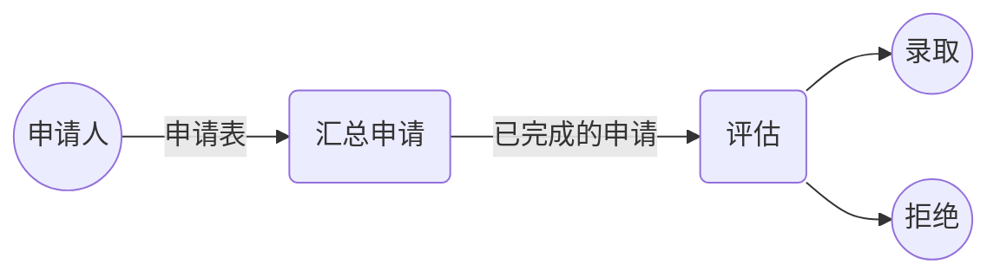
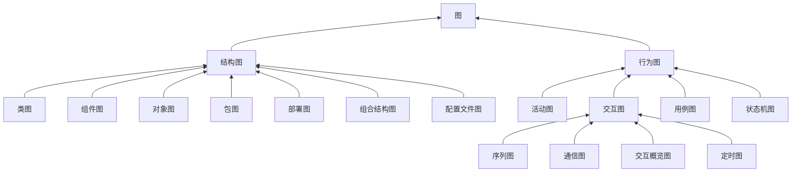
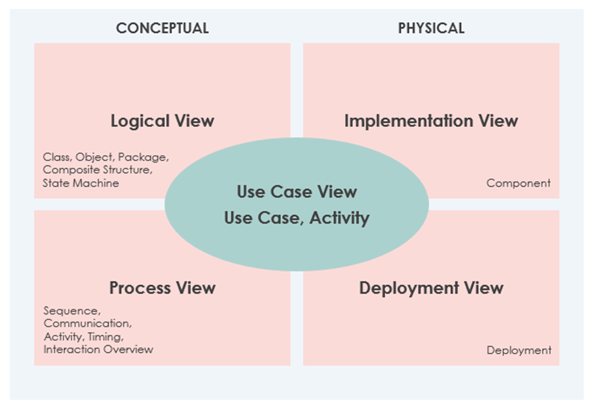

# 软件工程

## 第一课

---

### 简介及教学大纲

---

* **课程名称：** 软件工程
* **课程目标：** 全面介绍软件工程的各个方面。
* 课程结构：
  * **01 - 介绍：** 涵盖过程、术语和工具。
  * **02 - 需求：** 涉及分析和建模。
  * **03 - 设计：** 包括用户界面（UI）、系统和程序设计。
  * **04 - 测试：** 专注于单元测试和集成测试。
  * **05 - 管理：** 涉及法律、风险和质量保证（QA）。
* 参考资料：
  * [1] 陈越等，《软件工程》，浙江大学，https://www.bilibili.com/video/BV16g411M712?p=1
  * [2] Curran Muhlberger等，《软件工程》，康奈尔大学，https://www.cs.cornell.edu/courses/cs5150/2022sp/
  * [3] 伊恩·萨默维尔，《软件工程》（第10版），机械工业出版社。
* **课程特点：** 理论与实践相结合，涉及软件开发的各个关键阶段。

---

#### **课程的总体目标**

* 培养优秀的软件开发工程师 (SDE):
  * 仅仅是优秀的编码员、数学家或竞争者，并不一定能成为优秀的软件开发工程师。
* 具备持续学习和思考的意识:
  * 课程所学内容有限，很快就会过时。
  * 要具备全局观，进行聪明且非技术性的思考。
  * 做有意义的事情。
* 肩负重大的责任和光荣的使命:
  * 迎接第四次工业革命。
  * 在中国创造伟大的产品。
  * 将我们的IT产品和服务出口到世界各地。

---

### 课程总览

---

#### 术语：利益相关者

* **利益相关者：** 参与项目中的角色。
* 客户（甲方，项目经理）：
  * 提供资源以换取软件。
  * 承担项目失败的风险。
  * 设定需求和优先级。
  * 客户满意度是衡量项目成功的主要标准。
* 开发人员（程序员）：
  * 应被视为利益相关者（但不是最重要的一个）。
  * 也是一种昂贵的资源。
  * 具有能力、保密性和合规性的责任。
* 顾客（顾客）：
  * 购买软件或选择软件供组织使用。
* 用户（用户）：
  * 实际使用（与...交互）软件。

---

#### 软件开发过程

* 主要阶段：
  * **可行性与规划：** 评估项目的可行性和制定计划。
  * **需求：** 收集和分析用户需求。
  * **用户界面/体验设计：** 设计用户友好的界面。
  * **系统设计：** 设计软件的整体架构。
  * **程序开发（编码部分）：** 编写代码实现功能。
  * **验收与发布：** 测试软件并交付给用户。
  * **运营与维护：** 维护软件的正常运行。
* 注意事项：
  * **迭代：** 需求等阶段可能在开发周期中重复进行。
  * **区分：** 需要区分各个阶段的职责和任务。
* 课程关联：
  * 这些是课程的主要内容，并将在项目报告中呈现。

---

#### 可行性分析

* **定义：** 在决定开始一个项目之前进行的可行性研究。
* 研究内容：
  * 拟议项目的范围是什么？
  * 项目在技术上是否可行？
  * 预计的收益是什么？
  * 成本是多少？
  * 资源是否可用？
  * 风险是什么以及如何管理？
* 研究结果：
  * 可行性研究得出“开始”或“不开始”的决策。

---

#### 需求

* **定义：** 从客户的角度定义系统的功能。
* **目标：** 通过与客户、顾客和用户协商，确定系统的功能、约束和目标。
* 阶段划分：
  * 需求分析：
    * **目的：** 理解和澄清所需内容。
    * **详细程度：** 总体、概念性。
    * **受众：** 业务分析师、利益相关者。
  * 需求定义：
    * **目的：** 以清晰且结构化的方式记录用户需求。
    * **详细程度：** 高级、非技术性。
    * **受众：** 业务用户、产品负责人。
  * 需求规格说明：
    * **目的：** 提供详细、结构化的技术描述。
    * **详细程度：** 精确、形式化。
    * **受众：** 开发人员、测试人员。
* **开发方式：** 需求可以在独立的研究中制定，也可以逐步产生。
* **重要性：** 未能就需求达成一致并充分定义需求是软件项目失败的最大原因之一。

---

#### 用户界面/体验 (UI/UX)

* 可用性的重要性：
  * 在许多现代应用和软件系统中，可用性非常重要。
  * 需要良好的用户界面设计。
* 用户测试与迭代开发：
  * 用户界面需要通过用户进行评估。
  * 这需要迭代开发：
    * 设计用户界面。
    * 与用户进行测试。
    * 修改用户界面。
    * 重复。
* 产品驱动，而非技术驱动：
  * 产品失败的原因有很多，但丑陋的产品肯定会失败。

---

#### 系统设计

* **视角：** 从软件开发人员的角度描述系统。
* 内容：
  * **系统架构：** 建立一个满足需求的硬件和软件系统架构。
  * **关键要素：** 安全性和性能是系统设计的组成部分。
* 模型：
  * **用途：** 模型通常用于表示需求、系统设计和程序设计。
  * **UML：** 本课程讲授统一建模语言（UML）的基本概念。
* **鼓励：** 你应该得意忘形！（此处“得意忘形”应理解为积极鼓励，不要过于谦虚）

---

#### 程序开发

* **目标：** 利用系统设计和用户界面设计，构建满足需求的程序。

* 内容：

  * **程序设计（设计模式）：** 应用设计模式来组织和构建程序。

  * 实现（编写代码）：

     编写代码实现程序功能。

    * **基本要求：** 代码无错误（bug free）。
    * 进阶要求：
      * 注重代码性能（performance），运用数据结构和算法，实现高效功能。
      * 重视代码安全性，避免安全漏洞，防止系统被攻击和劫持。
      * 遵循代码规范，包括变量命名规则、代码风格等，确保代码的可读性和可维护性。
      * 技术发展：
        * LLM 可以根据指令或需求生成代码，提高编码效率。
        * 开发人员的职责：
          * 判断 LLM 生成代码的正确性和可用性。
          * 确保代码符合规范。

  * 测试：

     对程序进行测试，确保其正确性和可靠性。

    * **重要性：** 测试是软件开发过程中至关重要的环节，有助于发现和修复错误，保证软件质量。
    * **测试意识：** 开发人员应具备测试意识，重视测试工作。
    * 测试标准：
      * 测试代码量：高质量的测试代码量通常不低于正常工程代码量。
      * 测试用例：覆盖各种场景和边界情况，确保测试的全面性。
    * 测试工具：
      * AI 生成测试用例：利用 AI 提高测试用例生成的效率。
      * 测试人员的职责:
        * 人工审核AI生成的测试用例，确定测试的边界条件。

---

#### 测试

* 用户测试（User Testing）：
  * **内容：** 用户测试用户界面的各个版本，围绕 UI 展开。
  * **目的：** 通过用户体验发现界面问题，为需求或设计变更提供依据。
  * **方式：** 让用户实际操作原型，观察用户反馈。
* 程序测试（Program Testing）：
  * **内容：** 开发团队（主要是后端程序员）进行单元测试、系统测试和集成测试，运行代码以发现潜在问题。
  * 指标：
    * **代码覆盖率（Coverage）：** 要求覆盖所有代码行，甚至每个逻辑分支。
    * **第三方测试：** 大型企业通常有独立的第三方测试团队，模拟各种极端情况进行测试，以找出代码缺陷。
  * 开发人员职责：
    * 编写用例测试程序，确保代码质量。
    * 认真负责地编写代码，尽量避免错误，减少第三方测试团队发现问题的可能性。
  * **目的：** 保证代码的健壮性和稳定性。
* 验收测试（Acceptance Testing）：
  * **内容：** 客户根据需求分析阶段确定的需求，对整个产品进行测试。
  * **目的：** 验证产品是否满足客户需求，确认产品是否可以交付。
  * **意义：** 通过验收测试，表明整个测试流程完成。

---

#### 验收与发布

* 验收测试（Acceptance Testing）：
  * **内容：** 客户根据需求对系统进行测试。
  * 重要性：
    * 需求工程的重要性：验收测试的结果直接反映了需求工程的质量。
    * 避免“抓马”情况：由于需求不明确或客户变卦，可能出现戏剧性的情况，导致验收测试失败。
    * 关注需求而非技术：验收测试失败往往是需求问题，而非技术问题。
  * 结果：
    * 通过：进入交付与发布阶段。
    * 不通过：产品可能需要推倒重来。
* 交付与发布（Delivery and Release）：
  * **内容：** 验收测试成功后，系统交付给客户并发布到生产环境或面向市场。
  * **意义：** 产品正式投放市场，供用户使用。

**总结：**

验收测试是验证产品是否满足客户需求的关键环节，需求工程的质量直接影响验收测试的结果。交付与发布标志着产品正式投放市场。

---

#### 运营与维护

* 运营（Operation）：
  * **内容：** 系统正式上线，投入实际生产环境，接受市场检验。
  * 挑战：
    * 上线初期可能出现大量错误（errors）和问题（problems）。
    * 需要及时修复，保证系统稳定运行。
    * 可能出现由于用户量增长，或者被恶意用户找到系统设计缺陷，从而产生新的问题。
  * 应急机制：
    * 大厂通常实行“on call”制度，即安排专人 24 小时待命，随时解决突发问题。
    * “on call”频率因公司文化而异。
* 维护（Maintenance）：
  * **内容：** 识别并修复运营过程中出现的错误和问题。
  * 特点：
    * 可能需要连夜加班修复紧急问题。
    * 需要应对各种意想不到的“奇葩”情况。
* 演进（Evolution）：
  * **内容：** 根据用户需求和市场变化，增加新功能或改进现有功能，实现系统迭代升级。
  * 驱动力：
    * 用户提出新需求。
    * 市场竞争需要。
    * 设计模式的意义：
      * 设计模式能够很好的帮助系统进行迭代更新。
* 淘汰（Phase out）：
  * **内容：** 系统因各种原因停止服务，退出市场。
  * 原因：
    * 产品失去竞争力。
    * 技术更新换代。
    * 意义：
      * 标志着软件生命周期（Software Life Cycle）结束。
      * 意味着产品的终结。

---

### 拓展知识

---

#### 多样性

* 软件用途的多样性：
  * 软件必须服务于多种不同的目的，在许多不同的环境中，为许多不同的人服务。
* 项目多样性对开发人员的要求：
  * 项目多样性要求开发人员具有多才多艺的能力。
* 软件开发方式的多样性：
  * 在所有情况下，都没有“最佳”的软件创建方式。
  * 功能、时间、成本是需要权衡的因素。
  * 软件开发与算法的区别：
    * 算法追求“state of the art”（最先进），软件开发则追求“最合适的软件”。
    * “最合适的软件”：在有限的时间和成本内，最大程度地实现功能。
* 软件工程师的技能要求：
  * 软件工程师必须掌握各种方法、工具和技术。
  * 持续学习：
    * 需要不断接触新知识、新技术，适应技术发展趋势。
    * 例如：掌握 AI 工具的使用，提高编码效率。
  * 如果不能够掌握新的技术，那么就很有可能会被行业淘汰。

---

#### 风险

* 项目困境：
  * 许多（可能大多数）软件开发项目都会遇到困难。
  * 深求（DeepSeek）与ChatGPT的对比：
    * 市场变化带来的风险：DeepSeek的出现打破了ChatGPT在大模型领域的垄断地位，导致其估值大幅下降。
    * 这说明即使技术领先，也可能因市场因素面临巨大风险。
* 问题：
  * 无法按预期运行（功能）。
  * 预算超支（成本）。
  * 交付延迟（时间）。
* 竞争目标：
  * 每个软件项目都在功能、成本和时间之间进行权衡。
  * 额外的功能会增加开发、测试、维护等的额外成本。
  * 不同阶段的侧重点：
    * 初创阶段：时间优先，快速抢占市场。
    * 发展阶段：功能优先，满足用户需求。
    * 成熟阶段：成本优先，降本增效。
* 后果：
  * 失败的项目可能导致公司破产。
    * 例如：ChatGPT估值因市场变化而大幅缩水。
  * 管理者可能会失去工作。
    * 公司进入成熟阶段，为降低成本可能裁员。
  * 用户和社会可能会受到伤害。
    * 例如：新能源汽车厂商倒闭，导致用户无法正常使用车辆。

**总结：**

软件开发面临多重风险，不仅包括技术风险，还包括市场风险。在不同阶段，项目对功能、成本和时间的侧重点不同。软件开发人员需要充分认识到这些风险，并采取措施加以应对。

---

#### 最小化风险：沟通

* 软件使用率低：
  * 多达一半的交付软件从未被使用。
  * 开发人员构建了“错误的软件”，不符合客户的需求。
* 软件开发团队的职责：
  * 了解客户对软件的期望。
    * 避免“想当然”：理解客户的真实需求，避免误解。
  * 了解客户的组织对客户的期望。
    * 从公司层面考虑：产品是否符合客户公司的商业模式和发展趋势。
    * 案例：DeepSeek 的出现导致许多公司裁减自研大模型团队。
  * 了解客户和用户对软件的期望。
    * 用户视角：产品是否满足用户和顾客的期待。
    * 避免开发“没有意义”的产品。
* 开发人员的价值：
  * 开发人员可以增加技术见解，但客户满意度是衡量项目成功的标准。
  * 产品驱动，而非技术驱动！
  * 培养产品意识：从产品角度审视开发，而非仅关注技术。

---

#### 最小化风险的具体方法：

* 可行性研究：

   确定项目是否值得开始。

  * 谨慎选择：不要盲目接受需求，评估项目可行性。

* 分离需求和设计：

   确保客户的需求得到清晰的理解，并与开发人员如何实现这些需求相分离。

  * 阶段划分：严格区分需求分析、架构设计、程序设计和测试阶段。
  * 降低风险：避免因需求变更导致整个项目推倒重来。

* 里程碑和发布：

   向客户报告或演示进展情况。

  * 频繁沟通：及时向客户展示可工作版本，保持需求同步。
  * 避免后期返工：防止最终交付的产品与客户预期不符。

* 验收和用户测试：

   客户测试软件是否符合要求。

  * 充分了解客户：了解客户的测试方式和设备环境。
  * 客户教育：必要时像“幼儿园老师”一样指导客户使用和测试。

* 交接：

   确保客户收到可以在长时间内运营和维护的软件包。

  * 可维护性：保证交付的产品易于运维和维护。
  * 长期支持：确保产品在版本迭代后仍能有效维护。

---

#### 最小化风险：可见性

* 责任人的知情权：
  * 承担责任的人必须知道正在发生的事情。
* 决策者的评估依据：
  * 决定你的晋升或离职的人必须知道你的贡献。
* 管理者：
  * 必须依靠他人提供进度或困难的报告。
* 软件开发人员：
  * 难以评估进度。
  * 通常对成就保持谦逊。
  * 认为报告是浪费时间。
  * 行动迅速，言语谨慎。（“敏于行而讷于言”）

---

#### 最小化风险：短开发周期

* 风险最小化：
  * 通过每周而不是每月频繁交付可工作的软件来最小化风险。
* 好处：
  * 客户、顾客和用户可以评估开发人员的工作。
    * 尽早发现问题：每次发布后，客户都能及时评估，尽早发现并解决问题。
  * 有机会适应不断变化的环境。
    * 及时调整：根据用户反馈和需求变化，及时调整产品方向。
* 敏捷开发原则：
  * 这是敏捷软件开发的基本原则之一。
    * 核心思想：快速迭代，频繁发布，及时反馈。
    * 及时发布：即使是不完美或功能不完整的版本，只要能工作，就尽快发布。
    * 用户反馈驱动：根据用户反馈调整产品，降低最终产品失败的风险。

**详细解释：**

* 缩短开发周期：
  * 将发布周期从数月缩短到数周甚至数天。
  * 快速迭代：频繁发布新版本，快速迭代产品。
* 用户评估：
  * 及时反馈：用户能及时评估新版本，提出问题和建议。
  * 尽早纠正：开发者能尽早发现并纠正问题，避免后期返工。
* 敏捷开发：
  * 适应变化：敏捷开发能更好地适应需求和环境的变化。
  * 持续集成：敏捷开发强调持续集成和持续交付，确保及时发布。
  * 用户参与：敏捷开发鼓励用户参与，确保产品符合用户需求。

---

#### 规模

* 系统方面：

  * **差异性：** 大型和超大型系统在功能、成本和时间上可能完全不同。
  * **需求变化：** 需求已经多次更改。

* 人力资源方面：

  * **规模：** 可能包含100到10,000+人/年。

  * 复杂性：

     没有人能理解整个项目。

    * 软件工程本质：管理科学，管理人的学科。
    * 组织协调：将不同背景、能力的人组织在一起，交付产品。
    * 管理难度：团队规模扩大，管理难度呈非线性增长。
    * 规模效应：初期规模扩大带来明显收益，后期收益趋于平缓。
    * 大公司病：团队规模扩大，出现内耗、斗争等管理问题。

  * **人员流动：** 人员频繁流动。

* 贡献者列表：

  * （此处省略了长长的贡献者列表，但您可以根据需要查看PPT上的完整列表）

* 补充内容：

  * 小团队的优势：
    * 精悍的小团队可能比臃肿的大团队更高效。
    * 案例：DeepSeek 团队规模较小，却在技术上超越了大型团队。
  * 规模与管理：
    * 软件开发中，规模扩大带来管理上的挑战。
    * 需要有效的管理策略，避免“大公司病”。
  * 核心思想：
    * 软件工程不仅关注技术，更关注人的管理。
    * 团队规模应与项目需求相匹配，避免盲目扩张。

---

#### 管理

* 项目管理：

  * 进度跟踪：

     跟踪项目进度与计划是否一致。

    * 协调时间表：制定并协调项目时间表。

  * 任务优先级：

     确定任务的优先级。

    * 任务分配：根据优先级分配任务。

* 人员管理：

  * 资源分配：

     在正确的时间分配具有正确技能的合适数量的开发人员。

    * 合理分配：分配适当数量、技能的开发人员，以及合适的工具和时间。
    * 避免过度：时间过短可能导致工作质量下降，时间过长可能导致效率低下。

  * 工作环境：

     确保开发人员拥有高效的工作环境。

    * 生产环境：提供高效的生产环境。

* 合规建议：

  * 环境理解：

     了解法律、法规和经济环境。

    * 法律意识：具备法律意识，了解市场动态。

* 开发流程：

  * 最佳实践：

     实施最佳实践，以在不过度增加开销的情况下最小化风险。

    * 流程管理：采用最佳实践，降低风险，提高效率。

**详细解释：**

* 项目管理：
  * 制定详细的项目计划，并定期跟踪进度，确保项目按时完成。
  * 根据任务的重要性和紧急程度，合理分配优先级，确保关键任务优先完成。
* 人员管理：
  * 根据项目需求和人员技能，合理分配开发人员，避免人员冗余或不足。
  * 提供必要的工具和资源，确保开发人员能够高效工作。
  * 营造良好的工作氛围，提高团队凝聚力和工作效率。
* 合规建议：
  * 了解相关的法律法规和行业标准，确保项目合规性。
  * 关注市场动态和技术趋势，及时调整项目方向。
* 开发流程：
  * 采用成熟的开发流程和最佳实践，提高开发效率和代码质量。
  * 持续改进开发流程，不断优化团队协作和项目管理。

---

#### 好的流程

* 好的软件：
  * 好的流程带来好的软件。
* 风险降低：
  * 好的流程降低风险。
* 可见性增强：
  * 好的流程增强可见性。
* 团队合作：
  * 好的流程促进团队合作。

---

## 第二课

---

### 软件开发过程

---

#### 过程的顺序

第一讲介绍了几个过程步骤：

* 需求
* 用户界面设计
* 系统设计
* 程序开发（设计和编码）
* 验收和发布

每个软件项目都会以某种形式包含这些基本步骤，但是：

* 这些步骤可以是正式的或非正式的。
* 这些步骤可以以各种顺序执行。

软件开发过程或方法论是一种系统化的方式，将这些步骤组合起来以构建软件系统。

---

#### 软件开发过程

##### 瀑布模型

在开始下一个步骤之前完成每个过程步骤。

##### 迭代优化

快速完成所有步骤以创建一个粗略的系统，然后重复这些步骤以改进系统。

##### 螺旋模型

迭代优化的变体，其中新的和更新的组件在完成后被添加到开发中的系统中。

##### 敏捷开发

在一系列迭代（sprint）中开发小增量软件，每个迭代都创建可部署的代码。

---

#### 重量级和轻量级软件开发

在**重量级过程**中，目标是完全完成每个步骤，并在之后尽量减少变更和修订。每个步骤在开始下一个步骤之前都要进行完整的文档记录。

示例：修改后的瀑布模型

在**轻量级过程**中，开发团队的中间文档很少。期望根据经验进行更改，并且只记录最终系统。

示例：敏捷软件开发

---

#### 重量级和轻量级方法论

| 重量级 |  | 轻量级 |
|---|---|---|
| 过程和工具 | v.s. | 个体和交互 |
| 面面俱到的文档 | v.s. | 可以工作的软件 |
| 遵循计划 | v.s. | 响应变化 |
| 合同谈判 | v.s. | 客户合作 |

---

#### 历史

软件工程作为一个学科，可以追溯到 20 世纪 70 年代早期。

在那个时候：

* 大多数计算机系统都是对以前手动完成的系统进行转换，例如，工资、账单、机票预订。需求都得到了很好的理解。
* 许多系统都遵循相同的架构，主文件更新。系统设计得到了很好的理解。
* 编码很繁琐，没有现代语言和工具。因此，在开始编码之前，有一个好的程序设计非常重要。

这些因素导致了软件开发的瀑布模型。

---

#### 瀑布模型


这个基本模型存在问题，在实践中很少使用。

---

瀑布模型是一个**重量级过程**，每个过程步骤都有完整的文档记录。

**优点：**

* 任务分离
* 过程可见性
* 每个步骤的质量控制
* 每个步骤的成本监控

**缺点：**

* 在实践中，过程的每个阶段都会揭示对先前阶段的新理解，这通常需要对早期阶段进行修订。
* 瀑布模型不够灵活。

---

纯粹的顺序模型是不可能的。

计划必须允许某种形式的迭代。

**示例：**

* 在对需求和初步设计进行初步研究之前，可行性研究无法创建拟议的预算和时间表。
* 详细设计和实现揭示了需求规范中的差距。
* 需求和/或技术可能在开发过程中发生变化。

计划赶不上变化！

---

#### 修改后的瀑布模型


带有反馈的瀑布模型

这样更好

---

#### 何时使用修改后的瀑布模型

当需求被充分理解且设计简单明了时，修改后的瀑布模型效果最佳，例如：

* 转换需求被充分理解的手动数据处理系统（例如，电费账单）。
* 功能与早期产品密切相关的新版本系统（例如，汽车自动刹车系统）。
* 大型系统中某些组件的需求明确，且与系统其余部分明确分离的部分。

---

#### 迭代优化

**概念**

* 在有一个可运行的系统之前，需求很难理解，特别是用户界面。
* 系统和程序设计可以从原型中获益。

**过程**

* 在开发过程的早期创建一个原型系统。
* 与客户一起审查原型，并与用户一起测试它，以提高对需求的理解并阐明设计。
* 在一系列迭代中优化原型。

---

#### 迭代优化：一个例子

**问题：** 向编程环境添加图形包

**需求**

* 客户不确定几个重要的需求，例如，如何管理跨不同对象的坐标的语法。

**过程**

* 使用预处理器和初步运行时包构建原型版本。
* 进行几次迭代。对于每次迭代：
  * 与用户一起测试系统
  * 进行修改
  * 重复，直到用户对功能满意为止
* 作为最终迭代，替换预处理器并消除运行时包中的补丁和快捷方式。

这是一个迭代优化的例子。

---


---

#### 迭代优化讨论

这是一个**中等重量级**的过程，在过程中创建文档。

迭代优化使用各种技术，使客户能够在开发早期审查计划中的系统：

* 用户界面模型
* 抛弃式软件组件
* 虚拟模块
* 快速原型
* 连续优化

尽快让一些东西运行起来，供客户和用户评估，但不要发布。

**假装直到你成功**

---

#### 螺旋开发

**示例**

开发新版本的操作系统（微软）。

**螺旋开发**

通过螺旋开发，总会有一个经过全面测试的系统，但功能不完整。

* 创建一个具有最终产品整体结构的基本系统，并为缺失的组件提供虚拟存根。
* 对于每个已完成的组件，创建一套全面的测试用例。
* 开发团队构建新的或改进的组件，每个组件都有一套测试用例。将这些组件添加到源代码库中。
* 在每日周期中，测试人员从源代码库构建整个系统，并运行完整的测试用例集。

---


---

#### 螺旋开发讨论

螺旋开发广泛用于开发大型系统的新版本：

* 整体系统架构已被充分理解。
* 大型组件可以单独开发和测试。
* 系统的重要性证明了设置一套全面的自动化测试所带来的开销是合理的。

**挑战**

* 难以对架构进行重大更改。
* 难以进行影响许多组件的更改。

---

#### 在线系统的增量发布

小团队正确开发小型系统比协调有许多分支的大型项目更容易。

对于网站和其他在线软件，通常可以发布一个非常基本的系统，并在后续的短迭代中添加额外的功能。

**示例：**

从商店向家庭配送的初创公司。

**优点**

* 投资回报很快开始。
* 在后续迭代的开发中，需求更容易理解——最大限度地减少浪费的精力。
* 来自客户和客户的反馈可以纳入后续阶段。

---

#### 敏捷方法

术语“敏捷”用于各种方法。

**一般原则：**

* 大型项目被分成称为**迭代**的小增量。
* 开发由 4 到 9 人的小团队进行。
* 进度安排被分成固定的**时间盒**，可能是 2 到 4 周。
* 每个迭代都是一个时间盒，团队在此期间完成软件项目的一部分。单个迭代将经历几个过程步骤，例如需求、设计、编码和测试。
* 每个迭代都以完全测试好的代码结束，准备投入生产。
* 这是一个**轻量级过程**，在过程中创建最少的文档，但最终版本需要完整的文档以供将来维护。

---

#### 敏捷开发


每次迭代后，代码可以：

* 发布（原始敏捷方法）
* 与来自其他迭代的代码组合，用于后续发布
* 合并到更大的代码库中（螺旋开发）

---

#### 敏捷：发布代码

**敏捷的版本**

原始版本的敏捷要求每个迭代都以发布的代码结束。这在实践中很少可行。

在本课程中，我们将迭代定义为创建生产质量的代码。

有些人使用术语“迭代”来涵盖任何短期活动，但这超出了敏捷的精神。

---

#### 敏捷开发：返工

**敏捷开发的挑战**

* 敏捷方法非常适合在既定架构内开发或持续增强系统。
* 高级团队必须建立整体架构并协调迭代。

**返工**

* 通过敏捷开发，整体系统的需求和设计会逐步显现。
* 不可避免地，一些早期迭代的部分需要返工。
* 这需要更改已经过全面测试并可能已经发布的代码。这总是很棘手。

如果返工量很大，不完全润色每个组件，而是使用迭代优化来最小化返工量会更有效。

---

#### 混合流程

在实践中，许多大型项目使用的流程混合了四种软件流程的各个方面。

**示例**

* 需求明确的项目可能会使用修改后的瀑布方法来指定需求和系统设计，然后使用一系列敏捷迭代。
* 需求模糊的项目可能会使用迭代优化来阐明需求，然后使用修改后的瀑布模型来构建最终版本。
* 通过螺旋开发，新的组件可以作为一系列迭代来开发。
* 用户界面必须与用户一起测试。这迫使迭代开发，无论系统的其余部分使用什么流程。

---

#### 混合流程：分阶段开发

将一个大型项目分成两个或多个阶段。

* 具有基本功能的系统的第一个版本很快投入生产（第一阶段）。
* 后续阶段基于从先前阶段用户获得的经验。

**优点**

* 投资回报很快开始。
* 在开发后续阶段时，需求更容易理解。
* 成本可以分摊到更长的时间段内。

---

#### 关于软件流程的观察

已完成的项目应该包含所有基本的过程步骤，但是……开发过程始终是部分演进的。

**通过以下方式降低风险：**

* **原型化** 关键组件
* 频繁**发布**，或将大型项目分成**阶段**
* 与**用户**和**客户**进行早期和重复的测试
* 遵循**可见的**软件流程

在没有修订准备的情况下，永远不可能完成每个步骤。

---

#### 选择软件流程

软件开发过程中的变更代价很高。

* 如果需求理解不透彻或预计会发生变化，请选择保持灵活性的流程。迭代优化、敏捷迭代、分阶段实施。
* 如果一个大型软件系统有许多相互关联的组件，请避免在开发过程中对系统设计进行重大更改。修改后的瀑布模型。
* 如果软件的市场理解不透彻，请使用尽快将可运行的软件展示给客户的流程。敏捷迭代。

---

#### 企业流程

大型软件开发组织有自己内部的流程，这些流程是为他们的需求而设计的。例如：

* 亚马逊（互联网商务）是使用敏捷方法的先驱。大多数软件开发都分为大约四周的迭代。

  快速行动，打破常规

* 洛克希德·马丁（政府承包商）遵循修改后的瀑布模型，该模型符合美国政府管理软件合同的方式。

* 微软（PC 软件）非常重视使用各种设备和向后兼容性进行测试。大部分开发都使用螺旋流程。

---

#### 时尚和流行词

每隔几年，一种新的软件方法论就会受到广泛宣传。

最近的例子包括英雄式编程、敏捷、Scrum、DevOps、Jenkins 管道等。

都声称是对以前的软件开发方式的巨大改进。

大多数都包含一些好的想法，但其他一些只是旧概念的简单重新表述。

每种新方法论都会发明新的流行词。

不要被营销所迷惑。

没有适用于所有类型软件的开发流程。

即使是最好的流程也需要熟练的开发人员来创建良好、安全、可靠的系统。

---

#### 期末项目要求

1. 描述你的项目中使用的流程，并解释原因

---

### 可行性研究

---

#### 可行性研究

可行性研究是在承诺项目之前进行的研究。

可行性研究会得出以下决定：

* 继续进行
* 不继续进行

在生产项目中，可行性研究通常会导致预算请求。

可行性研究可以提案的形式呈现。

---

#### 为什么可行性研究很困难？

**不确定性**

* 客户可能不确定项目的范围。
* 收益通常很难量化。
* 方法通常定义不明确。资源和时间表的估计非常粗略。
* 可能需要组织变革。

因此，可行性研究在很大程度上依赖于有经验的人的判断。

在项目开始时犯的错误是最难纠正的。

---

**倡导**

需要倡导来激发对项目的热情：说服组织承担一项昂贵、复杂且风险众多的项目。

热情是好的，但热衷者通常强调潜在的好处，而淡化风险。

进行可行性研究和做出决定的人通常对项目的进行有既得利益，例如，经济利益、职业发展。

---

#### 决策者的观点

可行性研究提出建议。

客户组织的资深成员决定是否开始一个大型软件项目。他们需要哪些信息？

* **客户：** 这个项目是为谁准备的？
* **范围：** 项目的边界是什么？
* **收益：** 有什么收益？可以量化吗？如果软件是一个产品，可能的销售预测是什么？
* **技术：** 项目是否可行？是否有至少一种技术方法来执行项目？
* **资源：** 对人员、时间、设备等的估计是多少？
* **替代方案：** 如果项目不做，有哪些选择？

---

#### 风险在哪里？可以最小化吗？

**技术风险**

必须有一个包含粗略时间表和人员分配的概要计划。

该计划必须为意外情况留有很大的余地。（项目通常需要可行性计划中设想的两倍的人员和/或时间。）

**外部**

每个系统都与其他系统交互。其他系统是否致力于必要的努力（例如，潜在用户和客户）？

外部压力和障碍在哪里？

---

#### 组织可行性

一个主要的计算机系统对组织提出要求：

* 组织是否具有管理专业知识？
* 组织是否具有技术专业知识？即使工作由承包商执行，组织也需要专业知识来监督工作。
* 组织是否致力于人员、工作流程等的变更？

**示例**

版权存款系统：文书工作流程。

---

#### 可行性研究：范围

范围表达了系统的边界：

* 它将有一个包含功能的列表
* 它将有一个排除功能的列表
* 它将有一个依赖项列表
* 它将有一个要替换的当前系统列表

对范围的混淆是客户对系统不满意的常见原因。

“这就是你计划做的一切吗？”“但我以为你会做 xyz。”“没有 abc 我就不能使用这个系统。”

---

#### 可行性研究：收益

为什么提议这个项目？你能量化这些收益吗？

**组织收益**

* 创建适销对路的产品
* 提高组织效率（例如，节省员工）
* 控制一个复杂到无法手动控制的系统
* 新的或改进的服务（例如，更快地响应客户）
* 安全或安保

专业收益不是做项目的原因

---

#### 可行性研究：技术

可行性研究需要证明拟议的系统在技术上是可行的。

这需要：

* 需求概要
* 可能的系统设计（例如，数据库、分布式等）
* 要获取或开发的软件的可能选择
* 用户、数据、事务等的数量估计

这些粗略的数字是用于估计人员配备、时间表、设备需求等的临时计划的一部分。

实际采用的技术方法可能会有很大不同。

---

#### 可行性研究：规划和资源

可行性研究必须包含概要计划：

* 估计人员配备和设备需求，以及初步时间表
* 确定主要里程碑和决策点
* 确定与外部系统的交互和依赖关系
* 提供可交付成果和交付日期的初步列表

关于项目管理有单独的讲座。

---

#### 可行性研究：替代方案和风险

可行性研究应识别风险和替代方案。

**风险**

* 什么可能会出错？
* 如何监控进度并识别问题（可见性）？
* 后备方案是什么？

**替代方案**

* 继续使用当前系统、增强它，还是创建新系统？
* 内部开发还是外包？（如何管理合同？）
* 交付阶段和修改计划的可能点。

---

#### 可行性研究的技术

最高优先级是确保客户和开发团队对系统的目标有相同的理解。

为了让开发团队理解目标：

* 与客户和客户组织员工面谈
* 审查现有系统（包括竞争对手的）

为了让客户理解拟议的系统：

* 演示关键功能或类似系统
* 用户界面模型
* 浏览典型事务或交互

---

**预算概要：**

* n 人 m 个月，每月 x 美元 (**具体数字需详细列出，确保预算清晰透明**)
* 设备、建筑物等。(**详细列出所需设备和办公场所，并注明费用**)
* 应急费用（至少需要 50%，**实际工作中建议预留 100% 冗余，即一个月的工作量预估两个月**)

**阶段/里程碑：**

* 指定可交付成果和大概日期 (**精确到具体日期，让决策者清晰了解项目进度**)
* 计划发布 (**明确各版本发布时间，制定详细的开发规划**)

---

#### 可行性研究：决策

不同的组织和高级经理有不同的可行性研究风格，例如，一些决策者：

* 监控团队和流程
* 依赖于详细阅读书面报告
* 依赖于面对面询问知识渊博的人

**但他们必须理解这个决定。**

**音频重点补充：**

* 不同决策者对可行性分析的偏好各不相同，有的注重团队过程，有的依赖报告内容，有的则更倾向于咨询专家。
* 无论决策者偏好如何，**最终目的都是确保他们能够真正理解并信任可行性分析报告的内容**。
* 因此，在进行可行性分析时，需要充分考虑决策者的风格，并以清晰、易懂的方式呈现信息，确保他们能够做出正确的决策。

---

#### 可行性报告

可行性研究应有一份书面报告。

**它应该是一份书写良好、展示良好的文档。**

* 针对一般受众：客户、财务管理、技术管理等。
* 足够短，每个人都能阅读。
* 足够长，没有遗漏重要主题。
* 详细信息可以包含在支持性文档中。

**一份没有被阅读和理解的报告是无用的。**

**音频重点补充：**

* 可行性分析报告应以书面形式呈现，并注重排版和展示效果。
* 报告应面向不同背景的读者，避免使用过于专业的技术术语，确保易于理解。
* 报告内容应简洁明了，突出重点，避免冗长。
* 如果需要展示详细信息，可以将其放在附加文件中，但正文报告应保持精炼。
* 编写报告的目的是为了让决策者理解并做出正确的决策，因此，一份无法被理解的报告是毫无价值的。
* 要像对待毕业设计开题报告一样重视可行性报告。

---

#### 期末项目要求

2. 在你的最终报告中包含可行性报告（假设评分者是决策者）

---

### 项目管理

---

#### 项目管理的目标

完成一个项目：

* 按时
* 按预算
* 具备所需功能
* 令客户满意
* 不使团队疲惫

**提供项目进度可见性**

**及早发出问题警告，以便进行纠正**

**音频重点补充：**

* 项目管理的目标是确保项目在规定的时间、预算内完成，实现所有预定功能，并让客户满意。
* 同时，项目管理也需要保障团队成员的工作状态，避免过度劳累。
* 通过项目管理，需要能够清晰地展示项目进度，并及时发现潜在问题，以便尽早采取纠正措施。

---

#### 项目管理的挑战

**客户希望知道：**

* 系统是否会实现承诺的功能？
* 何时交付？如果迟到，会迟到多久？
* 成本与预算相比如何？

**通常，软件是更大的活动的一部分**

* 如果系统是产品，则必须将营销和开发相结合（例如，Microsoft Office）
* 如果系统必须与其他系统一起工作，则必须协调开发（例如，汽车中的嵌入式系统）

**但是：**

* 每个软件系统都是不同的。
* 大多数系统没有得到很好的规范，或者需求在开发过程中发生变化。
* 即使系统被很好地理解，估计时间和精力也充满了错误。

**音频重点补充：**

* **客户关注点：** 客户主要关注系统的功能实现、交付时间和成本控制。
* 软件与更大活动的关联：
  * 当软件作为产品时，需要将市场营销和开发相结合。
  * 当软件作为子系统时，需要与其他系统进行协调。
* 项目管理面临的挑战：
  * 每个软件系统都是独特的，难以预测所有情况。
  * 需求可能在开发过程中发生变化，导致项目范围变更。
  * 时间和精力的估计可能存在误差，影响项目进度。
  * 在开发过程中，会遇到各种不可控的问题。

---

#### 项目管理的各个方面

**规划**

* 可行性研究期间的进度概要
* 项目每个部分的更完整进度（例如，每个过程步骤、迭代或迭代）

**应急计划**

* 预测可能出现的问题（风险管理）

**进度跟踪**

* 定期将进度与计划进行比较
* 定期修改计划
* 客户和开发人员共同进行范围变更等

**最终分析**

* 分析项目，以便在下一个项目中进行改进

**音频重点补充：**

* **详细进度规划：** 在项目管理过程中，需要制定更详细的进度计划，包括每个步骤、迭代或 sprint 的具体任务和时间安排。
* **风险管理：** 预见项目中可能出现的问题，并制定相应的应急计划，进行风险管理。
* 进度跟踪与调整：
  * 定期将实际进度与计划进行比较，确保项目按计划进行。
  * 根据实际情况，及时调整项目计划。
  * 在进行范围变更时，需要与客户和开发人员充分沟通。
* 项目复盘：
  * 项目完成后，进行复盘分析，总结经验教训。
  * 找出项目中做得好的地方和存在的问题，以便在下一个项目中改进。
  * 复盘是提升个人和团队能力的重要途径。

---

#### 术语

* 可交付成果 (Deliverable):
  * 提供给客户的工作产品（模型、演示、原型、报告、演示文稿、文档、代码等）
  * 向客户和用户发布系统或子系统
  * **音频重点补充：** 指的是可以提供给客户直接使用的产品形态，例如已经成型的产品、可以发版的系统或子系统。
* 里程碑 (Milestone):
  * 完成一组指定的活动（例如，交付可交付成果、完成过程步骤、迭代结束）
  * **音频重点补充：** 指的是完成一系列活动后取得的重大进展，例如实现了一组重要功能。
* 活动 (Activity):
  * 随着时间推移的项目的一部分（也称为任务）
  * **音频重点补充：** 指的是占用一定时间来完成的项目任务，例如开发一个具体功能。
* 事件 (Event):
  * 一组活动的结束，例如，各方就预算和计划达成一致
  * **音频重点补充：** 指的是一组活动的集合，是比活动更大的概念。
* 依赖关系 (Dependency):
  * 在达到某个事件之前无法开始的活动
  * **音频重点补充：** 指的是活动之间的先后顺序，例如某个活动必须在前序活动完成后才能开始。
* 资源 (Resource):
  * 活动所需的人员时间、设备或其他有限资源
  * **音频重点补充：** 指的是完成项目所需的各种资源，包括人力、时间、设备等。

**音频重点补充：**

* 强调了“可交付成果”指的是已经成型的、可以直接交付给客户使用的产品。
* 解释了“里程碑”是项目进展中的重要节点，代表着一组重要功能的完成。
* 详细解释了“活动”、“事件”、“依赖关系”和“资源”等术语在项目管理中的具体含义，并结合实际例子帮助理解。
* 提到了使用项目管理软件(飞书，jira，onprocess等)来帮助开发项目，并且建议学生在课程作业中使用。

---

#### 标准项目管理方法

* 项目的范围在过程早期确定。
* 开发分为任务和里程碑。
* 估算每个任务所需的时间和资源。
* 将估算值组合起来，创建进度表和计划。
* 持续审查进度与计划的对比情况，可能每周一次。
* 通过范围、时间、资源等的变更来修改计划。

通常，计划由单独的项目管理团队管理，而不是由软件开发人员管理。

**与修改后的瀑布模型和迭代优化一起使用。**

**音频重点补充：**

* **项目范围的早期确定：** 在项目开始前，明确定义项目范围，为后续开发奠定基础。
* **任务和里程碑的划分：** 将开发过程分解为具体的任务和里程碑，便于跟踪进度和管理风险。
* **时间和资源的估算：** 估算每个任务所需的时间和资源，为项目计划提供依据。
* **进度表和计划的制定：** 将估算值整合，制定详细的进度表和项目计划。
* 进度审查与调整：
  * 定期审查实际进度与计划的偏差，及时发现问题。
  * 根据实际情况和变化，灵活调整项目计划。
  * 范围、时间、资源等变更都需要及时反映在计划中。
* **项目管理团队的独立性：** 项目计划通常由专门的项目管理团队负责，确保计划的客观性和全局性。
* **计划变更的集中管理：** 任何计划变更都需要汇总到项目经理处，由其统一决策，确保计划的一致性。

---

#### 敏捷项目管理方法

* 规划分为高层次的发布预测和低层次的详细规划。
* 发布规划是对一系列时间盒内可以实现的目标的最佳猜测和高层次视图。
* 发布计划不断修改，可能是每天修改。
* 客户和开发人员共同控制发布计划和迭代的选择。
* 对于每个时间盒，团队计划它可以实现的目标。团队可以使用甘特图或其他传统规划工具。

**音频重点补充：**

* 规划分层：

   敏捷项目管理将规划分为高层次的发布预测和低层次的详细规划。

  * 发布预测是对整体项目目标和时间线的粗略估计。
  * 详细规划则关注每个迭代（sprint）的具体任务和目标。

* 发布计划的动态性：

   发布计划不是一成不变的，而是随着项目进展和需求变化不断调整的。

  * 由于敏捷开发的迭代特性，发布计划可能需要频繁修改，甚至每天更新。
  * 高层次的发布计划更易于修改，以适应变化。

* **共同控制：** 客户和开发团队共同参与发布计划和迭代的选择，确保项目目标与客户期望保持一致。

* 迭代计划：

   在每个时间盒（迭代）开始时，团队会详细规划可以完成的工作。

  * 团队可以使用甘特图等工具进行迭代计划。

* **核心理念：** 敏捷项目管理强调灵活性和适应性，通过迭代开发和持续反馈，确保项目能够及时响应变化，最终交付满足客户需求的产品。

---

#### 估计活动所需时间

对于经验丰富的员工，估计完成单个任务的实际时间通常相当准确，但是……

小细节被低估了。

* 从几乎“完成”到完全“完成”的时间比预期的要长得多。（只需要整理一件事。我需要把注释整理得更好。我真的应该去掉那个补丁。）
* 没有计划应对干扰。（我的系统崩溃了，我决定升级软件。我孩子的学校因下雪而关闭。我花了一天时间面试求职者。）
* 有些事情必须做两次。

**音频重点补充：**

* **经验丰富的员工的估计：** 对于经验丰富的员工，估计完成单个任务的时间通常比较准确。
* 被低估的细节：
  * **“几乎完成”到“完全完成”：** 从“几乎完成”到“完全完成”的时间往往比预期更长，因为一些小细节（如整理注释、修复补丁）容易被忽略。
  * **干扰因素：** 员工可能会受到各种干扰（如系统崩溃、家庭事务、面试等），这些干扰会影响工作进度。
  * **重复工作：** 有些任务可能需要重复进行，这也会增加所需时间。
* 规划中的注意事项：
  * **避免使用模糊词汇：** 在评估进度时，避免使用模糊词汇（如“快完成了”），要求员工提供精确的估计。
  * **考虑干扰因素：** 在规划时间时，要考虑到可能出现的干扰因素，并预留一定的缓冲时间。
  * **预估重复工作：** 如果某些任务可能需要重复进行，要在时间估算中考虑到这一点。
  * **文化差异：** 注意不同文化背景下员工对“完成”的理解可能存在差异，避免因文化差异导致误解。

---

#### 团队估算

敏捷项目管理方法

* 不同的团队以不同的速度工作。
* 团队最了解它在单个时间盒或迭代中可以实现的目标。
* 团队致力于迭代的成果。
* 在时间盒内，团队必须有一个内部计划。

**在你的项目中，你需要致力于成果，并有一个计划来管理你的进度。**

**音频重点补充：**

* **团队速度差异：** 敏捷开发中，不同的团队工作效率不同，因此需要团队自行评估工作量。
* **团队自主性：** 团队最了解自身能力，能够准确评估在单个迭代（时间盒）内可以完成的工作。
* **团队承诺：** 团队需要对每个迭代的成果负责，确保按时交付。
* **内部计划：** 在每个迭代内，团队需要制定详细的内部计划，合理分配任务和时间。
* **项目经理的职责：** 作为项目经理，需要确保团队对成果负责，并协助团队制定合理的进度计划。
* **团队的责任和规划：** 敏捷项目管理强调团队的自主性和责任感，团队需要对迭代成果负责，并制定内部计划来管理进度。

---

#### 启动时间

在一个大型项目中，启动时间通常为三到六个月：

* 人员必须完成以前的项目（疲劳）或被招聘。
* 必须获取和安装硬件和软件。
* 员工必须学习新的领域和软件（学习时速度较慢）。
* 客户可能没有准备好。

新公司有特别的困难，因为他们可能必须雇用员工、寻找办公空间等。

**音频重点补充：**

* **启动时间的重要性：** 大型项目启动前需要充分准备，启动时间可能长达3-6个月。
* 影响启动时间的因素：
  * **人员因素：** 人员可能需要完成之前的项目、招聘新员工等。
  * **硬件和软件：** 需要采购、安装硬件和软件，耗费时间。
  * **员工学习：** 员工需要学习新的领域和软件，存在学习曲线。
  * **客户准备：** 客户可能没有准备好启动项目，例如资金、决策等问题。
* **新公司的挑战：** 新公司可能需要额外的时间来招聘员工、寻找办公场所等。
* **提前规划：** 项目管理者需要提前规划，考虑到启动时间的影响，确保项目顺利启动。

---

#### 项目规划工具

关键路径法、甘特图等。

* 从活动数据构建工作计划。
* 以图形或表格形式显示工作计划。

项目规划软件（例如，PingCode、飞书、Jira）

* 维护活动和相关数据的数据库
* 计算和显示进度表
* 管理进度报告

**音频重点补充：**

* **项目规划工具的重要性：** 在软件规划和项目管理中，使用合适的工具可以显著提高效率和准确性。
* 规划方法：
  * **关键路径法和甘特图：** 常用于识别关键时间节点和路径，帮助优化项目进度。
* 项目管理软件：
  * **PingCode、飞书、Jira等：** 这些软件对于大型软件开发项目至关重要，能够有效管理任务、进度和资源。
  * **功能：** 维护活动数据、计算和显示进度表、管理进度报告等。
* 实际应用：
  * **学生案例：** 提到去年有学生团队使用飞书进行项目管理，展示了清晰的任务分配和进度跟踪，取得了优秀成绩。
  * **建议：** 鼓励学生尽早熟悉和使用项目管理软件，为未来的工作做好准备。
* **工作场景：** 提醒学生，在工作岗位上，项目管理软件将成为日常工作的一部分。

---

#### 简单的甘特图


---

#### 甘特图

用于小型项目、单个时间盒和迭代

* 日期沿顶部运行（天、周或月）。
* 每行代表一项活动。活动可以是顺序的、并行的或重叠的。
* 活动的进度是一个水平条。左端标记任务的计划开始。右端标记预期结束日期。
* 通过将每个活动填充到与已完成工作成比例的长度来更新图表。这通常很困难。
* 通过在当前日期在图表中绘制一条垂直线，可以将迄今为止的进度与计划进行比较。

---

#### 活动图

强调依赖关系的调度技术组

* **实线箭头：** 活动（任务）
* **虚线箭头：** 虚拟活动（依赖关系）
* **空心圆圈：** 事件
* **空心方框：** 里程碑

---

示例：带有时间估计的活动图


---

#### 最早事件日期和最早开始日期

**最早开始日期：** 可以开始一项活动的最早日期。

**最早事件日期：** 假设每个活动都从其最早开始日期开始，则在该节点结束的所有活动都将完成的日期。

**最早项目完成日期：** 假设每个活动都从其最早开始日期开始，则项目完成的日期。

这些计算都取决于活动图表示的依赖关系以及执行各个任务的时间估计的准确性。

---


---

#### 最晚事件日期和最晚开始日期

**最晚开始日期：** 可以开始一项活动且仍能在最早项目完成日期之前完成项目的最晚日期。

**最晚事件日期：** 为了在最早项目完成日期之前完成项目，在该节点结束的所有活动必须完成的最晚日期。

---

每个事件都必须在所示日期前完成，否则将无法达到最终日期。


---

#### 关键路径

* 关键路径上的事件的最早事件日期等于最晚事件日期。
* 关键路径上的每个活动都必须从最早开始日期开始。


---

#### 浮动时间

* 不在关键路径上的活动有浮动时间。


* 此活动的最早开始日期是 17。它必须在第 23 周之前完成。由于其持续时间为 3 周，因此可以在第 17 周到第 20 周之间的任何时间开始。这给出了 3 周的浮动时间。

---

#### 浮动时间和关键路径

**浮动时间：** 活动的最晚开始日期和最早开始日期之间的差异

最晚开始日期 = （最晚事件）结束 - （时间估计）

最早开始日期 = （最早事件）开始

浮动时间 = （最晚事件）结束 - （最早事件）开始 - （时间估计）

**关键路径：** 图中每个活动浮动时间都为零的路径

如果关键路径上的活动未在其最早开始日期开始或完成时间长于预测时间，则项目完成日期将延迟。

---

#### 使用关键路径法识别问题

问题被发现得越早，就越容易解决。

**示例**

比预期更早地购买关键设备。

---

#### 在活动图或甘特图中添加资源

每个活动都标有资源，例如：

* 人员数量（例如，2 名 Java 程序员）
* 关键人员（例如，首席系统架构师）
* 设备（例如，3 台装有指定软件的服务器）
* 设施（例如，视频会议中心）

每个资源都标有可用性，例如：

* 招聘和培训
* 休假
* 设备可用性

---

#### 使用活动图进行资源管理

假设每个活动都从最早开始日期开始：

在每个时间段内，计算：

* 所需资源
* 可用资源

识别资源短缺/盈余

调整进度

* 聘用额外人员（例如，顾问）
* 重新安排进度（例如，更改休假）
* 更改活动执行顺序

---

#### 关键人员：《人月神话》

在计算机领域，并非所有人都是平等的

* 有些人效率更高（例如，更有经验）。
* 有些任务对每个人来说都太难了。

增加更多人员会增加沟通的复杂性

* 有些活动需要一个人的思考。
* 有时，活动的经过时间无法缩短。
* 增加更多人员可能会增加完成项目的时间。

如果关键人物生病或辞职，项目会发生什么？

> 关键词解释：
>
> 人月：一个程序员一个月的工作量
>
> 人月神话：如果一个项目需要10人月，那么10个人一个月就能完成，或者1个人10个月也能完成。这种线性推论在软件开发中是错误的。
>
> 即，不能因为进度落后就盲目加人，也不能为了节省成本盲目减人。

---

#### 管理进度

进度可以由团队成员或外部项目经理管理。

* 创建和维护进度。
* 跟踪进度与进度的对比情况。
* 检查进度中的浮动时间（最小化风险）。
* 不断进行调整：
  * 在上一个活动完成之前开始活动
  * 分包活动
  * 重新协商可交付成果
* 让高层管理人员了解情况（可见性）。

需要团队成员的信任。

---

#### 期末项目要求

3. 在你的最终报告中描述你的项目计划/进度，并使用本部分介绍的技术和组成部分

## 第三课

---

### 需求分析

---

#### 需求

**需求从客户的角度描述系统的功能。**

* 需求确立了系统的功能、约束和目标。
* 客户和开发人员都必须理解需求。

**开发团队和客户需要密切合作来定义需求。**

**音频重点补充：**

* 需求分析的本质：
  * 需求分析是从客户（甲方）的角度出发，描述系统应具备的功能。
  * 它明确了系统的功能、约束条件和最终目标。
* 理解的重要性：
  * 客户和开发人员必须对需求有透彻的理解，这是项目成功的基础。
* 密切合作：
  * 开发团队和客户需要紧密合作，共同定义需求，确保需求的准确性和完整性。
* 沟通的挑战：
  * 在实际工作中，客户的背景可能千差万别，开发人员需要具备良好的沟通能力，像对待幼儿园小孩一样，耐心细致地与客户沟通，明确所有细节。
* 避免误区：
  * 不要因为开发人员与客户很熟悉，而忽略了沟通的重要性。

---

#### 为什么需求很重要？

| **失败的软件项目的原因** | **百分比** |
| ------------------------ | ---------- |
| **不完整需求**           | **13.1%**  |
| **缺乏用户参与**         | **12.4%**  |
| 缺乏资源                 | 10.6%      |
| **不切实际的期望**       | **9.9%**   |
| 缺乏高层支持             | 9.3%       |
| **需求和规范变更**       | **8.8%**   |
| 缺乏规划                 | 8.1%       |
| **系统不再需要**         | **7.5%**   |

未能理解需求导致开发人员构建了错误的系统。

**音频重点补充：**

* 需求分析的重要性：
  * 统计数据显示，软件项目失败的主要原因与需求分析密切相关。
  * “不完整需求”、“缺乏用户参与”、“不切实际的期望”、“需求和规范变更”、“系统不再需要”等都是导致项目失败的重要因素。
* 失败原因分析：
  * **不完整需求：** 需求不完整导致开发出的软件与客户期望不符，或遗漏重要功能。
  * **缺乏用户参与：** 开发出的功能没有实际用户使用，导致项目失败。
  * **不切实际的期望：** 客户对软件功能有不切实际的期望，导致软件无法满足其需求。
  * 结论：
    * 在软件开发初期，必须充分重视需求分析，确保需求的准确性和完整性。
    * 许多项目失败的种子在需求分析阶段就已经埋下，因此必须在该阶段做好充分准备。

---

#### 需求的困境

定义需求可以分为几个步骤：

* **分析**：通过与客户、顾客和用户协商来确定功能。
* **建模**：以系统化和易于理解的方式组织需求。
* **定义**、记录和沟通需求。

重量级过程在开始设计之前，针对整个系统完成这些步骤。

使用轻量级过程，这些步骤针对每个迭代分别完成。

**音频重点补充：**

* 需求工程的三个步骤：
  * **分析：** 与客户、用户协商，明确他们希望系统实现的功能。
  * **建模：** 将分析阶段得到的需求系统化地组织起来，用框架图等方式呈现。
  * **定义：** 明确每个模块的具体实现方式和逻辑，以及模块之间的联系。
* 重量级与轻量级过程的差异：
  * **重量级过程：** 在系统设计开始前，完成所有需求的分析、建模和定义。
  * **轻量级过程：** 在每个迭代中，针对部分需求重复进行分析、建模和定义。
* 沟通与合作：
  * 需求分析需要与用户和甲方进行深入沟通，了解他们的真实需求。
  * 建模是将需求可视化的过程，有助于更好地理解和沟通。
  * 定义是明确具体实现细节的过程，确保开发团队能够正确理解需求。
* 迭代的重要性：
  * 轻量级过程通过迭代的方式，逐步完善需求，确保最终产品符合用户期望。

---

#### 需求步骤


**音频重点总结：**

* 需求工程的流程：
  * 在软件工程开始前，进行可行性分析，并生成可行性分析报告。
  * 若项目可行，则进入需求工程阶段。
  * 需求工程包括三个部分：需求分析、需求建模和需求定义。
* 需求分析：
  * 与客户（甲方）进行深入沟通，了解其需求。
  * 形成对需求的描述或报告，该描述应通俗易懂。
* 需求建模：
  * 将需求以系统化的方式组织起来，例如使用框图进行可视化呈现。
* 需求定义：
  * 细化需求的每个模块，明确其背后的逻辑和实现方式。

---

#### 需求的困境

除非你知道系统需要做什么，否则你无法构建系统。

**但是……**

客户可能只对需求有部分了解。

* 当他们看到系统时，他们会要求新的功能。
* 他们经常要求进行重大更改。
* 这些更改可能会迫使你重做系统的很大一部分。这些对于**重量级**和轻量级过程都是问题。
* OOP（面向对象编程）能救你的命！

**音频重点补充：**

* 面向对象编程 (OOP) 的作用：
  * **应对需求变更：** OOP 通过模块化设计，降低了需求变更对整个系统的影响。
  * **解耦：** 将功能解耦成独立的模块，修改某个模块时，不会影响其他模块。
  * **减少重构：** 当客户提出需求变更时，只需修改相关模块，无需重构整个系统。
  * **提高代码可维护性：** OOP 使代码更易于理解和维护，降低了维护成本。
* 程序员的挑战：
  * 客户频繁变更需求是常见现象，程序员需要保持耐心和良好的沟通能力。
  * OOP 能够有效应对需求变更，减轻程序员的工作负担。

---

#### 重量级过程：修改后的瀑布模型


**音频重点总结：**

* 修改后的瀑布模型与需求工程：
  * 在修改后的瀑布模型中，需求工程是在可行性分析之后进行的。
  * 与传统的瀑布模型不同，修改后的模型允许反馈和迭代。
  * 如果发现需求未能满足客户的期望，可以返回需求工程阶段重新进行。

---

#### 重量级过程中的需求

重量级过程需要详细的规范

* 详细说明每个需求的书面文件。
* 经过客户和开发人员的仔细检查。
* 可能是合同文件。
* 将用于验收测试。

困难

* 规范的创建耗时且困难。
* 规范难以维护。
* 检查详细的规范很繁琐。
* 客户很少理解其含义。

创建和维护详细的需求规范的困难是许多组织偏爱轻量级开发过程的原因之一。

**音频重点补充：**

* 重量级过程的需求特点：
  * 强调在项目初期明确所有需求细节。
  * 需要创建详细的书面规范，包括每个需求的详细说明。
  * 规范需要经过客户和开发人员的仔细检查和确认。
  * 规范可能作为合同文件，具有法律效力。
  * 规范将作为验收测试的依据。
* 重量级过程的需求困境：
  * **创建困难：** 详细规范的创建非常耗时且困难，因为客户可能对需求理解不清晰。
  * **维护困难：** 随着项目进展，需求可能发生变化，导致规范难以维护。
  * **检查繁琐：** 详细规范的检查非常繁琐，且客户可能难以理解技术细节。
  * **客户理解：** 客户通常缺乏技术背景，难以理解详细规范的含义。
* 轻量级过程的优势：
  * 由于创建和维护详细需求规范的困难，许多组织更倾向于采用轻量级开发过程。
  * 互联网行业发展迅速，重量级开发过程很难适应。

---

#### 轻量级过程：敏捷开发


每个sprint都有自己的一组需求。

> 术语解释：
>
> sprint：短开发周期

---

#### 轻量级过程中的需求

轻量级过程以sprint为单位，每个sprint只开发一部分需求。

* 工作代码用于检查需求。
* 客户和开发人员共同处理需求。
* 迭代期间创建最少的文档。
* 需要为未来的维护人员提供更完整的文档，但细节在代码中提供。

**困难**

* 有些需求是系统范围的，无法在单个迭代中定义

例如，数据库、安全架构、整体用户界面设计。

* 未来迭代的需求可能会导致早期迭代的重大返工。

**音频重点补充：**

* 轻量级过程的需求特点：
  * 以迭代（sprint）为单位，每个迭代只开发部分需求。
  * 使用可工作的代码原型来验证需求是否满足客户期望，而非仅依赖文档。
  * 强调客户与开发人员的紧密合作，共同完成需求工程。
  * 迭代期间尽量减少文档工作量，但并非完全没有。
  * 最终产品完成后，需要提供完整的文档，但细节应体现在代码注释中。
* 困难与挑战：
  * 系统级需求（如数据库架构、安全设计、整体UI设计）无法在单个迭代中完成。
  * 未来迭代的需求变更可能导致早期迭代的重大返工。
* 代码注释的重要性：
  * 强调代码注释的重要性，尤其是在大型项目中。
  * 鼓励养成良好的代码注释习惯，提高代码可读性和可维护性。
  * 推荐参考优秀的开源项目，学习其代码注释规范。
  * 强调代码注释是轻量化开发中，对未来维护的重要文档。

---

#### 中量级过程：迭代优化


每个迭代都会修改需求。

---

#### 中量级过程中的需求

**中量级过程迭代地开发需求。**

* 第一次迭代有主要需求的概述。
* 每次迭代都会完善概述并添加细节。
* 未来的维护人员需要文档，但细节在代码中提供。

**困难**

* 每次迭代都可能需要对以前的工作进行重大返工。
* 开发人员经常将新需求修补到以前的迭代中。

**音频重点补充：**

* 中量级过程的需求特点：
  * 以迭代的方式逐步完善需求。
  * 第一次迭代提供主要需求的概述，后续迭代逐步完善并添加细节。
  * 强调文档的必要性，但鼓励将细节体现在代码注释中。
  * 为未来的维护人员提供必要的文档。
* 困难与挑战：
  * 每次迭代都可能需要对之前的工作进行重大返工。
  * 开发人员可能倾向于将新需求直接修补到之前的迭代中，导致代码混乱。

---

#### 哪个更好？

**对于大型系统，你必须灵活。重量级过程和轻量级过程都有问题。**

但是……

**如果使用得当，两种类型的过程都能很好地工作。**

* 当使用重量级过程（如修改后的瀑布模型）时，以适度的细节指定需求，但要为修订做好准备。一些细节可以留到过程的后期。
* 当使用轻量级过程（如敏捷）时，在过程的早期（可能在开始常规迭代之前）开发系统范围的需求和整体系统架构。

**音频重点补充：**

* 没有绝对的优劣：
  * 软件开发没有“最好”的模式，只有“最合适”的模式。
  * 重量级和轻量级过程在需求工程方面都存在各自的问题。
* 灵活运用：
  * 关键在于理解两种过程的优缺点，并灵活运用。
  * 避免照搬照抄，根据实际情况进行调整。
* 重量级过程的调整：
  * 在重量级过程中，需求定义不必过于详细，为后续修订预留空间。
  * 部分细节可以推迟到项目后期确定。
  * 为需求变更做好心理准备。
* 轻量级过程的调整：
  * 在轻量级过程中，需要在项目初期明确系统级需求和整体架构。
  * 系统架构应在早期明确，因为其难以在迭代过程中轻易更改。
  * 确保全局要素不被敏捷开发的局部性所忽略。
* 核心要点：
  * 根据项目规模、复杂度和团队特点选择合适的开发模式。
  * 在任何模式下，都需要充分考虑需求变更的可能性，并做好应对准备。

---

#### 需求目标

**以适当的细节理解需求。**

**确保客户和开发人员理解需求及其含义。**

以**对客户清晰**的方式定义需求。这可以是书面规范、原型系统或其他形式的沟通。

以**对将要设计、实现和维护系统的人员清晰**的方式定义需求。

“我们对您需求的理解是……”

---

#### 需求分析：客户访谈

客户访谈是需求分析的核心

客户可能只对需求有一个模糊的概念

* 留出充足的时间。
* 在与客户会面之前做好准备。
* 做完整的笔记。
* 如果你不明白，要反复深入探究。
* 重复你听到的内容。

小组会议通常最有效

---

#### 需求分析：理解需求

**深入理解需求**

* 领域理解：不断学习新知识
* **示例：** 制造灯泡
* 理解术语
* 客户经常使用专业术语。如果你不明白，请要求解释，“我们没有钱”（We don't have no money）
* 理解所有利益相关者的真实需求
* 客户可能对他们需要什么没有清晰的想法，或者他们可能没有清楚地表达需求。

不断提问，“你为什么这样做？”“这是必要的吗？”“有什么替代方案？”

“你认为人工智能是怎样的 vs. 人工智能的真实情况”

---

#### 需求分析：新旧系统

客户常常对旧系统过于熟悉，以至于他们没有意识到新系统中不需要某些功能。

**替换**系统是指构建一个系统来替换现有系统。

**遗留**系统是指未被替换，而是被扩展或必须与新系统连接的现有系统。

问题：我们是否还需要保留这个旧功能？

案例分析：特斯拉

在需求分析中，区分以下几点非常重要：

* 新系统中需要哪些旧系统的功能
* 新系统中不需要哪些旧系统的功能
* 提议的新功能

---

#### 需求分析：未言明的需求

发现未言明的需求通常是制定需求中最困难的部分。

**示例：**

* 抵制变革
* 部门摩擦（例如，人员调动）
* 管理层的优势和劣势

---

#### 利益相关者分析

识别利益相关者（谁会受到该系统的影响？）

* 客户
* 顾客
* 用户（多种类别）
* 高层管理人员
* 管理员
* 计算人员

**示例：**

网络购物网站（购物者、管理、财务、仓库）

---

#### 观点分析

**观点分析**

分析每个利益相关者群体所看到的需求。

**示例：大学招生系统**

* 申请者
* 大学行政部门
  * 招生办公室
  * 助学金办公室
  * 特殊办公室（例如，体育、发展）
* 学术部门
* 计算人员
* 运营和维护

---

#### 特殊研究

理解需求可能需要研究：

**技术评估**

* 实验、原型等。
* **示例：** Windows XP 启动更快

**市场调研**

* 焦点小组、调查、竞争分析等。
* **示例：** 微信支付、拍摄

使用数据驱动的方法，它们通常会结合在一起


---

#### 指定需求：现实性和可验证性

需求必须是**现实的**，即必须能够满足它们。

**错误：** 系统必须能够执行 x（如果目前没有已知的计算机系统能够以合理的成本执行 x）。

* 关于 LLM 的错觉

需求必须是**可验证的**，即，由于需求是**验收测试**的基础，因此必须能够测试是否满足了需求。

**错误：** 系统必须易于使用。

**正确：** 经过一天的培训，操作员应该能够每小时处理 50 笔交易。

* 量化你的影响和 KPI！

---

#### 敏捷：发布代码

使用重量级过程，需求由完整的规范定义。使用轻量级过程，规范涵盖可能存在不确定性的选定部分。

**目标：**

**记录客户和开发人员之间的协议**

* 为验收测试提供基础
* 提供可见性
* 作为系统和程序设计的基础
* 与可能在该系统或子系统上工作或依赖该系统或子系统的其他团队沟通
* 通知未来的维护人员

---

#### 轻量级过程

使用轻量级过程，需要经验和判断力来区分可以留到开发过程后期处理的细节，以及必须在过程早期与客户达成一致的关键需求。

通常需要详细规范的示例

* 业务规则（例如，参考会计准则）
* 法律约束（例如，数据保留、隐私方面的法律）
* 数据流（例如，数据源、数据验证）

一个常见的错误是遗漏关键细节。这会导致客户和开发人员之间的误解。轻量级过程的全部目的是拥有最少的中间文档，但你需要一些文档。

---

轻量级过程使用概要规范 + 其他工具

* 以适当的细节描述关键需求的文档。
* 由客户和开发人员审查。

详细信息由补充工具提供，例如，

* 用户界面模型或演示。
* 模型，例如，数据库模式、状态机等。

客户比规范更能理解原型和模型

* 迭代或增量（敏捷）开发过程允许客户了解最终系统将做什么。

---

#### 功能需求

功能需求描述了系统必须执行的功能。它们包括以下主题：

* 事务
* 数据
* 用户界面

---

#### 非功能需求

与系统必须执行的功能没有直接关系的需求

* 产品需求：性能、可靠性、可移植性等……
* 组织需求：交付、培训、标准等……
* 外部需求：法律、互操作性等……
* 市场营销和公共关系

---

#### 非功能需求示例

**示例：图书馆**

使用客户员工熟悉的科技：

* 硬件和软件系统（IBM/Unix）
* 数据库系统（Oracle）
* 编程语言（C 和 C++）

认识到客户是联邦图书馆

* 涵盖政府系统的法规，例如，残疾人无障碍设施
* 开发一个受其他主要图书馆尊重的系统的重要性

---

#### 需求：与客户协商

有时，客户会要求实现非常昂贵或不可能实现的功能。或者两个需求可能相互矛盾。

这需要协商。

与客户讨论需求。为什么需要它？是否有等效的替代方案？

解释你担忧背后的原因。解释技术、组织和成本方面的影响。

乐于接受建议。你的理解是否存在差距？也许第二个意见可能会提出其他方法。

客户和开发团队必须解决这些问题。

**示例**

国家科学基金会拨款系统，客户要求支持多种格式。经过协商，同意第一阶段仅支持 PDF。

---

#### 需求与系统设计

技术决策

需求分析应对系统设计做出最少的假设。但是，需求定义必须与计算技术和可用资源保持一致。

在实践中，分析和设计是相互交织的。然而：

1. 不要让对设计的假设影响需求分析。
2. 不要让需求分析预先判断系统设计。

---

#### 期末项目要求

**4. 在你的最终报告中列出所有需求（功能和非功能），并解释你是如何识别这些需求的**

你可以参考提供的示例需求

[示例一](https://www.dropbox.com/s/61a7hg7tbw4p0nx/Mentcare requirements document.pdf?e=1&dl=0)

[示例二](https://www.dropbox.com/s/grgaaxtdas4oj1i/InsulinPumpRequirements.pdf?e=1&dl=0)

---

### 场景和用例

---

#### 需求与系统设计

**场景**

场景是一个场景，它说明了与拟议系统的某些交互。

场景是在需求分析期间使用的一种工具，用于描述拟议系统的特定用途。场景通过具体示例捕获从外部（例如，用户）看到的系统。

**术语说明**

一些作者限制使用“场景”一词来指代用户与系统的**整体交互**。

其他作者使用“场景”一词来指代交互的**部分内容**。

在本课程中，该术语具有这两种含义。

---

#### 描述场景

一些组织对于描述场景有复杂的文档标准。

至少，描述应包括：

* **场景目的**的陈述
* 选择**视角**
* 通过场景跟踪的个人**用户或交易**
* 关于**设备或软件**的假设
* 场景的**步骤**

在敏捷开发中，场景被描述为用户故事

---

#### 敏捷：用户故事

敏捷“用户故事” - 具有适度细节的叙述性场景

* 通常写在卡片上
* 开发人员分解成任务以估计工作量
* 客户优先考虑包含在迭代中
* 推迟的故事可能会以最少的返工进行修订


---

#### 与客户一起开发场景

**与客户一起开发场景的示例**

* 正在为一个系统开发需求，该系统将使大学生能够使用网络浏览器在自己的房间里在线参加考试。

为典型学生如何与系统交互创建一个场景

在接下来的几张幻灯片中，红色问题是在开发场景时向客户提出的典型问题。

---

#### 与客户一起开发场景：典型学生

**目的：**

描述代表性学生使用在线考试系统的场景 **[此场景基于哪个视角？]**

**个人：**

**[谁是典型学生？]** 学生 A，计算机科学专业。 **[学生可以在哪里？其他大学有区别吗？]**

**设备：**

任何带有受支持浏览器的计算机。 **[是否有受支持浏览器的列表？是否有任何网络限制？]**

**场景：**

1. 学生 A 进行身份验证。 **[大学生如何进行身份验证？]**
2. 学生 A 启动浏览器并输入考试系统的 URL。 **[学生如何知道 URL？]**
3. 考试系统显示选项列表。 **[列表是否针对个人用户量身定制？]**
4. 学生 A 选择考试 1。
5. 显示问题列表，每个问题都标记为已完成或未完成。 **[问题可以按任意顺序回答吗？]**
6. 学生 A 选择一个问题，并选择提交新答案或编辑之前的答案。 **[是否始终可以编辑之前的答案？是否有其他选项？]**
7. **[有哪些问题类型：文本、选择题等？]** 第一个问题需要书面回答。学生 A 正在提交新答案。学生可以选择在浏览器中键入答案或附加单独的文件。学生 A 决定附加一个文件。 **[接受哪些文件类型？]**

8. 对于第二个问题，学生选择编辑之前的答案。学生 A 选择删除之前在浏览器中键入的解决方案，并用附加的文件替换它。 **[学生可以编辑之前的答案，还是必须始终用新答案替换？]**

9. 作为在一个会话中完成整个考试的替代方法，学生 A 决定保存已完成的问题以便稍后继续。 **[是否始终允许这样做？]**

10. 学生 A 注销。

11. 稍后，学生 A 登录，完成考试，提交答案并注销。 **[此过程与此考试的初始工作有何不同？]**

12. 学生 A 现在已完成考试。学生选择将考试提交给评分系统的选项。 **[如果学生没有尝试每个问题怎么办？评分员是否收到通知？]**

---

#### 讨论

从**教师**的角度描述在线考试系统的使用场景

**目的：**

**个人：**

**设备：**

**场景步骤：**

**将在下一节课中介绍！**

---

## 第四课

---

### 场景和用例

---

#### 与客户一起开发场景（续）

* 与客户一起开发场景可以明确在构建系统之前必须达成一致的许多功能需求，例如政策、程序等。
* 场景通常会明确用户界面的需求，但用户界面的设计不应成为场景的一部分。

**尽管此场景非常简单，但省略了许多细节。**

**复杂的系统可能需要许多场景。**

---

#### 分析特殊需求的情景

情景对于分析特殊需求非常有用。

例子

* **撤销。** 在金融系统中，交易被计入错误的账户。使用什么步骤序列来撤销交易？
* **错误。** 一家邮购公司有多个库存数据库的副本。如果它们变得不一致会发生什么？

错误恢复的情景

* 墨菲定律：“凡是可能出错的，都会出错”。为所有可能出错的情况以及系统预期如何处理这些情况创建情景。

在质量保证中也很有用

---

#### 将场景建模为用例

**模型**

**场景**在与客户讨论拟议系统时很有用，但在完全理解系统之前，需要使需求更加精确。

这就是需求**建模**的目的。

**用例**提供了这样的模型。

---

#### 两个简单的用例


---

#### 参与者和用例图


**参与者**是系统中扮演特定**角色**的用户。

参与者可以是人或外部系统。


**用例**是参与者需要在系统帮助下执行的任务。

---

#### 用例和参与者

* 参与者是**角色**，而不是个人（例如，图书馆员可以有多个角色）
* 参与者必须是用例的**受益者**（例如，不是借书时处理书本的图书馆员）

在命名参与者时，选择描述角色的名称，而不是“用户”或“客户”等通用名称。

---

#### 考试系统的用例


---


请注意，参与者是一个角色。一个人可以在一个关联中担任“考生”，在不同的时间担任“教师”。

---

#### 描述用例

一些组织有复杂的文档标准。

**元数据**

* 用例的**名称**
* 用例的**目标**
* **参与者**或**参与者**
* **触发器**
* 开始时的**进入条件**
* 结束时的**后置条件**

**事件流**

* 事件的**基本流程**
* 事件的**替代流程**
* **异常**

---

#### 参加考试用例：基本流程

**事件的基本流程：**

1. 考生连接到服务器。
2. 服务器检查考生是否已通过身份验证，必要时运行身份验证过程。
3. 考生从选项列表中选择考试。
4. 考生重复选择问题，并键入解决方案、附加带有解决方案的文件或编辑解决方案。
5. 考生提交完成的考试或保存当前状态。
6. 提交完成的考试后，服务器检查是否已尝试所有问题，并向考生发送确认信息。
7. 考生注销。

---

#### 参加考试用例：替代流程

**替代流程**和**异常**对通过用例的路径进行建模，而不是基本流程。

在以下列表中，每个流程都链接到基本流程的一个步骤。

**替代流程是成功完成用例的替代路径。**

3. 考生之前输入了部分考试内容，但没有提交。

4. 解决方案文件不被系统接受。

6. 不完整的提交。

**异常会导致用例失败。**

2. 身份验证失败。

---

#### << extends >> 关系

**<< extends >> 关系**

用例可以使用其他用例

如果替代流程或异常需要额外的细节，可以使用 << extends >> 关系将其建模为单独的用例。

---

#### 用例之间的关系：<< extend >>


---

#### << includes >> 关系

**<< includes >> 关系**

<< includes >> 关系允许一个用例包含另一个用例的步骤。

当包含的用例出现在其他上下文中时，这很有价值。它通常是独立开发的。

---

#### 用例之间的关系：<< includes >>


身份验证用例可能在其他上下文中使用。

---

#### 开发周期中的情景和用例

情景和用例都很直观——易于与客户讨论

**情景**是需求分析的工具。

* 它们可用于验证用例和检查系统设计。

* 它们可以用作**验收测试**的测试用例。

**用例**是建模需求的工具。

* 一组用例可以为需求规范提供框架。

* 用例是系统和程序设计的基础，但通常很难转化为类模型。

---

#### 具有多个参与者的用例


这就是你学习OOP的原因！

---

#### 用例图

**用例图**

用例图显示参与者及其与系统的交互之间的**关系**。

它不显示这些交互的**逻辑**。

---

#### 一个旧的考试题 :star:

**比萨订购系统**

比萨订购系统允许网络浏览器的用户订购比萨进行送货上门。要下单，购物者搜索要购买的商品，一次将一件商品添加到购物车，并可能再次搜索更多商品。

选择完所有商品后，购物者提供送货地址。如果不用现金支付，购物者还提供信用卡信息。

该系统允许购物者向比萨店注册。然后，他们可以保存自己的姓名和地址信息，这样就不必在每次下单时都输入这些信息。

开发一个用例图，用于放置订单的用例，“放置订单”。用例应显示与先前指定的两个用例的关系，“识别客户”（允许用户注册和登录）和“信用卡支付”（对信用卡支付进行建模）。

---


---

#### 讨论

使用购物者、收银员和送货员创建订购系统用例。

---

#### 期末项目要求

5. 在最终报告中呈现你的情景和用例图。
6. 以OOP风格组织你的代码。

---

### 需求模型

---

#### 需求模型

当您通过**观点分析**、**情景**、**用例**等方式构建对需求的理解时，使用**模型**来分析和指定需求。模型在客户的理解和开发人员的理解之间架起一座桥梁。

需求分析和规范的技巧包括为特定任务选择合适的工具。

* 多种工具和技术。

* 许多在其他课程中都很熟悉。

* 没有适用于所有情况的正确技术。

---

#### 模型：有用的文本

Grady Booch, James Rumbaugh, Ivar Jacobson, 《统一建模语言》。Addison-Wesley 1999。

Grady Booch, et al., 《面向对象的分析与设计及其应用》，第三版。Benjamin/Cummings 2007。

Rob Pooley, Perdita Stevens, 《使用UML进行面向对象和组件的软件工程》，第二版。Addison-Wesley 2005。

---

#### 模型

模型是对现实的简化。

* 我们构建模型是为了更好地理解我们正在开发的系统。

* 我们构建复杂系统的模型是因为我们无法完全理解这样一个系统。

模型可以是正式的或非正式的。项目越复杂，正式模型就越有价值。

---

#### 建模原则

创建什么模型的选择对如何解决问题和如何形成解决方案有深刻的影响。

**没有单一的模型是足够的。** 每个重要的系统最好通过一小组几乎独立的模型来处理。

每个模型都可以在不同的精度级别上表达。

好的模型与现实相连。

---

#### 统一建模语言

UML是用于建模软件系统的标准语言。

在需求和实现之间架起桥梁。

提供了一种指定和记录软件系统设计的方法。

它旨在独立于过程和编程语言，但特别适合面向对象的程序开发。

---

#### 模型：UML中的图和规范

在UML中，一个模型由**图**和**规范**组成。

**图**是一组元素的图形表示，通常呈现为顶点（事物）和弧（关系）的连接图。

每个图都有技术**文档**支持，其中**指定**了图中表示的模型的更详细信息。

没有规范的图几乎没有用处。

---

#### 数据流模型

一种非正式的建模技术，用于显示数据在系统中的流动。

* 圆圈：外部实体
* 圆角方框：处理步骤
* 方框：数据存储或源
* 箭头：数据流

---

##### 示例：大学录取


```mermaid
graph LR
    A((申请人)) -- 申请表 --> B(汇总申请)
    B -- 已完成的申请 --> C(评估)
    C --> D((录取))
    C --> E((拒绝))
```

显示了数据流，但数据存储在哪里？有支持信息吗？

---

##### 示例：汇总申请


* **外部实体：** 申请人、确认
* **数据流：** 申请表、已完成的申请、评估请求、支持文件
* **处理步骤：** 接收文件、开始评估
* **数据存储：**待处理数据库、申请人数据库

**问题：**

* 此模型是否涵盖所有情况？
* 是否存在特殊情况？

---

##### 示例：处理已完成的申请

需求需要对决策过程进行描述。


* **外部实体：** 拒绝、录取、通知
* **数据流：** 评估请求、特殊请求
* **处理步骤：** 评估、经济援助
* **数据存储：**申请人数据库

**问题：**

* 何时使用数据流模型？

---

#### 决策表模型

**大学录取决策**

| **SAT > S1**          | **T** | **F** | **F** | **F** | **F** | **F** |
| --------------------- | ----- | ----- | ----- | ----- | ----- | ----- |
| GPA > G1              | -     | T     | F     | F     | F     | F     |
| SAT between S1 and S2 | -     | -     | T     | T     | F     | F     |
| GPA between G1 and G2 | -     | -     | T     | F     | T     | F     |
| Accept                | X     | X     | X     |       |       |       |
| Reject                |       |       |       | X     | X     | X     |

每一列都是一个独立的决策案例。列从左到右处理。请注意，规则是具体的且可测试的。

**回忆一下你以前学过的任何模型？**

---

#### 流程图模型

一种非正式的建模技术，用于显示系统一部分的逻辑以及数据在系统中经过的路径。

* 方框：操作
* 菱形：决策
* 梯形：手动操作
* 不规则方形：报告

---

好的，这是对PPT图片的翻译和整理：

#### 示例：大学录取汇总申请


* **操作：** 新数据库记录、更新数据库
* **决策：** 新申请人？申请完成？
* **手动操作：**表格接收
* **报告：** 通知学生

**解释：**

1. 收到表格。
2. 判断是否为新申请人：
   * 如果是，则创建新的数据库记录，并通知学生。
   * 如果不是，则更新数据库。
3. 判断申请是否完成：
   * 如果是，则进行评估。
   * 如果不是，则通知学生。

**问题：**

* 何时使用流程图？

**将此示例（显示逻辑）与数据流模型（显示数据流）进行比较。**

---

#### 建模工具：伪代码

一种非正式的建模技术，用于显示系统一部分背后的逻辑。

**示例：大学录取决策**

```pascal
admin_decision(application)
if application.SAT == null then error(incomplete)
if application.SAT > S1 then accept(application)
else if application.GPA > G1 then accept(application)
else if application.SAT > S2 and application.GPA > G2
	then accept(application)
else reject(application)
```

伪代码使用的符号可以是：

* 非正式的
* 软件开发组织使用的标准
* 基于常规编程语言

重要的是，每个相关人员都能理解其解释。

---

#### 建模工具：转换图

系统被建模为一组**状态**，$S_i$

**转换**是从一个状态到另一个状态的改变。

**条件**$C_i$的出现会导致从一个状态到另一个状态的转换。

**转换函数：**

​	$f(S_i, C_i) = S_k$

**示例**


---

#### 有限状态机模型

##### 治疗控制台

**示例：放射治疗控制台。**

你正在为操作员的控制台开发需求。

在一次访谈中，客户描述了操作员在操作机器时必须遵循的程序。

你使用有限状态机模型来指定这些程序。

这向客户表明你理解需求，并为开发人员指定了程序。

---

##### 治疗控制台：场景

**场景**

客户提供了以下粗略场景。

“设置是在患者准备就绪之前进行的。操作员从数据库中选择患者信息。这将提供为此患者批准的辐射场列表。操作员选择第一个场。这就完成了设置。”

“患者现在准备就绪。机器上的锁被解除，并应用该场的剂量。然后操作员返回场选择并选择另一个场。”

---

##### 状态转换图


* **状态：** 患者、场、设置、就绪、光束开启
* **转换：** 选择患者、输入、选择场、锁定关闭、开始、停止、锁定开启

**与客户讨论每个状态和转换。**

---

##### 状态转换表

| **状态** | **选择患者** | **选择场** | **输入** | **解锁** | **开始** | **停止** | **锁定** |
| -------- | ------------ | ---------- | -------- | -------- | -------- | -------- | -------- |
| 患者     | -            | -          | 场       | -        | -        | -        | -        |
| 场       | 患者         | -          | 设置     | -        | -        | -        | -        |
| 设置     | 患者         | 场         | -        | 就绪     | -        | -        | -        |
| 就绪     | 患者         | 场         | -        | -        | 光束开启 | -        | 设置     |
| 光束开启 | -            | -          | -        | -        | -        | 就绪     | 设置     |

本表可用于需求定义、程序设计和验收测试。

* 问题：**何时使用转换图？**

---

#### 实体-关系模型

关系数据库的需求和设计方法论

* 实体和关系的数据库

* 用于显示和操作实体-关系图的工具

* 用于操作数据库的工具（例如，作为数据库设计的输入）

实体-关系模型可用于需求规范和设计规范。

---

#### 建模工具：实体-关系图


**注意：** 实体-关系图有多种符号。这是 Chen (1976) 使用的符号。

---


---

##### 示例：Web数据的数据库模式


---

#### 原型设计需求

快速原型设计是所有建模方法中最全面的。

通过构建展示所需系统关键部分功能的系统来指定需求的方法。

对用户界面特别有价值。

---

#### 需求定义：数据字典

数据字典是系统使用的名称列表

* 名称（例如，“start_date”）
* 简要定义（例如，什么是“date”）
* 它是什么？（例如，整数、关系）
* 在哪里使用它（例如，源、使用者等）
* 可以与词汇表结合使用

随着系统的开发，需求中的数据字典是系统数据字典的基础，系统数据字典可能是最终文档的一部分。

---

#### 关于类和对象模型的说明

在本课程中：

* **类**和对象模型用作**程序设计**的工具，而不是用于建模需求。

* 有些人建议使用类和对象模型进行需求定义，但如果不限制系统设计，则很难使用它们。

* **流程图**和**有限状态机**被UML支持作为**设计**模型，但同样适用于**需求**。

---

#### 期末项目要求

7. 在你的最终报告中使用一些需求建模图。

---

## 第五课

---

### 用户体验

---

#### 用户体验的重要性

* 计算机系统的好坏取决于它为用户提供的体验。如果一个系统难以使用：
    * 用户可能无法找到重要的结果，或者错误地解释他们找到的结果。
    * 用户可能会厌恶地放弃。

* 适当的功能、简易的导航、优雅的设计和快速的响应时间，对系统的有效性产生显著的影响。
* 例子：Tik Tok，小红书

* 对用户的良好支持不仅仅是表面功夫。
* 开发良好的用户界面需要技巧和时间。

---

#### 术语

* **用户体验（UX）**
    * **用户体验（UX）** 指的是影响计算机及其系统可用性（或相反）的所有因素的总和。

* **用户界面（UI）**
    * **用户界面（UI）** 指的是产品屏幕或网页的交互性、外观和感觉。

* **人机交互（HCI）**
    * **人机交互** 是一门研究人们如何与计算机交互的学科。

---

#### 用于可用性需求和评估的工具

|          | 初始阶段 | 模型阶段 | 原型阶段 | 产品阶段 |
| -------- | -------- | -------- | -------- | -------- |
| 客户意见 | √        | √        | √        |          |
| 竞争分析 | √        |          |          |          |
| 专家意见 | √        | √        | √        |          |
| 焦点小组 | √        | √        |          |          |
| 用户观察 |          | √        | √        | √        |
| 测量     |          |          | √        | √        |

---

#### 可用性需求：焦点小组

* 焦点小组是一种小组访谈。
    * 访谈者
    * 潜在用户
        * 通常5到12人
        * 具有相似特征（例如，相同的观点）
    * 一组结构化的问题
        * 可能展示模型
        * 小组讨论
    * 与对比鲜明的用户群体重复进行

---

#### 可访问性需求

* 可访问性
    * 软件设计者必须为残障用户做好准备（例如，视力不佳、听力障碍、手动灵活性差）或英语知识有限的用户等。
    * 关于可访问性的需求最有可能出现在用户界面中。
    * 您可能需要承担支持残障人士的法律责任。
    * 示例：老人模式

---

#### 设备需求

* 可能需要支持性能较差的计算机、有限的屏幕尺寸、不良的网络连接等。

* 明确您所做的设备假设以及如何处理故障。使用良好和不良的设备进行用户测试。

* 硬件需求
    * 示例：边缘计算、模型压缩（MXNet、TVM）

* 网络需求
    * 无网络连接 - 干净地终止
    * 不稳定或不良的网络连接 - 提供用户继续或终止的选项
    * 示例：5G/6G

---

#### 分析/设计/构建/评估 循环

* 无论您使用什么流程来开发软件系统，用户界面的开发始终是迭代的。

    
    * 需求 -> 设计 -> 构建 -> 评估 -> 用户测试 -> 需求 （循环）

---

#### 用户界面的开发过程

* 在书面文件中指定交互式或图形界面几乎是不可能的。
    * **需求** 可以从草图、与现有系统的比较等中受益。
    * **设计** 应包括图形元素，并从各种形式的原型中受益。
    * 用户界面必须经过**用户测试**。预计会根据测试结果更改需求和设计。
    * **进度安排** 应包括用户测试和进行更改的时间。

---

#### 原型

* 原型是一个初步版本，可用于在需求和设计之间快速迭代。

    * 纸质原型 - 快速草图
    * 线框图 - 轮廓布局
    * 模型 - 展示布局、颜色等细节的图形设计
    * 操作原型 - 包括用于测试交互和导航的控件

---

#### 纸质原型


* 图像显示了一个手绘的游戏界面，包括一个记分牌、两个玩家区域、一个笑脸图标和一些按钮。

* 因为在绘制纸质原型上花费的精力很少，人们不会犹豫提出重大更改。更改可以以低成本进行。

---

#### 线框图


* 线框图展示了显示器上信息和控件的布局。

* 此线框图使用 Balsamiq 创建。

---

#### 模型


* 模型展示了建议的布局和图形设计元素，例如图标、颜色、字体等。

---

#### 心理模型和计算机模型

* 心理模型
    * 心理模型是用户对系统的看法以及系统提供的用户体验。
* 计算机模型
    * 计算机模型是系统提供的功能、数据、内容等。

---

* 心理模型是用户对系统提供的功能的看法。

* 计算机模型可能与用户的心理模型大相径庭。

* 示例：棋盘游戏，例如象棋
    * 心理模型 - 棋盘上的棋子
    * 计算机模型 - 描述游戏的数据和逻辑

* 示例：桌面隐喻，例如 Windows 和 Mac OS
    * 心理模型 - 桌面上的文件和文件夹
    * 计算机模型 - 文件系统和屏幕上可见项目的元数据

---

#### 心理模型 vs. 计算机模型


图像并排显示了两份《纽约时报》的页面，左侧的页面包含嵌入在文本中的照片，右侧的页面包含独立于文本的照片。

* **心理模型**认为照片嵌入在文档的文本中...
* ...但在计算机模型中，文本和照片是独立的文件，可以单独更改。

---

#### 心理模型和用户体验

* 用户体验由多个层次构成。

    

    * 用户界面
    * 导航
    * 内容和数据
    * 计算机系统和网络

* 这些层次共同提供了与心理模型相匹配的用户体验。

---

#### 模型-视图-控制器

* **模型-视图-控制器（MVC）** 是一种计算机模型，其层次结构对应于心理模型的层次结构。

* 它是交互式系统非常广泛使用的模型。

    
    * 视图：用户界面
    * 控制器：导航
    * 模型：内容和数据
    * 计算机系统和网络

---


* 术语**“模型-视图-控制器（MVC）”**用于表示多种略有不同的含义。

* 在本次讲座中，我们将 MVC 用作设计用户体验的计算机模型。

* 在其他讲座中，我们将其视为：
    * 系统架构（系统设计）
    * 设计模式（程序设计）
    * 程序开发框架

---

#### 计算机系统和网络


* 计算机系统和网络的**性能**、**可靠性**和**可预测性**是用户体验的关键因素。

* 用户界面可能是针对特定的硬件功能设计的，例如屏幕尺寸、输入设备、传感器、图形处理器等。

* 下一次讲座将讨论这些因素如何应用于网站和智能手机应用程序的用户体验。

---

#### 模型：内容和数据


* 在 MVC 中，**模型** 提供程序的所有功能，除了与用户的交互。它包括：
    * 程序逻辑
    * 数据结构、文件系统
    * 内容，例如，文本、图形数据、音频、元数据等。

---

#### 模型：内容和数据

* 缺乏经验的客户和图形设计师有时会要求模型不支持的界面功能。

  

* 这个游戏有一个撤消按钮。为此，模型必须保留所有先前移动的列表。

---

#### 模型：内容与视图的分离


* **Adobe Reader**
    * 要显示的信息 $\xrightarrow{\text{PDF}}$ 展示软件 $\rightarrow$ 显示
* **浏览器**
    * 要显示的信息 $\xrightarrow{\text{html}}$ 展示软件 $\rightarrow$ 显示

---


* 两种使用相同模型显示棋盘位置的不同方式。

---

#### 导航


* **控制器** 管理应用程序的流程。
    * 控制通过系统提供的各种**显示**（面板、网页、智能手机应用程序屏幕、弹出窗口等）的**导航**。
    * 管理离开显示时保存的**信息**，并使其可用于其他显示。
    * 调用在模型和用户界面之间传递信息的**用户界面函数**。

* 不同版本的 MVC 中，控制器的角色不同。

---

#### 视图：用户界面


* **用户界面** 是屏幕上的外观和用户操作。
    * 图形元素，例如字体、颜色、徽标、图标
    * 控件，例如鼠标、触摸屏、键盘
    * 输入，例如表单、文本框、菜单、按钮

* 对于用户界面设计，团队需要一个精通图形设计的人。

---

#### 用户界面设计原则

* 用户界面设计部分是一门艺术，但也有一些通用原则。
    * 一致性——在外观、控件和功能上保持一致。
    * 反馈——计算机系统在做什么？为什么用户会看到某些结果？
    * 用户应该能够中断或撤销操作。
    * 错误处理应该简单易懂。
    * 用户应该感到自己处于控制之中。

---

#### 导航：菜单

* 优点
    * 用户易于学习和使用。
    * 避免了某些类型的错误。

* 主要困难是大量选择的结构。
    * 滚动菜单
    * 分层菜单
    * 相关控制面板
    * 菜单加命令行

* 用户更喜欢宽而浅的菜单系统，而不是深的菜单系统。

---

#### 用户界面设计中的选择

* 对于相同的**界面功能**，可能存在多种**用户界面设计**的选择。

* 示例：退出全屏
    * 键盘：Esc 键，Ctrl-F
    * 图标 + 鼠标/触摸：


---

#### 用户界面设计中的选择

* 示例：屏幕空间利用率（飞书）

  

---

* 示例：代码段的大小（谷歌搜索）

  

---

#### 设计选择：信息呈现

* 文本
    * 精确，明确
    * 计算和传输速度快

* 图形
    * 易于理解/学习
    * 图标可能难以识别
    * 使用颜色
    * 变化显示不同的情况

---

#### 简单就是好：命令行界面

* 图形界面的问题
    * 不适用于某些复杂的交互
    * 仅适用于人类用户

* 命令行界面
    * 用户通过键入命令与计算机交互（例如，Linux shell 脚本）
    * 允许向计算机发出复杂的指令
    * 可以适应残障人士
    * 可用于规范和实现的正式方法
    * 通常需要学习或培训

---

#### 期末项目要求

8.  展示你的原型

---

### 网站和移动设备的用户界面

---

#### 系统和网络

* 模型-视图-控制器 (MVC)

    

---

#### 计算机系统和网络：设备感知界面

* 界面必须考虑计算机和网络的物理约束：
    * 台式计算机与笔记本电脑有何不同？
    * 智能手机有什么特别之处？
    * 如何利用触摸屏？
    * 什么适用于数码相机？

* 界面必须允许的约束：
    * 设备性能（例如，快速或慢速图形）
    * 有限的外形尺寸（例如，小显示屏、无键盘）
    * 连接性（例如，间歇性）

---

#### 网络

* 通过网络传输数据的任何操作都具有不可预测的响应时间，并且可能会出现延迟。

* 大型数据传输应在单独的线程中异步运行。

* 提供视觉反馈以指示操作正在进行中。

  

* 为用户提供取消长时间运行的数据传输的方法。

---

#### 智能手机和平板电脑：屏幕尺寸

* 智能手机和平板电脑的屏幕都很小。每个小区域都很重要。
    * 小型智能手机和大型平板电脑之间的屏幕尺寸差异很大。
    * 不同屏幕可能有不同的布局，甚至不同的版本。
    * 应用程序需要针对纵向和横向模式有不同的布局。

* 应用程序需要使用各种屏幕尺寸和方向进行测试。

* 某些应用程序可能会针对大屏幕进行优化。

* 使用模拟器查看您的应用程序在各种设备上的外观。

---

#### 屏幕尺寸：移动开发的模拟器


* 移动应用程序的开发环境为各种移动设备提供模拟器。

* 此示例是 Apple Xcode 的模拟器，展示了应用程序在 iPad 上的外观。

* 它在智能手机上的外观如何？

---

#### 智能手机：辅助功能

* **智能手机的显示屏和虚拟键盘都很小。**

* **一些应用程序依赖于语音或其他声音信号。**

* 视力不佳、色盲、听力损失或手指笨拙的人可能难以使用您的应用程序。

* Android 和 iOS 提供了许多辅助功能，并提供了有关如何构建辅助功能应用程序的在线建议。

* 对于您的用户测试，请尝试寻找视力、听力等方面不完美的人。让各个年龄段的测试人员进行测试。老年人通常不太会使用触摸屏。

  

---

#### 屏幕尺寸：响应式网页设计

* **响应式网页设计** 会根据屏幕尺寸或用于查看网页的设备或浏览器的其他特征来调整网页的查看方式。

* CSS 中的媒体查询允许页面根据显示网站的设备的特征（例如，浏览器窗口的宽度）使用不同的 CSS 样式规则。

* 例如。您使用笔记本电脑开发网站。它在智能手机上的外观如何？

---

#### 响应式网页设计

* 理想情况：
    * 单个网站通过使用灵活的网格和布局以及仔细使用 CSS 媒体查询来适应任何设备。

* 实际情况：
    * 智能手机等移动设备与普通计算机差异很大，因此很难创建一个在所有设备上都能良好运行的网站。

* 例如：
    * 小屏幕上显示的内容比大屏幕上少。
    * 智能手机通常以纵向模式使用；计算机屏幕是横向的。
    * 触摸屏与鼠标具有不同的特性，例如，用户无法悬停在菜单项上。
    * 虚拟键盘需要屏幕空间。

---

#### 响应式网页设计

* 主要网站针对不同设备有多个版本的网站。
* 他们识别用户的设备，并自动提供为该类型设备设计的版本。

---

#### 用户界面设计：导航

* 正确的导航对于用户体验至关重要。

* 应用程序由一个或多个页面（网页）或屏幕（移动应用程序）组成。
    * 网页：加载新页面使用网络，因此速度较慢
    * 智能手机或平板电脑：加载新屏幕通常是瞬间完成的

* 用户界面设计的第一步是选择要使用的页面或屏幕。
    * 每个屏幕上提供什么功能？
    * 屏幕如何组织？
    * 用户如何知道哪些屏幕可用？
    * 用户如何在屏幕之间移动？

---

#### 导航：页面和屏幕的组织

* 页面的组织必须与用户的心理模型相匹配。保持简单。

* 网页应用程序中的页面组织
    * 网络的基本构建块是超链接。这允许任何页面链接到任何其他页面。这很灵活，但可能导致令人困惑的应用程序。
    * 许多网站使用分层树结构。
    * 当用户离开页面时，除非显式保存，否则状态将丢失。

* 移动应用程序中的屏幕组织
    * Android 和 iOS 都鼓励使用基于堆栈的体系结构。
    * 当用户离开屏幕时，状态被推送到堆栈中，并在下次使用屏幕时可用。

* 向用户指示哪些页面可用以及如何访问它们。

---

#### 导航：用户测试

* 在构建应用程序之前，测试导航。
    * 创建简单的模型，例如纸上的粗略草图。
    * 创建大量简单的场景。它们应显示应用程序中的所有主要路径，包括用户错误、系统问题等。
    * 与客户和潜在用户一起逐步完成这些场景。

* 在开发过程的后期，这些场景可用于用户界面设计、程序设计和各种形式的测试。

* 在开始详细的用户界面设计和实现之前，更改基本导航要容易得多。

---

#### 移动应用程序：开发环境

* 应用程序开发很复杂。大多数应用程序都是使用 Android Studio 和 Apple 的 Xcode 等开发环境构建的。

* 在线有很好的教程和良好的文档。我强烈建议您在尝试构建真正的应用程序之前先学习一个教程。

* 如果您是 Android 或 iOS 开发新手，请留出充足的学习时间。

---

* **开发环境包括为导航和屏幕布局提供模板的标准类。**
* 包含这些类的设计可以使用操作系统提供的服务、API 等。
* 此示例使用 iOS TableViewController。
* 由于表格的长度可能很长，iOS 以一种能够有效利用存储和处理能力的方式实现了 TableViewController。


---

* 这些环境在用户界面设计方面具有一定的灵活性。它们支持多种导航、用户界面对象等方式。但它们也有局限性（例如，iOS 没有单选按钮）。

* 要构建良好的用户体验，请理解并采用开发环境的风格。
    * 用户将熟悉其他应用程序的界面风格。
    * 界面对象设计良好，技术实现良好。
    * 这些对象旨在用于各种设备。
    * 发布新版本的操作系统时，设计需要很少的修改。

---

#### 移动应用程序：设计挑战

如何在没有说明、没有用户手册、没有培训的情况下设计用户界面？

* 外观：
    * 传达信息的外观特征。

* 感觉：
    * 直观且提供令人满意体验的交互技术。

* 隐喻和心理模型：
    * 心理模型和隐喻。但可能没有直观的模型。

* 导航规则：
    * 如何在大型空间中的数据、功能和活动之间移动。

* 惯例：
    * 不需要额外培训的熟悉方面——对用户有利，对设计者有利，例如，滚动条、按钮、手势、帮助系统、滑块。

---

#### 移动应用程序：惯例

* 开发环境鼓励一致的应用程序。

* 您可能从未用过此应用程序，但看看有多少方面感觉很熟悉。

  

---

#### 网页和移动应用程序中的设计冲突

* 设计者希望控制用户看到的内容，但用户希望配置自己的环境。
    * 客户端计算机和网络连接的容量差异很大。
    * 客户端软件可能在各种操作系统上运行，这些操作系统可能不是最新版本。
    * 辅助功能要求设计者不要控制字体大小等参数。

* 明确说明您对用户的计算机、网络浏览器等所做的假设。

* 使用 CSS 等样式表，避免覆盖用户首选项。

* 和光同尘，倾听您的用户

    Tensorflow 与 Pytorch，前者不听客户的需求

---

#### 可用性和成本

* 用户界面开发可能是软件开发项目的主要部分。

* 良好的可用性在硬件或特殊软件开发方面可能会很昂贵。

* 如果用户界面必须在不同的计算机上使用或迁移到不同版本的系统，成本会成倍增加。

* 设计可以使用标准工具构建的用户界面：
    * 网络浏览器提供通用用户界面，其他人可以在其中维护用户界面软件。
    * 使用开发环境提供的标准类。

---

### 评估和用户测试

---

#### 分析/设计/构建/评估 循环


* 尽可能让不同的人员进行设计和评估。

---

#### 评估

* 如果您的系统有用户，则进度安排应包括用户测试的时间以及在用户测试完成后进行更改的时间。

* 何时进行评估
    * 开发过程中的迭代改进。
    * 确保系统在启动之前可用。
    * 启动后的迭代改进。

* 评估方法
    * 与用户进行实证评估（用户测试）
    * 对运行中的系统进行测量
    * 分析评估：没有用户

---

#### 评估

**如何衡量可用性？**
可用性包括以下方面：

**有效性**

* 用户实现特定目标的准确性和完整性
* **衡量标准：**解决方案的质量、错误率

**效率**

* 有效性和实现有效性所消耗的资源之间的关系
* **衡量标准：**任务完成时间、学习时间、点击次数

**满意度**

* 用户对系统使用的舒适度和积极态度
* 衡量标准：态度评级量表

来自 ISO 9241-11

---

#### 与用户进行评估

与用户进行评估的阶段：

* 准备 $\rightarrow$ 进行会话 $\rightarrow$ 分析结果

用户测试耗时、昂贵且至关重要。

---

#### 与用户进行评估：准备

* 确定可用性测试的**目标**
    * “用户能否在不超过 2 分钟的时间内找到所需信息？”

* 编写**用户任务**
    * “给定一份新的客户申请表，将一位新客户添加到客户数据库。”

* 招募**参与者**
    * 使用需求阶段的用户描述来确定潜在用户和用户任务的类别。

---

#### 可用性实验室

概念：在用户使用系统时监控他们


图像显示了一个带有两个部分的可视化效果，一部分是“评估者”，另一部分是“用户”。评估者部分显示了两个坐在椅子上的人，而用户部分显示了一个坐在桌子前使用电脑的人。两部分之间是一面单向镜。

---

#### 与用户进行评估：会话

* 进行会话
    * 可用性实验室
    * 模拟工作环境
* 观察用户
    * 人工观察员
    * 摄像机
    * 录音
* 询问满意度数据

---

#### 评估：用户数量

* 用户数量
    * 即使只有五个人，也可以从小规模用户测试中学习很多东西。
    * 尝试寻找不同类型的用户（年轻人/老年人、有经验者/初学者等）。
    * 仔细准备。
    * 将结构化测试与自由形式访谈相结合。
    * 每个测试至少有两名评估员。

---

#### 结果分析

* 测试系统，而不是用户
    * 尊重数据和用户的响应。不要为失败的设计找借口。
    * 如果可能，使用统计摘要。
    * 密切关注用户感到沮丧的区域。
    * 花费了很长时间
    * 无法完成任务
    * 注意有效的设计方面，并确保将它们纳入最终产品。

---

#### 基于测量的评估

* 基本概念：记录用户与系统交互中的事件

* 大数据时代的主流评估解决方案

* 来自 Web 系统的示例
    * 点击（何时、屏幕上的位置等）
    * 导航（从一个页面到另一个页面）
    * 按键（例如，在键盘上输入的输入）
    * 帮助系统的使用
    * 错误

---

* 系统日志分析
    * 使用了哪些用户界面选项？
    * 何时使用了帮助系统？
    * 发生了哪些错误以及发生的频率如何？
    * 关注了哪些超链接（点击流数据）？

* 人工反馈
    * 投诉和表扬
    * 错误报告
    * 向客户服务提出的请求

* 目标：了解您的用户
    * A/B 测试、数据挖掘、多模态、推荐系统、计算机视觉、自然语言处理...

---

#### 基于评估完善设计

* 不要让评估人员成为设计人员
    * 设计人员对自己作品的评估能力较差，但了解设计的要求、约束和背景：
        * 一些用户问题可以通过小幅更改来解决
        * 一些用户问题需要重大更改
        * 一些用户请求（例如，大量选项）与其他请求（例如，简单性）不兼容

* 设计人员和评估人员需要作为一个团队工作。

---

## 第六课

---

### 使用 UML 进行系统设计

---

#### 设计

**软件开发中的设计**

* 对于给定的一组需求，软件开发团队必须设计一个能够满足这些需求的系统。

* 这包括许多方面：

    * 系统架构

    * 程序设计

    * 安全性

    * 性能

* 设计也是关于可用性讲座的重要组成部分。

* 在实践中，需求和设计是相互关联的。特别是，进行设计工作通常可以明确需求。这种反馈是软件开发的迭代和敏捷方法的优势。

---

#### 创造力和设计

创造力和设计

* 系统和程序设计是软件开发中一个特别具有创造性的部分，用户界面也是如此。

* 最重要的是要力求**简洁**。目的是找到实现复杂需求的简单方法。

* 您希望人们将您的设计描述为“优雅”、“易于实现、测试和维护”。

* *“美丽胜于丑陋，简单胜于复杂”——《Python 之禅》*

软件开发作为一种工艺

* 软件开发是一门**工艺**。软件开发人员有多种可用于设计的工具，但您必须为给定的实现选择合适的**工具**。


---

#### 系统架构

**系统架构是系统的总体设计：**

* 计算机和网络（例如，内部计算机、云服务）

* 接口和协议（例如，http、IMAP、ODBC）

* 数据库（例如，关系型、分布式）

* 安全性（例如，Shibboleth）

* 操作（例如，备份、存档、审计跟踪）

**在开发过程的这个阶段，您还应该选择：**

* 软件环境（例如，语言、数据库系统、类框架）

* 测试框架

---

#### 系统架构模型

**我们的系统架构模型基于 UML。**

* 对于每个系统，都有模型选择。选择最能建模系统并且对所有人来说最清晰的模型。

**在 UML 中，每个模型都必须有一个图表和一个支持规范。**

* 讲座提供了给出系统概况的图表，但没有支持规范。这些图表显示了系统各部分之间的关系，但需要更多详细信息来指定一个系统。

**困境：对非技术人员来说太专业，对技术人员来说太不专业**

* 太多符号和规则需要记住

* 没有严格的语法/编译器引导

**UML 工具：Processon、Visual Paradigm、Visio 等。**

---

#### 图表类别


```mermaid
graph BT
	R[结构图] --> A[图]
	S[行为图] --> A
  B[类图] --> R
  C[组件图] --> R
  D[对象图] --> R
  E[包图] --> R
  F[部署图] --> R
  G[组合结构图] --> R
  H[配置文件图] --> R

  I[活动图] --> S
  L[交互图] --> S
  J[用例图] --> S
  K[状态机图] --> S

  M[序列图] --> L
  N[通信图] --> L
  O[交互概览图] --> L
  P[定时图] --> L
```

---

#### 各种图的视图

<div style="display: flex;">
  <div style="flex: 1;">
    <p><b>用例视图（Use Case View）</b></p>
    <p><b>逻辑视图（Logical View）</b></p>
    <p><b>实现视图（Implementation View）</b></p>
    <p><b>过程视图（Process View）</b></p>
    <p><b>部署视图（Deployment View）</b></p>
  </div>
  <div style="flex: 1;">
    
  </div>
</div>

---

#### UML中的基本关系

* **Association（关联）：** `ClassA -- ClassB` 
* **Aggregation（聚合）：** `ClassA o-- ClassB` 
* **Composition（组合）：** `ClassA *-- ClassB`
* **Generalization（泛化）：** `ClassA <|-- ClassB` 
* **Dependency（依赖）：** `ClassA <.. ClassB` 

> 以上采用PlantUML语法

---

#### 关联


---

#### 聚合


---

#### 组合


---

#### 比较


***聚合*和*组合*是关联的特定情况**

* 聚合和组合中，一个类的对象“拥有”另一个类的对象。
* **聚合**意味着子对象可以独立于父对象存在。
    * 示例：班级（父）和学生（子）。删除班级，学生仍然存在。
* **组合**意味着子对象不能独立于父对象存在。
    * 示例：房屋（父）和房间（子）。房间不能独立于房屋存在。

---

#### 泛化/特化


UML 图表的**泛化**关联在编程语言中也称为**继承**。

---

#### 依赖

依赖关系表示一个或一组模型元素**需要**其他模型元素才能进行规范或实现。

这意味着依赖元素的完整语义在**语义或结构**上**依赖**于提供程序元素的定义。

---

#### 子系统

子系统是构成系统一部分的元素分组。

* **耦合**是衡量两个子系统之间依赖关系的指标。如果两个系统紧密耦合，则很难在不修改另一个系统的情况下修改一个系统。

* **内聚**是衡量子系统内依赖关系的指标。如果子系统包含许多紧密相关的功能，则其内聚性很高。

将复杂系统理想地划分为子系统，子系统之间的耦合性较低，子系统内部的内聚性较高。

---

#### 组件图

**组件**是系统中可替换的部分，它符合一组接口并提供这些接口的实现。

组件可以被认为是子系统的实现。

**组件的 UML 定义**

* “系统实现的可分发部分，包括软件代码（源代码、二进制代码或可执行代码），还包括人类系统中的业务文档等。”

---

#### 组件图


**提供的接口**表示组件提供的接口。

**所需的接口**表示组件所需的接口。

**端口**通常用于帮助公开组件的所需接口和提供的接口。

---

#### 组件作为可替换元素

组件允许系统由二进制可替换元素组装而成。

* 组件是**位**，而不是概念。

* 组件可以被符合接口的任何其他组件替换。

* 组件是系统的一部分。

* 组件提供一组接口的实现。

---

#### 类图


---

#### 组件图与类图

**类**表示逻辑抽象（本讲座未涵盖，将在**程序设计**中展示）

* 它们具有属性（数据）和操作（方法）

* 类可以组合形成程序（即，用于**程序设计**）

**组件**具有只能通过**接口**访问的操作。

* 组件可以组合形成系统（即，用于系统设计）


---

#### 包图


**包是用于将类组织成包的通用机制。**

* 包是逻辑相关的 UML 元素的集合。

* 包图可用于简化复杂的类图，它可以将类分组到包中。

* 如果一个包中的更改可能会强制更改另一个包，则一个包依赖于另一个包。

---

#### 部署图


**节点**是在运行时存在的物理元素，提供计算资源，例如计算机、智能手机、路由器。

**组件**可以存在于**节点**上。

---

#### 示例：简单 Web 系统


* 来自服务器的静态页面

* 所有交互都需要与服务器通信


---

### 系统设计：架构风格

---

#### 架构风格

**架构风格是在许多不同应用程序中重复出现的系统架构。**

参见：

* Mary Shaw 和 David Garlan，《软件架构：新兴学科的视角》。Prentice Hall，1996 年
* David Garlan 和 Mary Shaw，《软件架构导论》。卡内基梅隆大学，1994 年

http://www.cs.cmu.edu/afs/cs/project/able/ftp/intro_softarch/intro_softarch.pdf

---

#### 架构风格：管道与过滤器


**示例：Linux 命令行**

```bash
ls | grep "CS3219" | grep "Lecture"
```


**一个子系统的输出是下一个子系统的输入。**

------

#### 架构风格：客户端/服务器

**示例：Web 系统**


* 客户端和服务器中的控制流是独立的。

* 客户端和服务器之间的通信遵循**协议**。

* 由于组件是二进制可替换元素，因此客户端或服务器都可以替换为实现该协议的另一个组件。

* 在**对等**架构中，相同的组件既充当客户端又充当服务器。

---

#### 架构风格：三层架构

**这种架构是客户端/服务器模型的扩展。**

* 中小型网站的标准架构

> **项目：30%**
>
> * 完成一个工业项目，例如，在云端开发 SaaS 应用
> * 4-6 名学生一个团队
> * 在团队信息（QQ 群在线文档）中声明您的项目名称、团队名称、成员
> * **按照课堂上学到的流程进行**，并展示您**自己的**贡献
> * 4 个实验：按照流程与我们讨论您的项目
>     * 需求、系统设计、程序开发、测试
> * 最终报告：报告文件 (.pdf)、源代码 (github/gitee 链接) 和演示视频
>     * 将包括软件开发过程中的主要组件（稍后介绍）
> * 本课程中的每位学生都将获得华为云积分用于项目开发
> * **分数将以小组形式计算**
>
> 

---

#### 带有数据存储的 Web 服务器

基本客户端/服务器网站仅返回固定的 HTML 页面。

将服务器连接到数据存储，以便它可以响应来自客户端的请求并返回合适的内容。


**优势：**

* 服务器端代码可以通过访问数据、配置页面、验证信息等来响应用户请求。

---

#### 示例


由于组件是可替换的二进制元素：

* 任何 Web 浏览器都可以访问该网站。

* 数据库服务器可以替换为支持相同接口的另一个数据库。

---

#### 架构风格：三层架构


**每一层都可以替换为实现相同接口的其他组件。**

---

#### 三层架构：广播搜索


这是多播协议的示例。

主要难点在于避免一个站点的故障导致整个系统退化（例如，每个事务都不能等待系统超时）。

---

#### 使用可下载的可执行代码扩展 Web


可以从服务器下载 JavaScript 等脚本语言的可执行代码。

这可以在三层架构中完成。

---

#### 带有 JavaScript 的 Web 浏览器


表示层变得更加复杂。由于它仍然支持相同的接口，因此它仍然是一个可替换的二进制组件。

---

#### 架构风格：存储库


**优势：** 数据密集型系统的灵活架构。

**劣势：** 修改存储库很困难，因为所有其他组件都与其耦合。

---

#### 架构风格：带有存储访问层的存储库


**优势：** 可以更改数据存储子系统，而无需修改任何组件，除了存储访问层。

---

#### 架构风格：批处理

**数据处理系统中广泛使用的存储库模型的替代方案。**

---

#### 示例：主文件更新

| 组织         | 应用         | 主文件 | 事务                |
| ------------ | ------------ | ------ | ------------------- |
| 康奈尔大学   | 注册         | 学生   | 添加/删除，记录成绩 |
| NYSEG        | 公用事业计费 | 住户   | 支付账单，抄表      |
| 汤普金斯信托 | 银行业务     | 客户   | 存款，取款          |

**特点**

* 许多复杂的事务类型，包括撤销（更正）。
* 主文件的正确性对于组织的成功至关重要。
* 主文件的批量更新是可以接受的（例如，隔夜）。
* 必须能够回答客户查询，而无需等待完全更新。

---

#### 主文件更新：事务

**示例：电力公用事业计费**

需求分析确定了许多事务类型：

* 创建账户/关闭账户
* 抄表
* 已收到付款
* 其他贷项/借项
* 支票已结清/支票被退回
* **账户查询**
* **错误更正**
* 等等，等等，等等。

---

#### 带有批处理的主文件：数据流模型


* **输入和验证过程**全天运行。它在事务到达时处理事务。
* **主文件更新程序**每天运行一次（通常在晚上）。
* **输出过程**在主文件更新完成后运行。

---

#### 批处理：输入和验证


由于输入和验证过程能够读取主文件，因此它可以检查事务是否与主文件兼容，例如，文件是否有客户的记录。

---

#### 使用主文件更新进行批处理的优势

**优点：**

* 备份和恢复具有固定的检查点。
* 更好的运营管理控制。
* 人员和硬件的高效利用。
* 简化了错误检测和纠正。

**缺点：**

* 主文件中的信息不会立即更新。
* 没有好的方法来回答客户查询。

---

#### 在线查询


* 客户致电组织并与客户服务代表交谈。
* **代表可以读取主文件和挂起文件，但不能更改它们。**
* 可选。客户无需通过客户服务即可读取主文件和挂起文件的选定部分。

---

#### 在线查询：用例


* 代表可以读取主文件和挂起文件，但不能更改它们。
* 如果代表希望更改主文件中的信息，则会创建一个新事务并发送到输入和验证过程。
* 代表可以创建一个注释，例如，与客户的电话交谈记录。它被视为一个新事务。

---

#### 时间关键系统

**时间关键（实时）系统是一个软件系统，其正确运行取决于产生的结果和产生结果的时间。**

* **硬**实时系统如果在所需的时间约束内未产生结果，则会失败。

    * 例如，飞机的电传操纵控制系统必须在指定的时间限制内响应。

* 如果在所需的时间约束内未产生结果，则 **软** 实时系统会降级。

    * 例如，允许网络路由器超时或丢失数据包。

---

#### 架构风格：守护进程

**当消息到达的时间间隔可能比处理它们的时间更短时，使用守护进程。**


**示例：Web 服务器**

守护进程在端口 80 上侦听

当消息到达时：

* 派生一个进程来处理消息
* 返回到端口 80 上的侦听

---

#### 架构风格：MVC

**示例 3：模型/视图/控制器 (MVC)**

* 此架构用于控制复杂的用户界面。

* 它是移动应用的标准架构。

---

#### 模型/视图/控制器 (MVC)

**模型/视图/控制器 (MVC) 的定义尚不稳定。该术语用于描述一系列架构和设计。**

* 有些是系统架构，其中模型、视图和控制器是单独的组件。

* 有些是程序设计，其中包含名为模型、视图和控制器的类。

---

#### 模型/视图/控制器作为系统架构


图像显示了模型/视图/控制器 (MVC) 作为系统架构的图示，其中包含模型、视图、视图控制、控制器和外部服务。

---

#### 示例：交易系统


---

#### 讨论

一家生产体育器材的公司决定创建一个在线销售体育器材的系统。该公司已经有一个**产品数据库**，其中包含其生产的器材的描述、营销信息和价格。

为了在线销售器材，该公司需要创建一个**客户数据库**和一个面向在线客户的**订购系统**。

计划分两个阶段开发该系统。在第一阶段，客户数据库和订购系统的简单版本将投入生产。在第二阶段，将对这些组件进行重大改进。

---

1.  绘制 UML 部署图。


---

2.  绘制 UML 组件图（带有接口）。


---

3.  您会为客户数据库使用哪种架构风格？

* **带有存储访问层的存储库**


---

#### 期末项目要求

9.  在您的报告中显示必要的系统设计图

---

### 虚拟化

---

#### 部署考虑因素

**依赖冲突**

**配置、数据蔓延**

**操作系统可移植性**

**意外的交互**

* 文件系统与全局变量具有相同的问题

**解决方案：封装；但是...**

* 在单独的计算机上部署存在利用不足的风险

---

#### 虚拟机

**在一台机器上运行多个操作系统实例**

* 真实硬件由主机操作系统或虚拟机监控程序管理

**提高硬件利用率，降低成本**

* 通过冗余硬件避免能源消耗

**有状态 - 仍然存在数据蔓延的风险**

* 通过自动化管理解决

**高开销**

* 软件冗余

示例：VMware、VirtualBox、Xen、Hyper-V

> 有状态应用程序需要在其自身内部或外部存储持久性数据，例如用户会话、数据库或文件。
>
> 应用程序的状态在多次请求之间保持不变。
>
> 如果容器被销毁，需要采取特殊措施来保护和恢复持久性数据。

---

#### 容器

**用降低的冗余度来换取操作系统的异构性**

**仍然隔离文件系统、网络，而无需复制操作系统**

**轻量级——新实例启动速度快**

* 提高弹性

**通常封装单个应用程序**

**通常被视为无状态**

* 不要写入文件系统

示例：Docker

> 无状态应用程序不会在其自身内部存储任何会话数据或持久性数据。
>
> 每次请求都被视为一个独立的事务，不依赖于之前的任何交互。
>
> 如果容器被销毁或重新启动，所有临时数据都会丢失，但不会影响应用程序的正常运行。

---

#### 无服务器

计算节点是无状态、短暂且事件触发的

数据存储服务仍然保持状态，但与应用程序无关

应用程序分解为事件处理函数

事件分派，容器生命周期由平台管理

示例：华为云函数图


---

#### 比较


---

#### 微服务

**组件封装服务并通过标准接口（二进制可替换）公开它们**

* 实际上，许多框架都是特定于语言的

* 在语言边界和分布式部署中很复杂

**微服务约束组件定义以减少耦合**

* 与语言无关的协议（例如 RESTful HTTP）

* 独立可部署

* 自由扩展


---

## 第七课

---

### 安全

---

#### 开发过程中的安全性

**安全目标**

* 确保合法使用的可用性

    > 个人理解：如微信电脑端必须手机验证才能登录，可能就是牺牲可用性来提高安全

* 防止恶意使用

* 保护隐私

* 安全是整个系统的属性
    * 仅与最薄弱的环节一样强大（可能不是软件）
    * 系统设计后很难改进
    
* 适当的安全措施需要威胁建模

**安全考虑需要成为整个软件开发过程的一部分。它们可能会对所选择的系统架构产生重大影响。**

---

#### 安全经济学

**安全是一个难以量化/开发/验证的属性**

**安全的开发实践成本高昂**

* 具有特定技能/知识的工程师/研究员
* 很少有证据表明客户会为更好的安全性支付额外费用

**许多风险由外部承担**

**整体系统安全性受最薄弱环节的限制**

**但是软件不安全性是可扩展的、脆弱的**

* 一旦被发现，利用可能是迅速而广泛的
* 网络系统允许妥协传播到越来越关键的系统

**未来的社会成本可能是巨大的**

---

**软件质量差的年度成本：2 万亿美元**

* 75% 由安全漏洞导致

**网络犯罪的年度成本：6 万亿美元**

* 勒索软件造成的损失：200 亿美元

**网络战的风险不断升级**

**一次讲座不会让您成为专家**

* 熟悉术语和上下文
* 避免常见错误

---

#### 安全功能和危险

**功能**

* **保密性：** 控制谁可以读取信息
* **完整性：** 控制信息如何更改或资源如何使用
* **可用性：** 提供对信息和资源的及时访问
* **问责性：** 了解谁有权访问资源

**危险**

* **信息损坏** —— 完整性
* **服务中断（拒绝服务）** —— 可用性
* **金钱盗窃** —— 完整性、保密性
* **信息盗窃** —— 保密性
* **隐私泄露** —— 保密性

---

#### 安全问题

**系统安全**
* 系统漏洞

**网络安全**
* 网络攻击

**加密**
* 密码学

**人工智能安全**
* 人工智能模型漏洞
* 差分隐私

**感知安全**

* 人机界面

**内容安全**
* 虚假信息攻击
* 人工智能生成内容

---

#### 完美的安全是不切实际的

**安全风险过去被视为做生意的成本**

* 罚款
* 身份保护服务
* 客户流失
* 必要修复的成本
* 机密信息丢失（商业机密、出口管制数据）
* 系统可用性丧失
* 敲诈勒索
* 盗窃和欺诈

**安全风险目前更像是国家安全问题！**

---

#### 组织内部的安全性：人员

**许多安全问题来自组织内部的人员。**

* 在大型组织中，会有一些不诚实和心怀不满的人
    * 不诚实
    * 恶意
* 安全依赖于值得信任的个人。如果他们不可信怎么办？

**人员本质上是不安全的。**

* 容易受到影响
* **示例：** 社交机器人、虚假信息攻击、零信任环境

---

#### 为安全性而设计：人员

使负责任的人员易于使用系统，使不值得信任的人员难以使用系统

* **示例：** 用户信任评估

培训人员负责任的行为

教育人们对未经证实的信息保持谨慎

---

#### 外部入侵者

所有网络系统都容易受到外部入侵者的安全漏洞攻击

**现代软件非常复杂，不可能消除所有漏洞**
* 许多技术精湛的个人和组织都在不断寻求发现和利用新的漏洞。
* 许多政府经常侵入计算机系统。

---

**外部安全漏洞的示例：**

* **未授权访问** —— 修改软件，安装监听设备
* **后门** —— 绕过身份验证
* **拒绝服务** —— 过载和其他形式的阻塞
* **窃听**
* **欺骗** (xxx@seu.com.cn)
* **网络钓鱼**
* ......

---

#### 外部入侵者：在线数据

在线系统捕获并保存大量私人数据：

* 购物网站：姓名、地址、信用卡（例如，Target）
* 金融系统：财务数据、身份证号码、信用数据
* 社交媒体：朋友、搜索词、位置数据（例如，Facebook）

如果这些数据被黑客入侵：

**对用户的损害：**

* 经济损失（例如，信用评级）
* 情感损失（例如，病史）

**对运行这些系统的公司的损害：**

* 罚款（甚至刑事指控）
* 损害赔偿的法律和解
* 客户流失
* 修复问题的技术成本

* **国家安全问题**

---

#### 外部入侵者：降低风险

**无法保证免受外部入侵者的安全，但仔细的软件开发可以产生重大影响。**

**如何降低风险：**

* **系统/接口设计** —— 安全协议、身份验证、访问障碍
* **编程** —— 防御性编程和严格的测试
* **操作程序** —— 备份、审计、漏洞测试
* **培训和监控人员**

---

#### 降低风险：依赖性

**软件安全性取决于整个堆栈**

* 硬件
* 操作系统和服务
* 库依赖
* 构建工具和运行时环境
* 应用程序本身
* 受信任和秘密数据

**风险管理需要策略和规划**

* 及时更新安全更新（可能需要停机）
* 及时更新吊销列表、证书续订
* 在可用性和安全性之间取得平衡（淘汰对不安全版本支持的时间表）

---

#### 降低风险：系统架构

**系统架构可以通过多种方式降低风险：**

* **安全协议**，例如 HTTPS 加密。
* **身份验证：**
    * 传输和存储时对密码进行加密
    * 双因素身份验证（有效但可能不方便）
    * 人脸识别
* **屏障**，例如防火墙、专用网络和虚拟专用网络。
* **数据安全**，例如存储数据的加密、备份。

---

#### 降低风险：在线数据

**数据收集**

* 仅收集必要的数据。
* 删除未使用的数据。
* 加密敏感数据。
* 定期执行安全审计。

**为麻烦做好准备**

* 备份所有数据。
* 了解隐私法律。
* 制定灾难计划：
    * 领导力
    * 给用户的消息
    * 公共关系
    * 技术恢复程序

---

#### 安全技术：屏障

**放置屏障以分隔复杂系统的各个部分：**

* 隔离组件，例如，不要将计算机连接到网络
* 防火墙
* 需要身份验证才能访问某些系统或系统的某些部分

**每个屏障都会对系统的允许用途施加限制。**

**当系统可以划分为子系统时，屏障最有效。**

**示例：** 将 Internet Explorer 集成到 Windows 中

---

#### 屏障：防火墙


> 图像显示了一个防火墙，位于公共网络和专用网络之间。

**防火墙**是两个网段交界处的一台计算机，它：

* 检查试图跨越边界的每个数据包
* 拒绝任何不满足特定条件的数据包，例如：
    * 打开 TCP 连接的传入请求
    * 未知的数据包类型

**防火墙以牺牲灵活性、给用户带来不便和增加系统管理为代价，提供更高的安全性。**

---

#### 安全技术：身份验证和授权

**身份验证（AuthN）** 确定代理的身份：

* 代理知道什么（例如，密码）？
* 代理拥有什么（例如，智能卡）？
* 代理可以物理访问什么（例如，ctrl-alt-del）？
* 代理的物理属性是什么（例如，指纹）？

**授权（AuthZ）** 确定经过身份验证的代理可以做什么：

* 访问控制列表
* 组成员身份

---

#### 示例：数字内容的访问架构


> 图像显示了数字内容的访问架构图，包含身份验证、角色、授权、策略、数字材料、属性、操作和动作。

---

#### 访问控制技术

* OpenID/OIDC（身份验证）
* SSH 密钥（身份验证）
* LDAP（身份、身份验证、授权）
* Kerberos（单点登录身份验证）
    * Unix 和 Windows 都支持
* SAML/Shibboleth（Web 单点登录身份验证和授权）

---

#### 网络安全和屏障

**实际上，访问控制通常与网络存在相关联**

* 拒绝服务攻击可能会影响资源，而无需进行身份验证

**防火墙、专用网络和气隙提供隔离**

> “气隙”（air gap）指是一种网络安全措施，用于将计算机系统或网络与任何其他网络（包括互联网）物理隔离。这意味着这些系统没有通过任何电缆或无线信号与外部世界相连。

* 将系统组件划分为信任域
* 将访问控制与其他层结合起来（纵深防御）
* 桥接通常很容易构建
* 云计算/XX 即服务成为挑战

**更一般而言，当系统划分为子系统时，屏障可能是一个有用的工具**

---

#### 通信安全技术：加密

允许数据安全地存储和传输，即使未经授权的代理查看位并且算法已知。


**非对称/对称加密**

**数字签名**

---

#### 通信安全

**完整性** —— 收到的位是否与传输的位匹配？

* **校验和**和**哈希值**可防止意外损坏
* 受信任的哈希值可以检测到蓄意篡改

**真实性** —— 接收者能否验证消息是否由声称的发送者发送？

* **消息身份验证码**（MAC）如果双方共享一个密钥，则提供真实性

**不可否认性** —— 第三方能否验证消息是否由声称的发送者发送？

* **数字签名**允许针对公钥进行验证（但开销更高）

---

**机密性** —— 只有预期的接收者才能阅读消息

* 由加密提供

**构建块**

* 带有关联数据的身份验证加密（AEAD）+ 公钥密码
* （历史上，分组密码 + 哈希函数 + 公钥密码）

**HTTPS 协议是一个标准解决方案！**

---

#### 非对称与对称


**对称加密**

* 由一方生成，密钥在多方之间共享
* 速度快，但有风险（密钥分发）

**非对称加密**

* 由一方生成，仅共享公钥
* 安全，但计算机开销高

---

#### HTTPS


图像详细描绘了 HTTPS 加密的工作原理，包括浏览器（C）如何与 Web 服务器（S）建立安全连接。图中展示了公钥和私钥的使用、证书验证、会话密钥的生成和加密，以及最终对称加密如何接管数据传输。

**HTTPS 如何工作**

1.  浏览器（C）发起 HTTPS 连接。
2.  服务器（S）发送其公钥。
3.  浏览器（C）验证证书。
4.  浏览器（C）生成会话密钥。
5.  浏览器（C）使用服务器的公钥加密会话密钥。
6.  加密的会话密钥发送到服务器（S）。
7.  服务器（S）使用其私钥解密会话密钥。
8.  非对称加密结束，对称加密接管。

---

#### 降低风险：编程

**软件开发挑战：**

* 开发安全可靠的组件
* 保护整个系统，使其部分的安全问题不会扩散到整个系统

**大型系统将有许多代理和组件：**

* 每个都可能不可靠且不安全
* 从第三方获取的组件可能存在未知的安全问题

**商业现成软件问题：**

* 现成软件的开发人员有相当大的动力来提供具有许多选项和功能的软件
* 在快速开发此类软件时，他们没有足够的动力来彻底考虑安全性。

---

#### 编写安全软件

需要以能够抵御入侵的方式编写与外部世界交互的程序（例如，网站、邮件服务器）。

有关前 25 个编程错误，请参阅：[Common Weakness Evaluation：软件弱点类型社区开发词典](https://cwe.mitre.org/top25/)

* 组件之间不安全的交互
* 风险资源管理
* 多孔防御

**项目管理和测试程序必须强调程序避免这些错误。**

---

#### 安全漏洞

**计算机可以执行不应被授权的代码或命令**

**缓冲区溢出：** 存储在内存中的用户提供字节被覆盖


**权限提升：** 经过身份验证的用户能够执行仅授权给更高权限用户的操作

* 示例：系统服务

**注入：** 软件将用户提供的数据视为指令

* 示例：printf、SQL、HTML/JS、引号
* 网页尤其容易受到攻击（混合数据和代码）
  * **XSS：** 获取受信任的页面以传递引用恶意 JavaScript 的内容
  * **CSRF：** 获取经过身份验证的 Web 浏览器以向服务提供商提交恶意请求


---

#### SQL 注入

**左侧（正确示例）：**

* 使用预编译语句或参数化查询：
    * `var sql = con.prepareStatement("SELECT id FROM students WHERE name = ?");`
    * `sql.setString(1, name);`
    * `sql.executeQuery();`
* 解释：
    * 此方法将用户输入 (`name`) 作为数据而非代码处理。
    * 数据库系统会正确转义用户输入中的特殊字符，防止它们被解释为 SQL 命令。
    * 即使 `name` 包含恶意 SQL 代码，它也会被视为普通字符串，不会执行。

**右侧（错误示例）：**

* 直接将用户输入拼接到 SQL 查询字符串中：
    * `con.createStatement().executeQuery("SELECT id FROM students WHERE name = " + name);`
* 解释：
    * 此方法将用户输入直接插入到 SQL 查询中，而没有进行任何安全检查或转义。
    * 如果 `name` 包含恶意 SQL 代码，例如 `' OR '1'='1`，则最终的 SQL 查询可能变为：
        * `SELECT id FROM students WHERE name = '' OR '1'='1';`
    * 由于 `'1'='1'` 始终为真，因此攻击者可以绕过身份验证或检索未经授权的数据。

---

#### 缓解注入攻击

**避免自行将参数拼接成命令字符串**

* 使用占位符和接受附加参数的 API

**输入验证**

* 永远不要仅依赖客户端验证

**污点跟踪**

* 标记所有从用户输入派生的值；
* 仅允许在通过适当的验证函数后使用

---

#### 旁道攻击

计时、功耗、排放可以泄露秘密


> 图像显示了 Tor 客户端如何通过多个节点（入口、中间、出口）与互联网通信，以及攻击者如何通过分析通信的计时、功耗和排放来获取信息。

**可以使用专门的技术来缓解**

* 或者偶尔使用成本更高的简单技术

* 示例：在网络通信中注入随机性

> 假如校验密码的实现是按顺序逐个比较每个字符，那么错误的位置不同，计算用时也不同。攻击者可以通过多次尝试并测量响应时间，来逐步推断出正确密码。解决方法是，使用恒定时间操作，或引入随机延时。

---

#### 捕获/避免安全漏洞

**需要最先进的技术来确保软件质量**

* 昂贵，不可扩展
* 集中社区力量，利用已建立的组件，保持更新
* 偏好简单性（不幸的是，标准已经适应了复杂性）

**技术：**

* 代码审查、专家审计
* 测试（模糊测试）
* 静态和动态分析（污点跟踪、内存检查）
* 形式验证
* 纵深防御

---

#### 沙箱

**纵深防御：** 假设应用程序可能被攻破；如何控制损害？

**示例：**

* Java 安全管理器
* 进程与线程（Chrome 标签页）
* 容器和虚拟机

---

#### 降低风险：程序

操作程序必须预见到安全问题。

**高级员工必须负责安全。**

**设备**

* 使用最新的安全补丁更新系统软件。
* 运行最新的病毒检查软件。
* 关于密码、个人设备和非标准软件的规则应明确。

**例行检查**

* 定期运行网络安全测试。
* 运行密码检查器。
* **示例：** 卡内基梅隆大学

**培训**

* 让员工了解安全。征求他们的意见。

---

#### 操作：恢复

由于硬件、软件、操作或安全问题，每个系统迟早都会发生故障。

操作程序必须预见到可能随时发生的数据丢失和系统损坏。

**备份技术**

* 定期检查系统的检查点。
* 定期备份所有数据。
* 保留所有重要交易的完整审计跟踪。

**恢复软件**

* 恢复软件很复杂。需要在真实情况下定期测试。
* 一个好的做法是重建整个系统，但这对于大型数据集可能不可行。

**使用 Docker！**

---

#### 开发过程中的安全性

**结论**

* 你永远无法保证系统是完全安全的，但你可以做很多工作来最大限度地降低风险并能够从问题中恢复。

---

### 性能

---

#### 计算机系统性能

**性能很重要**

* 一个瓶颈可能会拖慢整个系统
* 未来的负载可能比预测的要大得多
* **性能是一个简单的 KPI！**

---

#### 何时性能至关重要

**实时系统** 当计算速度必须足够快以支持所提供的服务时，例如，线传飞行控制系统具有严格的响应时间要求。

**非常大的计算** 其中经过的时间可能以天为单位，例如，天气预报的计算速度必须足够快，预报才有用。

**用户界面** 人们对此抱有很高的期望，例如，鼠标跟踪必须看起来是瞬间的。

**事务处理** 员工需要高效工作，客户不会因延迟而感到恼火，例如，高频交易

**资源受限的系统** 小型设备仍需要完成大型任务

---

#### 高性能计算

**高性能计算：**

* 具有大量事务的大型数据集合（例如，淘宝）
* 大量用户（例如，抖音）
* 大量计算（例如，天气预报）

**必须平衡硬件成本和软件开发成本**

* 有些配置很难编程和调试
* 有时可以将应用程序程序员与系统复杂性隔离开来

---

#### 所有软件系统的性能挑战

**任务**

1.  在系统实施之前预测性能问题。
2.  设计和构建不易受到性能问题影响的系统。
3.  在系统实施后识别原因并解决问题。

---

**基本技术**

* **了解**底层**硬件**和**网络**组件在执行系统时如何与**软件**交互。
* 计算每个子系统的**容量**和**负载**。容量是硬件和软件架构的组合。
* 识别负载接近**峰值容量**的子系统。

**示例**

* 计算表明搜索系统的容量为每秒 1,000 次搜索。
* 预计的峰值需求是多少？

---

#### 硬件和软件之间的交互

**示例**

* 在分布式系统中，节点之间传递哪些消息？
* 单个事务系统必须从磁盘读取多少次？
* 使用了什么缓冲和缓存？
* 操作是并行还是顺序？
* 其他系统是否在争用共享资源（例如，网络或服务器场）？
* 操作系统如何调度任务？

---

#### 寻找瓶颈：CPU 性能

CPU 性能在某些领域是一个限制性约束，例如：

* 大型数值计算
* 数学计算（例如，特征工程）
* 压缩和加密
* 多媒体（例如，视频）
* 感知（例如，图像处理）

---

#### 寻找瓶颈

***但是*，CPU 性能通常不是限制因素，因为现在多核机器很常见**

**硬件瓶颈**

* 从磁盘读取数据
* 内存不足（包括分页）
* 将数据从内存移动到 CPU
* 网络容量

**低效软件**

* 不能很好扩展的算法（例如，在遗留系统中）
* 并行和顺序处理

---

#### 寻找瓶颈：利用率

利用率是平均使用的服务容量的比例。

>  **利用率** = 使用的服务容量比例 
>
> ​              = 事务的平均服务时间 / 事务的平均到达间隔时间

> 个人理解：极端情况下，服务时间等于到达间隔，就像厕所排队，每出去一个，队尾就又来一个，此时队伍长度永远不会减少。

当任何硬件组件的利用率超过 0.3 时，请准备好应对拥塞。

> 这里的0.3应该是一个经验值。

峰值负载和需求的临时增加可能远大于平均水平。

---

#### 不同组件的时间尺度

| 组件         | 操作                    |
| ------------ | ----------------------- |
| CPU 指令：   | 2,000,000,000 条指令/秒 |
| 硬盘延迟：   | 500 次移动/秒           |
| 硬盘读取：   | 100,000,000 字节/秒     |
| 网络局域网： | 10,000,000 字节/秒      |

**实际性能可能远低于理论峰值**

---

#### 预测系统性能

1.  子系统直接测量（基准测试）

2.  数学模型（排队论）

3.  模拟

**所有这些都需要详细了解软件和硬件系统之间的交互。**

---

#### 数学模型

**排队论**

对于具有以下条件的单服务器队列，可以很好地估计拥塞情况：

* 到达是独立的随机事件（泊松过程）
* 服务时间遵循分布族（例如，负指数分布、伽马分布）

**许多结果可以扩展到多服务器队列。**

*厄兰在排队论中的早期工作主要是为了模拟电话网络中的拥塞情况。*

---

#### 数学模型：队列

**单服务器队列**

| 到达          | 排队等待 | 服务 | 离开          |
| ------------- | -------- | ---- | ------------- |
| $\rightarrow$ | O O O O  | [O]  | $\rightarrow$ |

**例子**

* 从磁盘读取请求（没有缓冲或其他优化）
* 在机场等待办理登机手续的顾客，只有一个办理登机手续的柜台

---

**多服务器队列**

| 到达          | 排队等待 | 服务                  | 离开          |
| ------------- | -------- | --------------------- | ------------- |
| $\rightarrow$ | O O O O  | [O]<br />[O]<br />[O] | $\rightarrow$ |

**例子**

* 在具有多个处理器的计算机上处理的任务
* 在机场等待办理登机手续的顾客，有多个办理登机手续的柜台

---

#### 技术：模拟

构建一个计算机程序，将系统建模为一组状态和事件。

```plaintext
advance simulated time
	determine which events occurred
	update state and event list
repeat
```

**离散时间模拟：** 时间以固定步长推进（例如，1 毫秒）

**下一个事件模拟：** 时间推进到下一个事件

可以通过随机变量（例如，下一个客户的到达、磁盘延迟的完成）或使用从运行系统收集的数据来模拟事件。

---

#### 队列行为：利用率


曲线的确切形状取决于队列的类型（例如，单服务器）以及到达时间和服务时间的统计分布。

---

#### 运行系统测量

**运行系统测量**

* **基准测试：** 在标准问题集、示例输入或系统模拟负载上运行系统。
* **仪表：** 计时特定事件。

**如果您对系统某部分的性能有任何疑问，请使用模拟负载进行实验。**

---

#### 示例：Web 实验室

基准测试：对称多处理器上的吞吐量与 CPU 数量的关系


> 横轴是 CPU 数量（1、2、4、8），纵轴是吞吐量（MB/s）。
>
> 图中显示了总吞吐量（total MB/s）和每个 CPU 的平均吞吐量（average / CPU）。

---

#### 修复不良性能

如果系统性能不佳，请首先确定原因：

* **仪表。** 向代码添加计时器。这通常会揭示延迟集中在系统的特定部分。

* **测试负载。** 以不同的负载运行系统，例如，高事务率、大型输入文件、大量用户等。这可能会揭示系统运行不佳时的特征。

* **设计和代码审查。** 团队审查系统设计、程序设计和可疑的代码段。这可能会揭示运行速度非常慢的算法，例如，排序、锁定过程等。

**找到根本原因并修复它，否则问题会重现！**

---

#### 提高性能

**专用硬件**

* 图形处理器（例如，Nvidia）

**算法/数据结构设计**

* 时间/空间复杂度

**专用数据库/数据仓库**

* Hive、ClickHouse

**并行处理**

* Spark、Kubernetes (K8s)


* **单体架构：**
    * 所有功能都集成在一个应用程序中。
    * 包括用户界面（UI）、业务逻辑（Business Logic）、数据访问（Data Access）和数据库（DB）。
* **微服务架构：**
    * 应用程序被分解为一组小型、独立的服务。
    * 每个服务负责特定的功能，例如产品目录（Catalog）、购物车（Shopping Cart）、折扣（Discount）和订单处理（Ordering）。
    * 服务之间通过 API 网关（API Gateway）进行通信。
    * 每个服务可以使用自己的数据库（DB）。
    * 客户端应用程序（Client Apps），如 Web 和移动应用，通过 API 网关与微服务交互。

---

#### 未来思考

**高性能计算的当前趋势**

* 高性能应用程序需要不断增加的并行计算、集群计算和云计算。
* 网络的性能至关重要——吞吐量和延迟都很重要。
* 数据中心正变得庞大且极其复杂。

**软件开发人员**

* 少数开发人员正在创建这种分布式并行基础设施。

---

## 第八课

---

### 性能

---

（本部分的内容与上一课的第二部分完全相同，跳过）

---

### 程序设计模型

---

#### 程序开发方法

**重量级方法**

* 程序设计和编码是分开的。
* 设计使用类模型和其他模型在开始编码之前详细说明程序。UML 是一种很好的建模语言。

**轻量级方法**

* 程序设计和编码是交织在一起的。
* 开发是迭代的，使用集成开发环境（IDE）。

**混合方法**

* 使用模型创建概要设计，并在编码过程中迭代地完善细节。

---

#### 程序设计

**程序设计**的任务是以可以实现为一个或多个可执行程序的形式表示软件架构。

给定一个系统架构，**程序设计**指定：

* 程序、组件、包、类、类层次结构等。
* 接口、协议（如果不是系统架构的一部分）
* 算法、数据结构、安全机制、操作规程

---

#### UML 模型

UML 模型（**图**和**规范**）几乎可以用于程序设计的各个方面。

* **图**概述了设计，显示了主要元素以及它们之间的关系。
* **规范**提供了有关设计每个元素的详细信息。

在**重量级**软件开发过程中，规范应具有足够的细节，以便可以直接用于编写代码。目标是在开始编码之前完成整个规范。

---

#### UML 模型

**主要用于需求分析的模型**

* **用例图** 显示了一组用例、参与者及其关系。

**主要用于系统架构的模型**

* **组件图** 显示了一组组件的组织结构和依赖关系。
* **部署图** 显示了处理节点的配置以及驻留在其上的组件。

**主要用于程序设计的模型**

* **类图** 显示了一组类、接口及其协作关系。
* **对象图** 或 **顺序图** 显示了一组对象及其关系。

---

#### 类 vs. 对象


| **基础类：狗** |          | **对象：鲍比** |          |
| -------------- | -------- | -------------- | -------- |
| **属性**       | **方法** | **属性值**     | **方法** |
| 颜色           | 坐下     | 颜色：黄色     | 坐下     |
| 眼睛颜色       | 躺下     | 眼睛颜色：棕色 | 躺下     |
| 身高           | 摇尾巴   | 身高：17 英寸  | 摇尾巴   |
| 长度           | 过来     | 长度：35 英寸  | 过来     |
| 体重           |          | 体重：24 磅    |          |

---

#### 类图

**类**是对一组共享相同属性、方法、关系和语义的对象的描述。

[图像描述]：图像展示了 UML 类图的基本概念和符号。


* **左上角：** 展示了一个名为 "Shape" 的类，它具有一个属性 "length" 和两个操作 "getLength()" 和 "setLength(l)"。箭头表示属性和操作属于 "Shape" 类。


* **右上角：** 展示了一个名为 "MyClassName" 的类，它有三个属性（attribute1: int, attribute2: float, attribute3: Circle）和三个操作（op1(in p1: boolean, in p2: String), op2(inout p3: int): float, op3(out p6: Class6): *）。注释说明 op3 返回一个指向 Class6 的指针（用 '*' 表示），参数 p3 的模式是 inout，参数 p6 的模式是 out，参数 p1 和 p2 的模式是 in，并且参数 p3 的类型是 int。


* **右下角：** 展示了访问修饰符的概念。
    * "Public Attribute" 指向 "MyClassName" 类中的一个公共属性 "+attribute1: int"。
    * "Private Attribute" 指向 "MyClassName" 类中的一个私有属性 "-attribute2: float"。
    * "Protected Attributes" 指向 "MyClassName" 类中的一个受保护属性 "#attribute3: Circle"。
    * 同样地，操作也有访问修饰符："+op1(in p1: boolean, in p2: String)", "-op2(inout p3: int): float", "#op3(out p6: Class6): *"。

**术语注意：操作（Operations）**在 Java、Python 等语言中类似于**方法（methods）**。

---

#### "Hello, World!" Applet

```java
import java.awt.Graphics;

class HelloWorld extends java.applet.Applet {
    public void paint(Graphics g) {
        g.drawString("Hello, World!", 10, 20);
    }
}
```

---

#### HelloWorld 类


---

#### 关联 (Association)

如果 Class1 和 Class2 之间存在关联，则它们之间存在结构链接。


* 一条直线末端标有 `1`，表示 **精确地一个** 关联实例。
* 一条直线末端标有 `0..1`，表示 **零个或一个** 关联实例（可选）。
* 一条直线末端标有 `*`，表示 **零个或多个** 关联实例。
* 一条直线末端标有 `1..*`，表示 **一个或多个** 关联实例。
* 一条直线下方标有 `(ordered)`，表示关联的实例是 **有序的**。

---

#### 标记：关系


* **关联 (Association)：** 一条实线连接两个类。
* **继承 (Inheritance)：** 一条带空心三角形箭头的实线，箭头指向父类。
* **实现 (Realization)：** 一条带空心三角形箭头的虚线，箭头指向实现的接口。
* **依赖 (Dependency)：** 一条带开放箭头的虚线，箭头指向被依赖的类。
* **聚合 (Aggregation)：** 一条带空心菱形的实线，菱形连接到表示整体的类。
* **组合 (Composition)：** 一条带实心菱形的实线，菱形连接到表示整体的类。

---

#### 泛化/继承 (Generalization/Inheritance)

泛化是更一般的类和更特定的类之间的分类关系。特定分类器的每个实例也是一般类的间接实例。因此，特定类继承了更一般类的特征。


---

#### 聚合/组合 (Aggregation/Composition)

聚合是一种特殊的关联类型，表示“部分-整体”关系。Class2 是 Class1 的一部分。Class2 的多个实例（用 `*` 表示）可以与 Class1 关联。Class1 和 Class2 的对象具有独立的生命周期。


组合是一种特殊的聚合类型，其中当整体被销毁时，部分也会被销毁。Class2 的对象与 Class1 共存亡。Class2 不能独立存在。


---

#### 依赖 (Dependency)

一个类的对象可能在某个方法代码中使用另一个类的对象。如果该对象没有存储在任何字段中，那么这被建模为依赖关系。

* 一种特殊的关联类型。

* 如果一个类的定义的更改可能导致另一个类的更改（但反之不然），则这两个类之间存在依赖关系。


---

#### 实现 (Realization)

实现是蓝图类和包含其各自实现级别细节的对象之间的关系。

该对象被称为“实现”了蓝图类。


---

#### 对象图


---

#### 类和对象的 UML 标记


***对象的名称带有下划线。***

---

#### 决定使用哪些类

给定一个现实生活中的系统，你如何决定使用哪些类？

**步骤 1. 识别一组代表系统设计的候选类。**

* 用户和实现者用来描述系统的术语是什么？这些术语是类的**候选者**。
* 每个候选类的定义是否清晰明了？
* 对于每个类，它有哪些职责？这些职责在各个类之间是否均衡？
* 每个类需要哪些属性和方法来履行其职责？

---

**步骤 2. 修改类集合**

**目标：**

* **提高设计的清晰度**
    * 如果每个类的目的清晰，方法和关系易于理解，开发人员就可能编写出简单的代码，未来的维护人员也能够理解和修改。
* **提高类内部的内聚性，降低类之间的耦合度**
    * 目标是实现类内部的高内聚和类之间的低耦合。

---

#### 应用类和解决方案类

一个好的设计通常是**应用类**和**解决方案类**的组合。

* **应用类**表示应用概念。**名词识别**是生成候选应用类的有效技术。
* **解决方案类**表示系统概念，例如，用户界面对象、数据库等。

---

#### 名词识别：一个图书馆示例

图书馆包含**书籍**和**期刊**。对于给定的**书籍**，图书馆可能拥有多个**副本**。一些**书籍**仅供短期借阅。所有其他**书籍**可以被任何**图书馆成员**借阅三个**星期**。**图书馆成员**一次最多可以借阅六件**物品**，但**员工成员**一次最多可以借阅十二件**物品**。只有**员工成员**可以借阅**期刊**。

**系统**必须跟踪**书籍**和**期刊**何时被借阅和归还，并执行这些**规则**。

---

#### 候选类

| 名词 (Noun)     | 注释 (Comments)      | 候选 (Candidate) |
| --------------- | -------------------- | ---------------- |
| Library         | 系统的名称           | 否               |
| Book            |                      | **是**           |
| Journal         |                      | **是**           |
| Copy            |                      | **是**           |
| ShortTermLoan   | 事件                 | 否 (?)           |
| LibraryMember   |                      | **是**           |
| Week            | 度量                 | 否               |
| MemberOfLibrary | LibraryMember 的重复 | 否               |
| Item            | 书籍或期刊           | **是 (?)**       |
| Time            | 抽象术语             | 否               |
| MemberOfStaff   |                      | **是**           |
| System          | 一般术语             | 否               |
| Rule            | 一般术语             | 否               |

---

#### 类之间的关系

|               |                |               |
| ------------- | -------------- | ------------- |
| Book          | is an          | Item          |
| Journal       | is an          | Item          |
| Copy          | is a copy of a | Book          |
| LibraryMember |                |               |
| Item          |                |               |
| MemberOfStaff | is a           | LibraryMember |

**是否需要 Item？**

---

#### 方法

|               |         |         |
| ------------- | ------- | ------- |
| LibraryMember | borrows | Copy    |
| LibraryMember | returns | Copy    |
| MemberOfStaff | borrows | Journal |
| MemberOfStaff | returns | Journal |

**目前不需要 Item。**

---

#### 一个可能的类图


---

#### 从候选类到完成设计

**用于转向最终设计的方法**

* **重用 (Reuse)：** 尽可能使用现有的组件或类库。它们可能需要扩展。
* **重构 (Restructuring)：** 更改设计以提高可理解性、可维护性等。技术包括合并相似的类、拆分复杂的类等。
* **优化 (Optimization)：** 确保系统满足预期的性能需求，例如，通过更改算法或重构。
* **完善 (Completion)：** 填补所有空白，指定接口等。

**设计是迭代的**

* 随着过程从初步设计转向规范、实现和测试，通常会发现程序设计的不足之处。要准备好进行重大修改。

---

#### 系统动态方面的建模

**交互图：** 显示一组对象及其关系，包括它们之间可能发送的消息。

* **顺序图：** 消息的时间顺序

---

#### 同步消息 (Synchronous Message)

**同步消息**（通常是操作调用）用带有实心箭头的实线表示。它是发送者和接收者之间正常通信的常规消息调用。


---

#### 返回消息 (Return Message)

返回消息使用带有开放箭头的虚线。


---

#### 构造器消息 (Constructor Message)

构造器消息创建它的接收者。在交互开始时已经存在的发送者位于图的顶部。通过构造器调用创建的目标会自动放置在图的更下方。


---

#### 析构器消息 (Destructor Message)

析构器消息销毁它的接收者。还有其他方式可以指示目标在交互过程中被销毁。只有当目标的销毁被设置为“在析构器之后”时，才需要使用析构器消息。


---

#### 非瞬时消息 (Non instantaneous Message)

消息通常被认为是瞬时的，因此，到达接收者所需的时间可以忽略不计。消息被绘制成一条水平箭头。为了指示消息在接收者实际接收到之前需要一段时间，使用倾斜的箭头。


> UML真强大呀，当时计网实验我是用tikz画的，说不定PlantUML也能画。

---

#### 顺序图 (Sequence Diagram)

交易系统：**客户 (Customer)** 在**库存 (Stock)** 中下**订单 (Orders)**。

步骤 1 - 2：客户创建一个订单。

步骤 3：客户向订单中添加商品。

步骤 4 - 5：检查每个商品在库存中的可用性。

步骤 6 - 8：如果商品可用，则将其添加到订单中。

步骤 9：返回。

步骤 10 - 11：保存并销毁订单。


---

### 程序开发

---

#### 集成开发环境 (Integrated Development Environments)

**基本软件开发需要：**

* 文本编辑器（例如，Linux 下的 vi 编辑器）
* 用于单个文件的编译器
* 构建系统（例如，Linux 下的 make）

**集成开发环境结合了：**

* 源代码编辑器
* 增量编译器
* 构建自动化工具
* 调试器
* 以及更多功能

---

**一个 IDE 提供：**

* 源代码编辑器
* 调试器
* 增量编译器
* 编程文档
* 构建自动化工具
* 版本控制
* 自动代码生成

**更多功能可通过插件获得。**

---

#### 程序设计：集成开发环境

**集成开发环境在设计（注意：不是编码！）程序方面提供的帮助很少。**

它们假定您已经有了一个设计：

* 类
* 方法
* 数据结构
* 接口

**程序设计的选项：**

* 使用建模工具进行程序设计，例如 UML
* 边设计边编码：设计 -> 代码 -> 重新设计循环（仅适用于小型程序）
* 现有框架
* 结合了框架和开发工具的先进环境

**通常最好结合这些不同方法的各个方面。**

---

#### 设计 - 编码 - 重新设计循环

如果类结构简单明了，则可以使用集成开发环境来：

* 创建类结构和接口的概要
* 编写代码
* 根据需要修改类结构并重新编写代码

这只有在小型团队密切沟通的情况下才有可能。

程序的最大规模取决于程序员的经验和程序的复杂性。

可能可以在一次敏捷迭代中完成。

**最终，重做的工作量会变得难以承受。**

---

#### 类层次结构

由于类层次结构的设计很困难，因此使用现有框架是一种好的做法。

通常，许多类已经为您编写好了，或者提供了抽象类，您可以将其用作自己子类的基础。

**示例：**

* 作为编程语言一部分的类层次结构
* 工具包（例如，用于图形用户界面）
* 设计模式
* 用于 Web 开发和移动应用程序的框架

---

#### 类层次结构：编程语言

**示例：Java**

Java 是一种相对简单的语言，但具有非常丰富的类层次结构。

* Java 程序的大部分功能都源自标准类。
* 学习和理解这些类很困难。
* 有经验的 Java 程序员可以快速编写复杂的系统。
* 没有经验的 Java 程序员编写的程序往往不够优雅且容易出错。

Java 和 Python 等语言随着时间的推移不断改变其类层次结构。常见的变化是用更通用的框架替换特殊用途的功能。

**如果您按照语言开发人员预期的风格使用类层次结构来设计程序，则很可能有助于长期维护。**

---

#### 高级开发环境

应用程序框架可以与任何程序开发环境一起使用，例如，Django 和 Eclipse（Python 版本）。

**一个高级开发环境结合了：**

* 集成开发环境 (IDE)
* 应用程序框架
* 用户界面布局管理器
* 以及更多

**示例：**

Apple 的 Xcode for iOS

---

高级开发环境旨在提供开发人员所需的一切。

**开发人员需要遵循所提供的程序选择。**

例如，当 Xcode 用于 iOS 开发时，它具有非常特定的用途：为 iPhone、iPad 等 Apple 设备开发移动应用程序。

* 特定的编程语言（Swift 或 Objective-C）
* MVC 框架

如果您接受整体程序设计，它将非常强大：

* 图形界面的自动布局
* 用于用户界面和导航的综合类集
* 所有 Apple 设备的模拟器

---

#### 使用开发框架

**开发框架功能强大且灵活。**

如果您的应用程序适合该框架，它们将完成大部分程序设计，并为应用程序的许多标准部分提供高质量的代码。

应用程序的某些部分可能需要单独设计。

**但请注意：**

* 您被迫在所提供的框架内构建应用程序。
* 这些框架会不断修改。
* **这些框架很复杂，需要很长时间才能学会。**

---

#### 生产编程

**墨菲定律：**

* **凡事皆有可能出错，则一定会出错。**

**挑战：**

* 代码必须在很长一段时间内进行维护，并适应不同的系统软件。
* 接口将被以新的和意想不到的方式使用。
* 每一种可能的错误最终都会在最糟糕的时间发生（坏数据、硬件和系统软件故障）。
* 很可能会发生安全攻击。

---

#### 生产编程

**健壮的编程：**

* 编写简单的代码。
* 避免有风险的编程结构。
* 如果代码难以阅读，请重写它。
* 合并冗余代码以检查修改后的系统状态。
* 显式测试隐式假设，例如，检查从其他例程接收的所有参数。
* 消除源代码中的所有警告。
* 为您的所有代码准备一套全面的测试用例。

**在生产环境中，预计在编码和测试上花费的时间要比在学术环境中长。**

---

## 第九课

---

### 复用与设计模式
---

#### 软件复用

通常，设计一个能够复用现有组件的程序是好的做法。这可以以更低的成本带来更好的软件。

**复用的潜在优势**
* 缩短开发时间和成本
* 提高成熟组件的可靠性
* 分摊维护成本

**复用的潜在劣势**
* 难以找到合适的组件
* 组件可能不太适合应用
* 质量控制和安全性可能未知

<font color="red">软件复用 -> 组件复用（架构层面）-> 模式复用（程序层面）</font>

---

#### 评估软件

来自信誉良好的开发者的软件很可能经过良好的编写和测试，但仍然可能存在缺陷和安全漏洞，尤其是在集成到不常见的应用程序中时。

该软件很可能比一个新的开发团队编写的要好得多。

但有时，为狭义定义的目标编写代码比使用通用软件更明智。

**维护**
在评估商业软件和开源软件时，都要注意维护。该软件是否由一个将在长期内持续维护的组织支持？

---

#### 复用：开源软件

开源软件的质量参差不齐。

* 由于问题报告和修复流程完善，Linux、Apache、Python、Lucene 等主要系统往往非常健壮且没有问题。它们通常比商业同类产品更好。

* 更多实验性系统，如 Hadoop，拥有稳定的核心，但其较少使用的特性尚未经过最佳软件产品的严格质量控制。

* 其他开源软件质量较差，不应纳入生产系统。

---

#### 评估应用软件包

用于业务职能的应用程序由云服务提供商等公司提供。它们提供了**巨大的功能**，并使组织免于更新财务系统等任务（当法律变更时）。

它们非常昂贵：
* 支付给供应商的订阅费。
* 对现有系统和来自供应商的特殊代码的修改。
* 安装时对组织的干扰。
* 长期维护成本。
* 更换不同供应商的成本巨大。

---

#### 为变更而设计：组件替换

软件设计应预见系统在其生命周期中可能发生的变化。

**新供应商或新技术**
组件被替换是因为其供应商倒闭、停止提供足够的支持、提高价格等，或者因为来自其他来源的软件提供更好的功能、支持、定价等。

这可以应用于开源或<font color="red">供应商（云）</font>提供的组件。

**新实现**
原始实现可能存在问题，例如，性能差、备份和恢复不足、难以排除故障或无法支持添加到系统的增长和新功能。

---

**需求增加**
当一个系统投入生产时，通常会揭示其<font color="red">弱点</font>和<font color="red">机会</font>，以便为用户界面设计增加额外的功能和改进。

例如，在一个数据密集型系统中，几乎可以肯定会有对额外报告和数据分析方式的需求。

<font color="red">对增强功能的需求通常是系统成功的标志。客户认识到潜在的可能性。</font>

---

**应用领域的变化**
大多数应用领域都在不断变化，例如，由于商业机会、外部变化（如新法律）、兼并和收购、新的用户群体、新技术等。

当应用领域发生变化时，重新实现一个全新的系统几乎不可行。因此，必须修改现有系统。<font color="red">这可能涉及大量的重构，但尽可能地复用现有代码非常重要。</font>

---

#### 设计模式

<font color="red">设计模式</font>是可以在各种系统中使用的模板设计。它们尤其适用于类可能在一个<font color="red">随时间演变的系统</font>中被复用的情况。

---

#### 继承和抽象类

设计模式广泛使用<font color="red">继承</font>和<font color="red">抽象类</font>。

可以使用其他类通过<font color="red">继承</font>来定义类。泛化类称为<font color="red">超类</font>，而特化称为<font color="red">子类</font>。

**抽象类**
抽象类是包含<font color="red">抽象方法</font>的<font color="red">超类</font>，其定义使得具体的<font color="red">子类</font>通过实现抽象方法来扩展它们。在从抽象类派生的类可以被实例化之前，它必须为其父类的所有抽象方法实现<font color="red">具体方法</font>。

---

#### 适配器（包装器）：包装遗留代码

**问题描述：**
将<font color="red">遗留类</font>的<font color="red">接口</font>转换为客户端期望的不同接口，以便客户端和遗留类可以在不进行更改的情况下协同工作。

这个问题通常发生在过渡时期，即长期计划是逐步淘汰遗留系统时。

**示例：**
你如何使用 Web 浏览器访问一个为不同客户端设计的信息检索系统？

---

#### 适配器设计模式：问题

**场景：**
一个应用程序的核心类需要使用来自“股票数据提供者”的数据，该提供者以 XML 格式提供数据。同时，应用程序需要将这些数据提供给一个只接受 JSON 格式数据的“分析库”。

**问题：**
核心类生成 XML 数据，而分析库需要 JSON 数据，两者之间存在格式不兼容的问题，导致核心类无法直接使用分析库的功能。


* 股票数据提供者 (Stock Data Provider) -> 输出 XML
* 应用程序 (Application)
    * 核心类 (Core Classes) -> 处理 XML
    * 尝试将 XML 直接发送给 -> 分析库 (Analytics Library) -> 期望 JSON
* XML 和 JSON 之间用一个红色的叉表示不兼容。


* 股票数据提供者 (Stock Data Provider) -> 输出 XML
* 应用程序 (Application)
    * 核心类 (Core Classes) -> 处理 XML
    * XML -> <font color="red">XML to JSON 适配器 (Adapter)</font> -> JSON
    * JSON -> 分析库 (Analytics Library) -> 接收 JSON

**解决方案：**
引入一个“XML to JSON 适配器”组件。该适配器接收核心类输出的 XML 数据，将其转换为分析库所需的 JSON 格式，从而解决了格式不兼容的问题，使得应用程序可以使用分析库的功能。

---

#### 适配器设计模式：对象图

**参与者：**

* **Client** (客户端)：与符合 `Client Interface` 的对象协作。
* **Client Interface** (客户端接口)：客户端期望调用的方法接口。
* **Service (Adaptee)** (服务/被适配者)：包含一些客户端需要的有用行为，但其接口与客户端期望的不一致。
* **Adapter** (适配器)：通过继承 `Client Interface` 并包含一个 `Service` 实例，将 `Service` 的接口转换为 `Client Interface` 期望的接口。

**对象图描述：**

1.  **Client** (客户端) 对象调用 **Adapter** (适配器) 对象的 `method(data)`。
2.  **Adapter** (适配器) 类实现了 «interface» `Client Interface`，该接口定义了客户端期望调用的 `method(data)`。
3.  **Adaptee** (被适配者) 是 `Service` 类的一个实例，它提供了 `serviceMethod(specialData)`，这是客户端需要的，但接口不同。
4.  **Adapter** (适配器) 类包含一个指向 **Adaptee** (被适配者) `Service` 实例的引用 (`- adaptee: Service`)。
5.  在 **Adapter** 的 `method(data)` 的实现中，`data` 被转换为 `specialData` (通过 `convertToServiceFormat(data)`，图中以注释形式表示)，然后调用 **Adaptee** 的 `serviceMethod(specialData)`。最后，将结果返回给客户端。

**目的：**

适配器模式允许不兼容接口的对象协同工作。适配器充当包装器，通过创建一个中间对象来转换一个类的接口，使其能够被另一个类理解。

---

#### 适配器设计模式：对象图


1.  <font color="red">Client</font>（客户端）是一个包含程序现有业务逻辑的类。

2.  <font color="red">Client Interface</font>（客户端接口）描述了其他类必须遵循才能与客户端代码协作的协议。

3.  <font color="red">Service (Adaptee)</font>（服务/被适配者）是一些有用的类（通常是第三方或遗留代码）。客户端无法直接使用此类，因为它具有不兼容的接口。

4.  <font color="red">Adapter</font>（适配器）是一个能够与客户端和服务一起工作的类。

> 个人理解：
>
> 适配器的复用度较低，更换客户或服务后，适配器都需要重新编写。
>
> 客户端接口是必须的，否则就退化为了硬编码调用。
>
> （可惜，之后老师的示例中，并没有直接出现客户端接口）

---


> 有圆形的洞，圆形柱体和正方形柱体，我们的用户（圆形的洞）想要知道柱体能否放入洞中，方式是调用物体的`getRadius`函数。
>
> 换句话说，我们的洞其实不关心放入的物体是什么形状，只要它实现了`getRadius`函数即可。因此，在判断正方形柱体能否进入洞时，需要通过适配器类来将其提供的`getWidth`方法转化为需要的`getRadius`方法。
>
> 在这个示例中，洞是客户，圆柱体可以视为客户接口，然后是一一对应的适配器与服务类。

---

#### 适配器设计模式：后果

每当使用适配器设计模式时，都会产生以下<font color="red">后果</font>：

* <font color="red">Client</font>（客户端）和 <font color="red">Adaptee</font>（被适配者）可以在不修改任何一方的情况下协同工作。
* <font color="red">Adapter</font>（适配器）可以与 <font color="red">Adaptee</font>（被适配者）及其所有子类一起工作。
* 如果 <font color="red">Client</font>（客户端）被其子类替换，则需要编写一个新的 <font color="red">Adapter</font>（适配器）。

---

#### 桥接：允许替换实现

**名称：** 桥接设计模式

**问题描述：**
将一个接口与其实现分离，以便可以替换不同的实现，可能在运行时进行替换（例如，测试同一接口的不同实现）。

<font color="red">桥接和适配器设计模式的比较</font>
* 桥接：定义了不会改变的接口
* 适配器：需要协同工作的遗留接口和新接口

---

#### 桥接


1.  <font color="red">Abstraction</font>（抽象）提供高级控制逻辑。它依赖于实现对象来完成实际的底层工作。

2.  <font color="red">Implementation</font>（实现）声明了所有具体实现通用的接口。一个抽象只能通过在此处声明的方法与一个实现对象通信。

3.  <font color="red">Concrete Implementations</font>（具体实现）包含特定于平台的代码。

4.  <font color="red">Refined Abstractions</font>（精炼抽象）通过通用的实现接口提供实现的变体。

---

#### 桥接示例


此图展示了桥接设计模式的一个示例，其中“遥控器”（Remote）是抽象，“设备”（Device）是接口，而“电视”（TV）和“收音机”（Radio）是具体的实现。

* **Client**（客户端）通过具体的遥控器（例如 `Remote` 或 `AdvancedRemote`）与设备进行交互。
* **Remote**（遥控器）是一个抽象类，它持有一个 `Device` 接口的引用。它定义了像 `togglePower()`、`volumeDown()`、`volumeUp()` 和 `channelUp()` 这样的高级操作。`Remote` 的具体子类（如 `AdvancedRemote`）可以扩展这些基本操作（例如，添加 `mute()` 功能）。
* «interface» **Device**（设备）定义了所有具体设备（如 `TV` 和 `Radio`）都需要实现的接口。它包括 `isEnabled()`、`enable()`、`disable()`、`getVolume()`、`setVolume(percent)`、`getChannel()` 和 `setChannel(channel)` 等基本操作。
* **Concrete Implementations**（具体实现）：`TV` 和 `Radio` 是 `Device` 接口的具体实现。它们各自以特定于自身的方式实现了 `Device` 接口定义的操作。

**桥接模式在图中的体现：**

桥接模式通过将抽象（`Remote`）与其实现（`Device` 及其具体子类 `TV` 和 `Radio`) 分离来实现灵活性。`Remote` 类不直接知道它控制的是 `TV` 还是 `Radio`，它只通过 `Device` 接口进行交互。这使得可以在不影响 `Remote` 抽象的情况下更改设备的具体实现，反之亦然。例如，可以添加一个新的设备类型（例如 `DVDPlayer`），而无需修改 `Remote` 类的基本结构。同样，可以创建不同类型的遥控器（例如 `UniversalRemote`）来控制不同的设备，而无需修改 `Device` 接口或其具体实现。

> 个人理解：
>
> 刚刚的适配器模式，是“客户+客户接口”与“服务+服务适配器”的一一对应。
>
> 现在的桥接模式，则是通过引用接口，实现两个维度的随意扩展。

---

#### 桥接：允许替换实现

**解决方案：**

* <font color="red">Abstraction</font>（抽象）类定义了客户端可见的接口。
* <font color="red">Implementor</font>（实现者）是一个抽象类，它定义了可供 <font color="red">Abstraction</font>（抽象）使用的底层方法。
* 一个 <font color="red">Abstraction</font>（抽象）实例维护对其对应的 <font color="red">Implementor</font>（实现者）实例的引用。
* <font color="red">Abstraction</font>（抽象）和 <font color="red">Implementor</font>（实现者）可以独立地进行改进。

---

#### 桥接：后果

**后果：**

* <font color="red">Client</font>（客户端）与抽象实现和具体实现相隔离。
* 接口和实现可以独立地进行测试。

---

#### 策略：封装算法

**名称：** 策略设计模式

**示例：**
在一个计算器中，你需要构建各种操作（加、乘、减、除等）。

**问题描述：**
将一个<font color="red">策略决定类</font>从<font color="red">一组机制</font>中解耦，以便可以透明地更改不同的机制。

---

#### 策略：封装算法

**解决方案：**

* 一个 <font color="red">Client</font>（客户端）访问由一个 <font color="red">Context</font>（上下文）提供的服务。
* <font color="red">Context</font>（上下文）服务是使用几种机制之一实现的。
* 抽象类 <font color="red">Strategy</font>（策略）描述了所有 <font color="red">Context</font>（上下文）可以使用的机制通用的接口。

---

#### 策略：后果

**后果：**

* <font color="red">ConcreteStrategies</font>（具体策略）可以从 <font color="red">Context</font>（上下文）中透明地替换。
* <font color="red">Policy</font>（策略）决定在当前情况下哪种 <font color="red">Strategy</font>（策略）是最佳的。
* 可以添加新的策略算法，而无需修改 <font color="red">Context</font>（上下文）或 <font color="red">Client</font>（客户端）。

> 个人理解：
>
> 将一组**可互换的算法**封装成独立的类，使它们可以**动态替换**

---

#### 外观：封装子系统

**名称：** 外观设计模式

**问题描述：**
减少一组相关类和系统其余部分之间的耦合。

**示例：**
一个<font color="red">音频播放器</font>由几个解码器类组成：<font color="red">MP3</font>、<font color="red">WAV</font>、<font color="red">OGG</font> 等。调用者只调用 <font color="red">player (Facade)</font> 类，该类再调用包含的类。

**问题描述：**
一个单独的 <font color="red">Facade</font> 类通过调用较低级别类的方法来实现子系统的高级接口。

---

#### 外观


* 方便地访问子系统特定部分的功能。
* 可以创建额外的外观类，以防止单个外观过于臃肿。
* 子系统类不知道外观的存在。
* 客户端使用外观而不是直接调用子系统对象。

> 个人理解：
>
> **为复杂的子系统提供一个统一的简化接口**，隐藏子系统的内部细节，让客户端更容易使用。
>
> 就像老人用的东西会有一个“一键启动”按钮一样

---

#### 外观：后果

**后果：**

* 将客户端与子系统的低级别类隔离开。
* 通过提供更高级别的方法简化子系统的使用。
* 使得可以在不更改客户端的情况下重构低级别类。

**注意：** 重复使用 <font color="red">Facade</font>（外观）模式会产生一个分层系统。

---

#### 组合：表示递归层次结构

**名称：** 组合设计模式

**示例：** GUI 中包含的 GUI。

**问题描述：**
表示宽度和深度可变的层次结构，以便可以通过通用接口统一处理叶节点和组合节点。

---

#### 组合：类图


`Component`（组件）接口描述了通用操作。

`Leaf`（叶节点）是树的基本元素，没有子元素。

`Container`（容器）（也称为组合）是具有子元素的元素：叶节点或其他容器。

`Client`（客户端）通过组件接口处理所有元素。

---

#### 组合：表示递归层次结构

**解决方案：**

* `Component`（组件）接口指定了 `Leaf`（叶节点）和 `Composite`（组合）之间共享的服务。
* 一个 `Composite`（组合）具有与 `Components`（组件）的聚合关联，并通过迭代每个包含的 `Component`（组件）来实现每个服务。
* `Leaf`（叶节点）服务执行实际的工作。

---

#### 组合：后果

**后果：**

* <font color="red">Client</font>（客户端）可以使用相同的代码来处理 <font color="red">Leaves</font>（叶节点）或 <font color="red">Composites</font>（组合）。
* 无需更改层次结构即可更改<font color="red">叶节点特定</font>的行为。
* 可以添加新的 <font color="red">Leaves</font>（叶节点）类，而无需更改层次结构。

---

#### 讨论

参见维基百科 (2019) 中的有趣讨论：

“使用这种模式可以在运行时互换具体类，而无需更改使用它们的代码。然而，与类似的设计模式一样，采用这种模式可能会导致不必要的复杂性，并在初始代码编写中增加额外的工作。”

---

#### 一道旧考题

一家生产体育用品的公司决定创建一个在线销售体育用品的系统。该公司已经拥有一个包含其制造设备规格、营销信息和价格的<font color="red">产品数据库</font>。

为了在线销售设备，该公司需要创建：一个<font color="red">客户数据库</font>和一个供在线客户使用的<font color="red">订购系统</font>。

计划分两个阶段开发该系统。在第一阶段，将投入生产客户数据库和订购系统的简单版本。在第二阶段，将对这些组件进行重大改进。

---

#### 一道旧考题

在第一阶段进行仔细设计将有助于第二阶段新组件的后续开发。

(a) 对于订购系统和客户数据库之间的接口：

i 选择一种设计模式，该模式允许从第一阶段到第二阶段的逐步过渡。

**桥接模式**

ii 绘制一个 UML 类图，显示这种设计模式如何在第一阶段中使用。

<font color="italic">如果你的图依赖于抽象类、继承、委托或类似属性，请确保在图上清晰地标明。</font>

---

#### 一道旧考题

(c) 这种设计模式如何支持：

i 第二阶段订购系统的增强？

<font color="red">通过子类化 OrderingAbstraction。</font>

ii 第二阶段客户数据库的可能替换？

<font color="red">通过允许多个 ConcreteDBImplementor 类（使用适配器模式）。</font>

---

#### 遗留系统

许多数据密集型系统，例如银行、大学等使用的系统，都是<font color="red">遗留系统</font>。它们可能在四十年前作为批处理、主文件更新系统开发，并且一直在不断修改。

* 最近的修改可能包括 Web、智能手机等的客户界面。
* 这些系统可能已经从一台计算机迁移到另一台计算机，跨越操作系统，到不同的数据库系统等。
* 这些组织可能通过合并等方式发生了变化。

<font color="red">为这样的遗留系统维护一致的系统架构是一个巨大的挑战，然而，构建新系统的复杂性如此之高，以至于很少有人尝试这样做。</font>

---

#### 遗留需求

**规划**
与客户合作制定系统重建计划。

**客户和用户所见的需求**
* 用户是谁？
* 他们实际上用该系统做什么？
* 系统是否存在用户依赖的重要未文档化功能或缺陷？
* 有多少人使用系统的边缘部分？哪些部分是灵活的？

**系统设计隐含的需求**
* 如果有任何系统文档，它对需求有何说明？
* 源代码是否包含任何关于需求的提示？
* 是否有支持过时硬件或服务的代码？如果有，是否还有人使用它们？

---

#### 遗留代码

**源代码管理**
* 使用源代码管理系统来建立源代码和由此源代码构建的二进制文件的起始版本。
* 创建一个测试环境，以便将重建的系统与当前系统进行比较。开始收集测试用例。
* 检查所有供应商软件的许可证。

---

#### 遗留代码

**重建软件**
<font color="red">通常，增量软件开发过程是合适的，每完成一个增量就发布一次。</font>

以下任务可以按任何适当的顺序进行，具体取决于代码的情况。通常，策略是在一系列阶段中处理系统的不同部分。

* 理解原始系统架构和程序设计。
* 建立组件架构，定义接口，即使大部分代码违反了该架构并需要适配器。
* 迁移到当前版本的编程语言和系统软件。
* 如果有任何没有源代码的子系统，则执行一个开发周期来创建实现需求的新代码。
* 如果存在重复代码，则替换为单个版本。
* 删除冗余代码和过时的需求。

<font color="red">随时清理。</font>

---

### 可靠性
---

#### 缺陷、故障和失效

**缺陷（故障）：**
编程或设计错误，导致交付的系统<font color="red">不符合规范</font>（例如，编码错误、协议错误）。

**失效：**
软件未能提供用户<font color="red">期望的服务</font>（例如，需求错误、令人困惑的用户界面）。

---

#### 缺陷与特性

<font color="red">这不是缺陷，这是特性！</font>
用户经常会报告程序行为不符合他们的预期，即使程序是按预期运行的。

<font color="red">这不是缺陷，这是失效！</font>
是否需要更改此行为应由客户而不是开发人员决定。

---

#### 术语

**故障避免**
构建旨在创建无故障（无缺陷）软件的系统。

**故障检测（测试与验证）**
在系统投入运行之前或发布后发现故障（缺陷）。

**容错**
构建在出现问题（缺陷、过载、坏数据等）时仍能继续运行的系统。

---

#### 需求失效

**一个实际的例子**
千年虫问题 (Year 2000 Problem)

> 人们默认用2位数字表示年份，直到2000年与1900年的误解出现

---

#### 失效：一个案例研究

一艘载有 1509 人的客轮在马萨诸塞州楠塔基特岛附近的一个浅滩搁浅。当时，该船的位置距离船员认为的地点大约 17 英里。该船正从百慕大驶往波士顿。

---

#### 案例研究：分析

**来自国家运输安全委员会的报告：**

* 该船由一个依赖全球定位系统 (GPS) 位置信息的自动驾驶仪控制。
* 如果 GPS 无法从卫星获取位置信息，它会基于航位推算（从已知点行驶的距离和方向）提供一个估计位置。
* GPS 在离开百慕大一小时后发生故障。
* 船员未能看到显示器上的警告信息（或检查仪器）。
* 34 小时和 600 英里后，航位推算的误差为 17 英里。

---

#### 案例研究：软件教训

所有软件都按规范运行（没有缺陷），但是...

* 在 GPS 软件规范制定后，需求发生了变化（独立系统现在是集成系统的一部分）。
* 自动驾驶仪和 GPS 的制造商对模式更改的通信采用了不同的设计理念。
* 自动驾驶仪没有被编程来识别来自 GPS 消息中的有效/无效状态位。
* 用户界面提供的警告不够醒目，无法提醒船员。
* 船员没有接受过关于该设备的适当培训。

<font color="red">可靠的软件需要软件开发过程的所有部分都得到良好的执行。</font>

---

#### 可靠软件的关键因素

* 期望质量的组织<font color="red">文化</font>。这源于管理层和高级技术人员。
* 关于<font color="red">需求</font>的精确且明确的协议。
* 旨在<font color="red">隐藏复杂性</font>的设计和实现（例如，结构化设计、面向对象编程）。
* 强调简洁、可读性和避免危险结构的<font color="red">编程风格</font>。
* 限制或检测错误的<font color="red">软件工具</font>（例如，强类型语言、源代码控制系统、调试器）。
* 在开发的所有阶段（包括需求、系统架构、程序设计、实现和用户测试）进行系统的<font color="red">验证</font>。
* 特别关注<font color="red">变更</font>和维护。

---

#### 构建可靠系统：组织文化

<font color="red">优秀的组织创造优秀的系统：</font>

* 管理人员和高级技术人员必须以身作则。
* 接受团队的工作方式（例如，会议、准备工作、对初级人员的支持）。
* 可见性。
* 在继续下一个任务之前完成当前任务（例如，编写文档、在代码中添加注释）。

---

#### 构建可靠系统：组织文化

**示例：一个图书馆联盟**

<font color="red">问题：</font>
* 数据库反复崩溃，丢失数据。
* 连续的版本发布都未能解决该问题。

<font color="red">分析：</font>
* 团队有一个很好的技术计划，但需要时间。
* 高级管理层坚持在准备就绪之前发布。

<font color="red">解决方案：</font>
* 给团队时间。
* 更换高级管理层。

---

#### 构建可靠软件：质量管理流程

**假设：**
没有好的流程就不可能有好的软件。

**例行程序的重要性：**

* 标准术语（需求、设计、验收等）
* 软件标准（编码标准、命名约定等）
* 完整系统的定期构建（通常是每天）
* 内部和外部文档
* 报告程序

<font color="red">这种例行程序对于重量级和轻量级开发过程都很重要。</font>

---

#### 构建可靠软件：质量管理流程

**当时间紧迫时...**

* 格外关注过程的早期阶段：可行性分析、需求分析、设计。
* 如果在需求分析过程中出现错误，后期修复的时间将非常有限。
* 经验表明，在早期阶段投入额外的时间通常会减少总的发布时间。

---

#### 构建可靠软件：与客户沟通

<font color="red">如果一个系统不能满足客户的需求，它就毫无用处</font>

* 客户必须详细<font color="red">理解</font>并审查商定的<font color="red">需求</font>。
* 仅仅向客户展示<font color="red">规格说明文档</font>并要求他/她签字是不够的。
* 客户方的相关人员必须审查<font color="red">设计</font>的相关领域（包括操作、培训材料、系统管理）。
* <font color="red">验收</font>测试必须由客户负责。

---

#### 构建可靠软件：复杂性

<font color="red">人类大脑只能理解有限的复杂性：</font>

* 可理解性
* 简洁性
* 复杂性的划分

<font color="red">一个简单的组件比一个复杂的组件更容易做好。</font>

---

#### 构建可靠软件：变更

变更很容易引入问题。

**变更管理**
* 源代码管理和版本控制
* 跟踪变更请求和缺陷报告
* 变更需求规格说明、设计和其他文档的程序
* 回归测试（稍后讨论）
* 发布控制

<font color="red">在添加新功能或修复缺陷时，很容易编写违反系统架构或整体程序设计的补丁。这应尽可能避免。应准备好修改架构以保持高质量的系统。</font>

---

#### 构建可靠软件：容错

**目标：**
一个在出现问题时仍能继续运行的系统。

**示例：**
* 无效的输入数据（例如，在数据处理应用程序中）
* 过载（例如，在网络系统中）
* 硬件故障（例如，在控制系统中）

**通用方法：**
* 故障检测
* 损害评估
* 故障恢复
* 故障修复

---

#### 容错：恢复

**向后恢复**
* 在特定事件（<font color="red">检查点</font>）记录系统状态。发生故障后，重新创建上次检查点的状态。
* 将检查点与系统<font color="red">日志</font>（事务审计跟踪）相结合，允许自动重复自上次检查点以来的事务。

<font color="red">恢复软件难以测试。</font>

**示例**
整个网络遭雷击后，由于过载，重启崩溃。（增量增长问题。）

---

#### 构建可靠软件：小型团队和小型项目

<font color="red">小型团队和小型项目在可靠性方面具有优势：</font>

* 小型团队的沟通减少了对中间文档的需求，同时降低了误解。
* 小型项目更容易测试和使其可靠。
* 小型项目的开发周期更短。需求中的错误不太可能发生，且修复成本更低。
* 当一个项目完成后，更容易为下一个项目做计划。

<font color="red">在过去几年中，敏捷开发变得流行的原因之一是其提高了可靠性。</font>

---

#### 命名约定可靠性指标

**可靠性**
在运行使用过程中发生故障的概率。

**在线系统的传统度量**
* 平均失效间隔时间 (Mean Time Between Failures, MTBF)
* 可用性（正常运行时间）
* 平均修复时间 (Mean Time To Repair, MTTR)

**市场度量**
* 投诉
* 客户保留率

---

#### 分布式系统的可靠性指标

<font color="red">传统指标难以应用于多组件系统：</font>

* 平均可靠性极佳的系统可能为某些用户提供糟糕的服务。
* 在大型网络中，任何给定时刻都可能存在问题，但只有极少数用户会看到。
* 当组件很多时，系统管理员依赖自动报告系统来识别问题区域。

---

#### 指标：用户对可靠性的感知

感知到的可靠性取决于：
* 用户行为
* 输入集
* 故障带来的痛苦

<font color="red">用户感知受到故障分布的影响</font>

* 一台经常崩溃的个人电脑，或者一台每隔几年停机两天的机器。
* 一个经常崩溃但能快速恢复且不丢失数据的数据库系统，或者一个三年才发生一次故障但数据必须从备份恢复的系统。
* 一个从不发生故障但运行速度非常慢且无法预测的系统。

---

#### 需求的可靠性指标

**示例：ATM 读卡器**

| 故障类别           | 示例                               | 指标（需求）        |
| ------------------ | ---------------------------------- | ------------------- |
| 永久性非破坏性故障 | 系统无法使用任何卡操作 -- 需要重启 | 每 1000 天 1 次     |
| 瞬时性非破坏性故障 | 系统无法读取未损坏的卡             | 每 1000 笔交易 1 次 |
| 破坏性故障         | 一系列交易破坏了金融数据库         | 绝不允许            |

---

#### 指标：提高可靠性的成本


**示例：**
许多超级计算机平均每天有 10 小时的生产工作时间。你如何花费你的资金来提高可靠性？

---

#### 示例：中央计算系统

一个中央计算机系统（例如，服务器集群）对于整个组织（例如，一个在线购物网站）至关重要。任何故障都是严重的。

**步骤 1：收集每个故障的数据**
* 创建一个记录每个故障的数据库。
* 分析每个故障：
    * 硬件
    * 软件（默认）
    * 环境（例如，电源、空调）
    * 人为因素（例如，操作员错误）

---

**步骤 2：分析数据**

* 每周、每月和每年的统计数据
    * 故障和中断次数
    * 平均修复时间
* 按组件的趋势图，例如：
    * 磁盘驱动器的故障率
    * 电源故障后的硬件故障
    * 每个组件中由软件缺陷引起的崩溃
    * 人为错误类别

---

**步骤 3：将资源投入到收益最大的地方，例如：**

* 软件改进的优先级顺序
* 操作员的变更程序
* 更换硬件
* 电源故障后的有序重启

---

## 第十课

### 验证、测试和缺陷
---

#### 构建可靠系统：两个原则

<font color="red">为了使软件系统可靠：</font>

* 开发的每个阶段都必须做好，并进行增量式的验证和测试。
* 测试和修正并不能确保质量，但是没有彻底的测试，可靠的系统是不可能的。

---

#### 静态验证与动态验证

**静态验证：**
不包含软件执行的验证技术。

* 可以是手动的或使用计算机工具。

**动态验证：**
* 使用试验数据<font color="red">测试</font>软件。
* 通过<font color="red">调试</font>来移除错误。

---

#### 静态验证：评审

<font color="red">评审</font>是一种在整个软件开发过程中进行的静态验证形式。


---

#### 评审

<font color="red">评审是优秀软件开发的基础部分。</font>

**概念**
同事互相评审工作：
* 可应用于软件开发的任何阶段，但对于评审<font color="red">程序设计</font>或<font color="red">代码</font>尤其有价值。
* 可以是正式的或非正式的。

**准备**
开发人员向同事提供文档（例如，模型、规范、设计）或代码清单。
参与者提前研究材料。

**会议**
开发人员引导评审人员浏览材料，描述每个部分的功能并鼓励提问。

---

#### 评审会议

<font color="red">评审是一个结构化的会议。</font>

**参与者及其角色：**
* <font color="red">开发者</font>：被评审工作的人员。
* <font color="red">主持人</font>：确保会议稳步进行。
* <font color="red">记录员</font>：以建设性的方式记录讨论内容。
* <font color="red">相关方</font>：同一项目的其他开发人员。
* <font color="red">外部专家</font>：未参与此项目的知识渊博的人员。
* <font color="red">客户</font>：对此过程的这一部分有了解的客户代表。

---

#### 评审的益处

**益处：**
* 额外的眼睛发现错误，提出改进建议。
* 同事分享专业知识，有助于培训。
* 可以识别组件之间的不兼容性。
* 激励开发人员整理遗留问题。
* 有助于进度安排和管理控制。

---

#### 成功的评审

<font color="red">为了使评审成功：</font>
* 高级团队成员必须展现领导力。
* 好的评审需要每个人的充分准备。
* 每个人都必须乐于助人，而不是带有威胁性。

<font color="red">预留充足的时间，并准备好在另一天继续进行。</font>

---

#### 静态验证：结对设计和结对编程

**概念：** 通过共享开发实现评审的益处。

**两个人作为一个团队协同工作，进行：**
* 设计和/或编码
* 测试和系统集成
* 文档编写和移交

**益处包括：**
* 两个人可以创建更好、错误更少的软件。
* 交叉培训。

<font color="red">许多软件公司报告了卓越的生产力。</font>

---

#### 静态验证：程序检查

<font color="red">旨在检测故障的正式程序评审：</font>
* 代码逐行阅读或评审。
* 在 2 小时的会议中评审 150 到 250 行代码。
* 使用常见错误检查表。
* 需要团队投入和训练有素的领导者。

<font color="red">据称其非常有效，可以取代单元测试。</font>

---

#### 静态验证：分析工具

程序分析器扫描程序源代码以查找可能的错误和异常。
* <font color="red">控制流</font>：具有多个出口或入口点的循环。
* <font color="red">数据使用</font>：未声明或未初始化的变量、未使用的变量、多次赋值、数组越界。
* <font color="red">接口故障</font>：参数不匹配、函数结果未使用、未调用的过程。
* <font color="red">存储管理</font>：未赋值的指针、指针运算。

---

**静态分析工具**

* <font color="red">交叉引用表</font>：显示变量、过程、对象等的每一次使用。
* <font color="red">信息流分析</font>：识别输出所依赖的输入变量。
* <font color="red">路径分析</font>：识别程序中的所有可能路径。

---

#### 动态验证

**动态验证**
使用给定的测试用例集执行已编程的代码。

---

**如果将测试划分为多个阶段，则测试最为有效**

<font color="red">用户界面测试（单独进行）</font>

**单元测试**

* 单元测试

**系统测试**
* 集成测试
* 功能测试
* 性能测试
* 安装测试

<font color="red">验收测试（单独进行）</font>

---

#### 软件测试的类型


---

#### 术语

**白盒/透明盒测试**
涉及测试软件应用程序的内部结构和工作原理。
测试人员可以访问源代码，并利用这些知识来设计测试用例。
任务负责人。

**黑盒测试**
测试人员不关心软件的内部知识或实现细节。
侧重于根据提供的规范或需求验证功能。
第三方测试人员。

---

**功能测试**
根据功能需求和规格进行测试。
单元测试/集成测试/系统测试/冒烟测试。

**非功能测试**
根据非功能需求和规格进行测试。
性能、可用性、安全性等。

---

**单元测试**
测试软件应用程序的各个单元或组件。
测试数据通常由单元的开发人员根据他们对规范的理解和单元的知识来选择。
由单元的开发人员或专门的测试人员创建。

**集成测试**
测试软件应用程序的单元或组件如何相互交互。
增量测试/非增量测试（大爆炸测试）。

**系统测试**
评估完整且完全集成的软件解决方案的整体功能和性能的测试。

---

#### 单元测试设计

<font color="red">测试永远无法证明系统是正确的。</font>
它只能表明 (a) 系统在单个案例中是正确的，或者 (b) 系统存在错误。
* 测试的目标是发现错误或证明程序在特定情况下是正确的。
* 测试永远不是全面的。
* 测试是昂贵的。

---

#### 测试用例

**测试用例**是为了**发现特定问题**而选择的具体测试。

选择测试用例是为了平衡开销和发现严重错误的可能性。
* 由<font color="red">开发团队</font>选择的用例在测试已知的脆弱区域方面是有效的。
* 由<font color="red">经验丰富的外部人员和客户</font>选择的用例在发现开发人员遗留的缺陷方面是有效的。
* 由<font color="red">缺乏经验的用户</font>选择的用例将发现其他错误。

**测试覆盖率**是衡量“多少代码”被测试的方法。
* 语句（行）覆盖
* 分支覆盖
* 路径覆盖
* ...

---

#### 语句覆盖

选择足够的测试用例，使得运行这些测试用例时，被测程序的每一个语句至少执行一次，其覆盖标准无法发现判定中逻辑运算的错误

```python
if A and B:
    print("case 1")
if C or D:
    print("case 2")
```

对于以上代码，一个测试用例即可覆盖所有语句：

| A    | B    | C    | D    | 覆盖情况   |
| ---- | ---- | ---- | ---- | ---------- |
| True | True | True | ---- | 1, 2, 3, 4 |

语句覆盖要求覆盖**可执行语句**，不包括头文件声明，代码注释，空行等.

**但是**，条件判断中触发了短路机制，针对b的判断逻辑完全没有被测试。

> 语句覆盖常常被人指责为“最弱的覆盖”，它只管覆盖代码中的执行语句，却不考虑各种分支的组合等等。

---

#### 分支覆盖

又称判定覆盖，使测试用例中每个判断的真条件与假条件至少各经历一次。

对于我们刚刚的示例，可选择以下测试用例：

| A     | B    | C     | D     | 覆盖情况                       |
| ----- | ---- | ----- | ----- | ------------------------------ |
| True  | True | True  | ----  | Branch 1 True, Branch 2 True   |
| False | ---- | False | False | Branch 1 False, Branch 2 False |

同样会因为短路机制而忽略一些分支的测试。

---

#### 条件覆盖（课件上没有）

每个判断的每个条件的取值至少一次。

| A     | B     | C     | D     | 覆盖情况              |
| ----- | ----- | ----- | ----- | --------------------- |
| True  | True  | True  | True  | A, B, C, D的True取值  |
| False | False | False | False | A, B, C, D的False取值 |

虽然在这个例子中，覆盖率与分子覆盖差不多，但它覆盖了每个条件的每个取值。

尽管如此，由于短路机制，有的判定逻辑不一定真的被测试了。

---

#### 条件组合覆盖（课件上没有）

每个判断的每个条件的取值至少一次。

对于分支1，就要测试以下四种，而分支2也有4种，一共16个测试用例。

| A     | B     |
| ----- | ----- |
| True  | True  |
| True  | False |
| False | True  |
| False | False |

尽管测试用例达到了16个，却不一定能覆盖所有路径。

---

#### 路径覆盖


对于分支1，它产生了2条路径，而分支2也产生了2条路径，至少需要4条路径，也就是4个测试用例。这意味着路径覆盖不一定能覆盖所有条件组合。

---

#### 模糊测试 (Fuzz Test)

向程序提供随机输入，查找崩溃、断言违例。

在 2010 年代越来越受欢迎；在发现安全漏洞方面非常有效。

可以通过覆盖反馈来增强（构造执行特定分支的输入）：
* 使用遗传算法
* 神经网络

---

#### 单元测试：一个Java示例

> 这里，我使用我向开源仓库提交的Bug报告为例！

[StackOverflowError when resolving nested inner class creation with recursive field access](https://github.com/javaparser/javaparser/issues/4673)

```java
import com.github.javaparser.JavaParser;
import com.github.javaparser.ParserConfiguration;
import com.github.javaparser.ast.CompilationUnit;
import com.github.javaparser.ast.expr.ObjectCreationExpr;
import com.github.javaparser.symbolsolver.JavaSymbolSolver;
import com.github.javaparser.symbolsolver.resolution.typesolvers.JavaParserTypeSolver;
import org.junit.jupiter.api.Test;

import java.io.IOException;
import java.nio.file.Files;
import java.nio.file.Path;

import static org.junit.jupiter.api.Assertions.*;

public class StackOverflowTest {

    @Test
    public void testStackOverflowError() throws IOException {
        Path tempDir = Files.createTempDirectory("java_parser_test");
        Path sourcePath = tempDir.resolve("p/A.java");
        Files.createDirectories(sourcePath.getParent());

        String code = "package p;\n" +
                "\n" +
                "class A {\n" +
                "    A a;\n" +
                "    class Inner {\n" +
                "    }\n" +
                "    void f(A a) {\n" +
                "        a.a.a.new Inner();\n" +
                "    }\n" +
                "}\n";
        Files.writeString(sourcePath, code);

        JavaSymbolSolver solver = new JavaSymbolSolver(
                new JavaParserTypeSolver(tempDir.toFile()));
        JavaParser parser = new JavaParser(
                new ParserConfiguration().setSymbolResolver(solver));

        CompilationUnit cu = parser.parse(sourcePath.toFile()).getResult().get();
        ObjectCreationExpr oce = cu.findFirst(ObjectCreationExpr.class).orElseThrow();

        assertThrows(StackOverflowError.class,
                () -> oce.resolve(),
                "Expected a StackOverflowError due to recursive resolution");
    }
}
```

与老师的示例类似，核心测试工具是：

```java
import org.junit.jupiter.api.Test;
import static org.junit.jupiter.api.Assertions.*;
```

编写单元测试用例的注意点是，确保代码不依赖任何外界环境，只测试功能。

在我的示例中，需要测试功能的是针对ObjectCreationExpr的resolve方法，我希望它抛出一个StackOverflow异常（这是为了方便开发者复现问题）

单元测试可以保证一个功能在经过了修改后，依然能确保实现此前实现的功能，理想情况下每次对代码进行更改，都应该执行其单元测试，保证新引入的修改没有引入错误。

---

#### 系统测试和集成测试

对组件或完整系统进行测试，组合已经过彻底测试的单元。
强调集成和接口。
使用典型实际数据的试验数据，和/或强调系统的边界，例如故障、重启。
系统地进行，逐步添加组件，直到整个系统组装完毕。

* <font color="red">可以是黑盒或白盒测试</font>：由开发团队或专门的测试人员进行。

<font color="red">如果在组装下一个组件之前每个组件都经过彻底调试，系统测试完成得最快。</font>

---

#### 增量测试（例如，每日测试）

**螺旋开发和增量测试**

* 创建具有最终系统结构和一些基本功能的第一个迭代版本。
* 创建初始的测试用例集。
* 每天将更改检入系统，每日重建整个系统。
* 每天运行一套全面的测试用例，识别并处理任何新错误。
* 不断添加新的测试用例。

<font color="red">许多大型软件公司，例如微软，都遵循这种每天构建整个系统和进行全面测试的流程。对于一个真正庞大的系统，这可能需要数百甚至数千台测试计算机和庞大的测试人员团队。</font>

---

#### 术语

**自底向上测试 (Bottom-up testing)**
每个单元都在其自己的测试环境中进行测试。适用于所有系统。

**自顶向下测试 (Top-down testing)**
大型组件使用桩模块进行测试。特别适用于：
* 用户界面
* 工作流程
* 客户和管理演示


---

#### 增量测试：一个示例

**示例**
一个由若干模块组成的日历包。

**起点**
一个具有良好总体结构和大部分功能的原型，但代码编写仓促且不够健壮。

**方法**
在每日循环中：
* 设计并编码包的一个小部分
    * 例如，一个接口，一个桩模块
* 集成到原型中
* 如果需要，创建额外的测试用例
* 回归测试

---

#### 自顶而下测试 vs 自底而上测试

自底而上：


逐个增加功能，新增的功能与现有功能集成进行测试

自顶而下：


从用户操作的顶层UI界面开始，逐个测试各个功能模块。

> 在自顶而下测试时，通常会使用***桩模块***。
>
> 例如，我们开发一个在线购物系统，其中购物模块依赖支付模块，但支付模块还未完成。我们可以设置一个字符处理的桩模块，该模块可以在需要的时候返回“支付成功”或“支付失败”，而并非真的实现了对应逻辑。

---

#### 回归测试

当软件被修改时，使用<font color="red">回归测试</font>来检查修改是否按预期运行，并且不会对未修改代码的行为产生不利影响。

<font color="red">每次更改后，无论多么微小，都运行整个测试套件。</font>

---

收集一组<font color="red">测试用例</font>，每个用例都有其预期的行为。

创建脚本来运行所有测试用例，并与预期行为进行比较。（脚本可以是自动的或需要人工交互。）

当系统发生更改时，无论多么微小（例如，修复了一个错误），添加一个新的测试用例来演示该更改（例如，一个揭示该错误的测试用例）。

在发布更改后的代码之前，<font color="red">运行整个测试套件</font>。

通常伴随着**冒烟测试**：
* 快速浏览一组基本的测试用例。
* 确保被测软件已准备好或足够稳定以进行进一步测试。

---

#### 持续集成 (Continuous Integration, CI)

**定期构建和测试整个系统**
* 更早地发现问题。
* 通过自动化和隔离问题来减少集成痛苦。
* 超出单个开发人员资源进行测试。
* 消除对开发人员自律的依赖。
* 持续监控代码的就绪状态。

**适用于开发和发布**
* 持续构建 + 测试
* 持续交付

---

#### CI 决策

**如何沿着发布工作流程组合系统。**

**沿着发布工作流程运行时运行哪些测试。**

**典型设置**

* 预提交测试套件控制所有合并：
    * 编译和与受影响代码相关的快速测试。
* 提交后测试套件验证主干上的提交子集：
    * 包含更大、更集成的测试。
* 发布推广流水线验证发布候选版本：
    * 包含更大的测试，可能需要专用资源。

---

#### 自动化、速度与基础设施

**测试必须是自动化的且可靠的**
* 理想情况下是完全可重现的。

**大多数步骤必须快速，以避免阻碍生产力**
* 缓存构建产物。
* 跳过未受影响的测试。
* 并行化并投资于计算资源。

**工具带来的益处**
* 与版本控制和代码审查集成。
  * 预合并和预发布门禁。
  * “上次已知良好”分支（新工作应该从这里分支，而不是主干）。

* 二分查找故障。
* 记录所有结果。
* 自动重新运行不稳定的测试。

---

#### 非功能测试

**性能测试**
确保软件应用程序在其预期工作负载下正常运行。

**可用性测试**
了解机器是否准备好上市。

**兼容性**
检查其在不同平台/环境上的兼容性（运行能力）。

---

#### 性能缺陷

不符合截止日期 / 无法满足 SLA。

响应性、流畅性不符合要求：
* 100 毫秒：GUI
* 15-30 毫秒：动画 (30-60 fps)
* 10 毫秒：MIDI、VR

某些输入导致意外的减速 / DoS 漏洞。

性能退化（逐渐和急剧的下降）。

跨平台的性能差异。

HPC 的吞吐量未达到最优。

---

#### 性能测试

**负载测试 (Load Test)**
在不同的负载条件下测量系统的响应。

* 针对正常和极端负载条件。
* 模拟系统上的真实世界负载，以了解其在压力下的表现。
* 识别瓶颈并确定系统可以承受的限制。
* 确保系统能够处理预期的使用水平。

**可伸缩性测试 (Scalability Test)**
测试向上或向下扩展用户请求负载或其他此类性能属性的能力。

* 可以在硬件、软件或数据库级别进行。
* 确保软件产品能够管理计划中的用户流量、数据量、事务计数频率以及许多其他方面的增长。

**稳定性测试 (Stability Test)**
在不同的环境参数下和长时间内检查软件的质量和行为，确保其不会失败。

---

#### 性能测试挑战

还有多少改进空间？
* 阿姆达尔定律：并行化、局部优化的加速限制。
* 屋顶线分析：你预计会受到带宽还是计算的限制？

减速是局部的、分散的还是突发的？

获得可靠的测量很困难：
* 不一致性、负载依赖性、JIT 编译、非代表性数据集。
* 平均情况 vs. 最坏情况。
* 延迟和带宽之间的权衡。

---

#### 阿姆达尔定律

加速比：$S = T_{before} / T_{after}$
确定运行时成本中可优化的部分 $p$。
$T_{before} = p \times T + (1 - p) \times T$
令 $s$ 为这部分优化的加速比。
示例：$s = 10$ 在一个 10 核机器上进行并行化。
通常对 $s \rightarrow \infty$ 时的极限感兴趣。

$T_{after} = p \times T / s + (1 - p) \times T$

$S(s) = 1 / (1 - p + p/s)$

当 $s \rightarrow \infty$ 时，$S \rightarrow 1 / (1 - p)$


---

#### 性能分析 (Profiling)

我们如何估计 $p$？我们的优化工作应该集中在哪里？

**性能分析技术**
* **采样 (Sampling)**：定期中断进程并检查堆栈跟踪。
    * 低开销
    * 数据不完整
* **跟踪 (Tracing)**：记录每次函数调用或返回。
    * 高开销
    * 完整的函数调用计数
    * 时序可能失真
* **指令级 (Instruction-level)**：估计每条语句的成本。
    * 需要 CPU 模型

---


#### 性能分析工具

**性能分析技术**
* **原生代码**
    * perf (Linux)
    * gprof
    * callgrind
* **Python**
    * cProfile
* **Java**
    * JProfiler
    * VisualVM
    * NetBeans
```
import cProfile
import re
cProfile.run('re.compile("foo|bar")')
```

     214 function calls (207 primitive calls) in 0.002 seconds
```
Ordered by: cumulative time
ncalls  tottime  percall  cumtime  percall filename:lineno(1function)
1    0.000    0.000    0.002    0.002 {built-in method builtins.exec}
1    0.000    0.000    0.001    0.001 &lt;string>:1(&lt;module>)
1    0.001    0.001    0.0012    0.001 init.py:250(compile)
1    0.000    0.000    0.001    0.001 init.py:289(_compile)
1    0.000    0.000    0.000    0.000 compiler.py:758(compile)
1    0.000    0.000    0.000    0.000 _parser.py:937(parse)
1    0.000    0.000    0.000    0.000 compiler.py:596(_code)
1    0.000    0.000    0.000    0.000 _parser.py:435(_sub)
```
* **Ncalls:** 调用次数
* **Tottime:** 在给定函数中花费的总时间
* **Percall:** tottime 除以 ncalls 的商
* **Cumtime:** 在此函数及其所有子函数中花费的累计时间
* **Percall:** cumtime 除以原始调用次数的商
* **Filename:lineno(function):** 提供每个函数的相应数据

---

#### 监控 (Monitoring)

为了检测性能下降和捕获回归问题，需要记录和监控性能指标。
* 可以测量 CI 中测试的持续时间，但受益于非负载服务器。

对于服务，还需要监控生产环境中的性能。
* 网络状况、负载是动态的。

对于可伸缩的微服务架构，可能会出现违反直觉的瓶颈。
扩展错误的组件可能会消除有益的反压。

---

#### 延迟 vs. 吞吐量

**延迟 (Latency)**：单个触发和系统响应之间的持续时间。
* “尾部延迟”（例如，在指定负载下的第 95 百分位数）比平均延迟更重要。

**吞吐量 (Throughput)**：处理固定量工作所需的时间。
* 通常是工作负载的函数。
* 通常吞吐量随着工作负载大小的增加而增加，直到达到饱和点。
* 通过批处理减少开销。
* 通常以牺牲延迟为代价。

---

#### 测试文档

每个项目都需要一个<font color="red">测试计划</font>，该计划记录了为确保彻底性、可见性和便于<font color="red">未来维护</font>而进行的测试程序。

测试计划应包括：
* 测试方法的描述。
* 测试用例和相关缺陷列表。
* 运行测试的步骤。
* 测试分析报告。

---

#### SQLite：一个例子

[SQLite 官网](https://www.sqlite.org/testing.html)

* 测试代码比应用代码多 640 倍
* 四个独立开发的测试工具
* 100% 分支测试覆盖率（在部署配置中）
* 数百万个测试用例
* 内存不足测试
* I/O 错误测试
* 崩溃和断电测试
* 模糊测试
* 边界值测试
* 禁用优化测试
* 回归测试
* 格式错误的数据库测试
* 广泛使用 assert() 和运行时检查
* Valgrind 分析
* 未定义行为检查
* 检查表

---

#### 修复缺陷 (Fixing Bugs)

**隔离缺陷 (Isolate the bug)**

* 间歇性问题 -> 可重复问题
* 复杂示例 -> 简单示例

**理解缺陷及其上下文 (Understand the bug and its context)**
* 根本原因 (Root cause)
* 依赖关系 (Dependencies)
* 结构性交互 (Structural interactions)

**修复缺陷 (Fix the bug)**
* 设计变更 (Design changes)
* 文档变更 (Documentation changes)
* 代码变更 (Code changes)
* 创建新的测试用例 (Create new test case)

---

#### 转移缺陷 (Moving the Bugs Around)

<font color="red">修复缺陷是一个容易出错的过程</font>
* 修复一个缺陷时，修复其环境。
* 缺陷修复需要静态和动态测试。
* 重复所有具有最轻微相关性的测试（回归测试）。

<font color="red">缺陷有复发的习惯</font>
* 修复缺陷后，将失败的测试用例添加到测试套件中，以备将来的回归测试。

**持久性 (Persistence)**
大多数人会绕过问题。最优秀的人会追踪根本原因并永久修复它。

---

#### 难以解决的缺陷 (Difficult Bugs)

一些缺陷可能极难追踪和隔离。对于间歇性故障尤其如此。
* 一台大型中央计算机每月无转储或其他诊断信息地停止几次。
* 一个数据库负载在运行数天后无任何诊断信息地终止。
* 一个图像处理系统运行正确，但使用大量的内存。

<font color="red">此类问题可能需要数月的努力才能追踪到。</font>

虚构示例请参见：Ellen Ullman，《The Bug: a Novel》，(Doubleday 2003)。

---

#### 追踪难以解决的缺陷：海森堡 Bug

<font color="red">海森堡 Bug（以海森堡不确定性原理命名）是一种计算机 Bug，当试图研究它时，它会消失或改变其特性。</font>

* **时序 (Timing)**：调试时，您逐行运行指令，操作之间的延迟可能比生产环境中大几个数量级（例如，不同线程的交互）。
* **内存 (Memory)**：调试期间，变量的地址可能会改变（例如，影响某些语言中用于浮点比较的精度）。
* **断言 (Assertions)**：当您的代码使用优化选项编译时，断言通常被禁用，而在本地开发环境中编译时，断言很可能处于活动状态。（评估断言可能会产生副作用，例如，时序）。

---

#### 当修复 Bug 给客户带来问题时

有时客户会构建依赖于某个 Bug 的应用程序。修复该 Bug 会破坏这些应用程序。
* 图形包绕 Z 轴的旋转方向错误。
* 即使模拟器没有 Bug，应用程序也会在使用模拟器时崩溃。（补偿性 Bug 问题。）
* Microsoft Internet Explorer 的 3 像素渲染问题。

对于这些 Bug 中的每一个，代码都很容易修复，但发布修复程序会导致现有程序出现问题。

---

#### 关于测试用户界面的注意事项 (A Note on Testing User Interfaces)

用户界面需要进行几个类别的测试。
* 在<font color="red">设计阶段</font>，会与试用用户进行用户测试，以确保设计是可用的。设计测试也用于开发图形元素和验证需求。
* 在<font color="red">实现阶段</font>，用户界面会经历标准的单元测试和系统测试步骤，以检查实现的可靠性。
* 最后，<font color="red">验收测试</font>是在完整系统上与用户一起进行的。

---

### 验收测试 & 交付

---

#### 验收测试

**验收测试**
* 完整的系统，包括文档、培训材料、安装脚本等，由客户在开发人员的协助下根据需求进行测试。
* 每个需求都单独进行测试。
* 使用场景来比较预期结果和系统实际表现。
* 重点在于系统如何处理问题、错误、重启和其他困难。

<font color="red">我们构建的系统是您想要的吗？它是否满足您的要求？</font>

---

#### 修改后瀑布模型中的验收测试


> 未修改的瀑布模型是严格的线性过程。每个阶段完成后无法回到之前的阶段。

---

#### 迭代开发中的验收测试

**迭代开发**
如果客户适当地参与到开发周期中：
* 客户将已经测试了系统的许多部分，例如，
    * 在每次迭代结束时
    * 在用户测试期间
* 问题和改进建议将被纳入到系统中。

<font color="red">但是：在最终系统发布之前，仍然必须进行验收测试。</font>

---

#### 敏捷开发中的验收测试

**增量开发**
验收测试对于敏捷开发尤其重要，因为每个 Sprint 都应该以准备发布的已完成代码结束。
* 每个 Sprint 都应该是一个完整的开发过程，以客户的验收测试和发布结束。
* 如果多个 Sprint 相互构建，则每个 Sprint 可能需要重复早期 Sprint 的验收测试，以检查它们是否仍然满足。

---

#### 验收测试资源

验收测试是软件项目的重要组成部分。
* 它需要在日程安排上花费<font color="red">时间</font>。
* 它可能需要在测试数据、设备和测试软件方面进行大量的<font color="red">投资</font>。
* 好的测试需要优秀<font color="red">人才</font>。
* <font color="red">帮助系统</font>和<font color="red">培训材料</font>是验收测试的重要组成部分。

---

#### 验收测试

* 由<font color="red">客户</font>进行的黑盒测试，无需了解内部结构。
* 整个系统作为一个整体进行测试。
* 重点在于系统是否满足需求。
* 测试应使用实际数据在真实场景中进行，由实际用户、管理员和操作员执行。

<font color="red">在新系统上线或取代遗留系统之前，必须成功完成验收测试。</font>

<font color="red">完成验收测试可能是系统付款前的合同要求。</font>

---

#### 发布技术

从生产系统的先前版本过渡到新版本具有挑战性。

**并行测试 (Parallel Testing)**：
客户使用相同的数据在新旧生产系统上并行操作，并比较结果。

**Alpha 测试 (Alpha Testing)**：
客户在真实的非生产环境中操作系统。

**Beta 测试 (Beta Testing)**：
客户在经过仔细监控的生产环境中操作系统。

**A/B 测试 (A/B Testing)**：
比较系统的两个版本，以确定哪个版本性能更好。

---

#### 发布：并行测试

**并行测试**
对于数据处理系统，如财务系统、工资系统等，<font color="red">旧</font>系统和<font color="red">新</font>系统并行运行几个生产周期，以检查新系统是否复制了旧系统的功能。
* 需要两套所有东西（员工、设备等）。
* 需要控制转换的软件（例如，不要邮寄两套付款单）。
* 需要自动脚本来比较结果。

可能需要几个月的时间。通常，新系统将分阶段投入生产。

---

#### 发布：Alpha 测试和 Beta 测试

Alpha 测试可以在缺少某些功能的软件上进行。Beta 测试需要功能完整的系统。

<font color="red">Alpha 测试和 Beta 测试必须进行管理。</font>
如果您只是简单地向客户提供软件版本：
* 许多客户永远不会使用它。
* 其他客户只会使用少数功能。
* 只有少数客户会系统地测试它。
* 只有少数客户会系统地报告问题。

您可以给客户什么<font color="red">激励</font>来测试您的软件？
* 经济奖励（例如，产品折扣）
* 声望（例如，认可、宣传）

---

#### 发布：A/B 测试

在 A/B 测试中，您获取一个网页或应用程序屏幕，并对其进行修改以创建同一页面的第二个版本。

一半的流量显示页面的原始版本（称为对照组 A），另一半显示修改后的版本（变体 B）。

当访客看到对照组或变体时，他们与每种体验的互动数据会被收集并通过统计分析进行分析。

然后，开发人员可以确定改变体验（变体 B）相对于基线（对照组 A）产生了积极、消极还是中性的影响。

---

#### 交付

一个好的交付包带来：
* 满意的客户
* 满意的用户
* 更少的支持和维护费用

<font color="red">但是许多项目会仓促完成打包、帮助系统和培训材料，交给团队中经验最少的成员，不进行适当的测试，并且通常会忽略软件过程的这一部分。</font>

---

#### 交付系统

<font color="red">最好是好的敌人。</font>
没有系统是完美的。
如果您坚持追求完美：
* 您将永远不会发布任何东西。
* 您仍然永远无法达到完美（因为最终的测试来自用户）。

<font color="red">了解满足客户的必要条件并专注于此。</font>

---

将产品推向市场并投入运营的压力通常会导致错误的决策。

必须在包装成本、未来支持和维护以及后期问题的风险之间进行权衡。

<font color="red">一切都很昂贵，但在我的经验中，迟到的痛苦通常小于将一个糟糕的系统投入运营的痛苦。</font>

不同类别的软件产品需要不同的包装和交付程序。

---

#### 软件交付

**通过收缩包装或互联网下载的软件包**

**安装脚本**

* 自动
* 各种硬件和操作系统
* 卸载、重新安装等

**支持（如果需要人员，则非常昂贵）**
* 培训
* 文档（用户、系统管理员、专家用户）

**维护**
* 客户没有源代码
* 除了新版本外，没有错误修复

---

**数据处理系统**

**验收**

* 验收期可能持续数月。
* 客户应该对完整的系统感到满意。

**支持**
* 客户应该能够自给自足。
* 为系统管理员和操作员提供文档和培训。
* 维护需要组织良好的源代码。
* 维护和支持合同。

---

**嵌入式系统**

**验收**
* 硬件和软件一起开发。
* 验收测试是软硬件结合的。

**维护**
* 缺陷修复可能需要维修硬件。
* 错误修复可能很昂贵或危险。

**支持**
* 培训支持人员。
* 为用户提供文档和培训。

---

#### 培训与可用性

一个设计良好的系统需要更少的培训：
* 良好的概念模型
* 直观的界面

不同的技能水平需要不同类型的培训：
* 熟练用户根据概念模型工作。
* 技能较低的用户更喜欢类似菜谱式的指令集。
* 偶尔使用的用户会忘记复杂的细节，但会记住总体结构。

---

#### 帮助系统

**资源**
* 一个好的帮助系统是一个主要的子项目（耗时，昂贵）。
* 一个好的帮助系统可以节省用户和支持人员的时间（节省时间，节省成本）。

**帮助系统设计**

* 用户需要多种查找信息的途径（按多个术语索引、示例、迷你教程等）。
* 帮助系统需要通过真实用户进行测试。

---

#### 文档类别

**软件开发**
* 需求、设计
* 源代码、测试计划和结果

**用户**
* 入门（面向不同的受众）
* 用户手册
* 已知问题、常见问题解答等的网站

**系统管理员和操作员**
* 系统手册

**商业**
* 许可、合同等

---

#### 安装工具

创建安装脚本可能是一个主要的子项目。
* 不同类别的软件需要不同的脚本、工具和过程。
* 必须在真实用户自己的环境中进行广泛的测试。

---

#### 交付：维护

大多数生产程序都由最初编写它们的程序员以外的人员维护。
* 哪些因素使程序易于他人维护？
* 哪些因素使程序难以他人维护？

---

## 第十一课

### 构建系统

---

#### 什么是构建系统

- **构建**是将源代码“翻译”为可执行二进制文件的过程  
- **对于大型项目，编译器已不再足够**
  - 项目中代码分布在多个路径  
  - 涉及多种语言和复杂的依赖关系  
  
- **构建系统**是辅助构建过程的一系列工具集合  

---

#### Make 构建示例

- 使用 **GNU Make**，根据 `makefile` 文件中的描述构建项目  
- Makefile 中定义了依赖关系和构建命令  
- 构建过程通常形成**依赖图（Dependency Graph）**  
- 可自动检测哪些文件发生变化，仅重建受影响部分  

---

#### 使用构建系统的好处（With Build Systems）

- 自动完成所有组件的编译与链接  
- 自动重建有变化的部分  
- 管理多个构建配置  
- 管理外部依赖  
- 自动化测试  
- 自动发布（如：去除调试符号、压缩网页资源、生成安装包）  

---

#### 构建系统的选项

1. **自写脚本**
   - 提供灵活性和功能性需要大量的重复工作
   - 定制系统的维护成本-
   
2. **遵循约定**
   - 适用于新项目，IDE 支持好  
   - 不适合大型或遗留项目  
   - 隐式规则难以诊断，可能引入冗余依赖

3. **配置构建工具**
   - 工具有学习成本，但知识通用  
   - 需维护构建配置，但更加明确  
   - 能处理自定义流程、多语言、代码生成等  
   - 某些 IDE 可能需额外配置  

---

#### 构建工具（Build Tools）

- 常见构建工具包括：
  - GNU Make、CMake  
  - Maven（以及 Ant）  
  - pip、setuptools  
  - Bazel 等

- 负责构建依赖图
  
- 两种构建模式：
  1. **任务驱动（Task-based）**每个目标执行任意命令  
     
     - 并行构建难、增量构建难

     > 工具无法判断某个文件修改后，是否需要重新运行该任务
     
  2. **产物驱动（Artifact-based）**每个目标声明输入输出  
     
     - 易于缓存、并行构建安全  
     
     > 每个编译目标明确声明输入和输出，避免重复构建

---

#### 任务驱动的构建工具

构建文件以 XML 格式编写，并定义了一些关于构建的简单元数据以及一个任务列表（XML 中的 `<target>` 标签）。

每个任务执行一系列 Ant 定义的可能命令，这里包括创建和删除目录、运行 javac，以及创建 JAR 文件。

使用命令行 `ant dist`，发生了以下步骤：

1. 加载名为 `build.xml` 的文件
2. 查找名为 `dist` 的任务，该任务依赖于名为 `compile` 的任务。
3. 查找名为 `compile` 的任务，该任务依赖于名为 `init` 的任务。
4. 查找名为 `init` 的任务，并发现它没有依赖项。
5. 顺序执行 `init`、`compile` 和 `dist` 中定义的命令。

等同于以下 Shell 脚本：

```bash
$ ./createTimestamp.sh
$ mkdir build/
$ javac src/* -d build/
$ mkdir -p dist/lib/
$ jar cf dist/lib/MyProject-$(date --iso-8601).jar build/*
```

---

**优点：**

* **功能强大，几乎可以用来做你能想到的任何事情。**

**缺点：**

* **难以并行化构建步骤。**
* **难以执行增量构建。**
* **难以维护和调试脚本。**

---

#### 产物驱动的构建工具(Bazel)

每个**目标**（target）都对应一个可以由系统创建的**产物**（artifact）：`java_binary`, `java_library`

* `name`：**目标在命令行上以及被其他目标引用时的名称。**

* `srcs`：**用于编译以创建目标产物的源文件。**

* `deps`：**必须在该目标之前构建并链接到该目标的其他目标。**

---

**Bazel 构建：MyBinary**

1. 在产物之间创建依赖图。
2. 使用该图递归地确定 MyBinary 的传递依赖项。
3. 按顺序构建这些依赖项中的每一个。
4. 构建 MyBinary，生成一个最终的可执行二进制文件，该文件链接了在步骤 3 中构建的所有依赖项。

---

* **沙箱（Sandboxing）** 用于强制执行产物依赖。
* **分布式编译，缓存（caching）**
* **测试依赖和缓存**
* **依赖项包括环境变量，工具链**
* **保守的头文件依赖提取**
* **可扩展以支持自定义语言、工具**

---

### 依赖

---

#### 内部依赖 vs. 外部依赖

**内部**
* 维护者的目标（希望）是一致的
* 可以审计库的所有用途
* 可以协调所有使用该库的代码的大规模变更（通过单体仓库简化）
* 可以通过**源代码管理**工具、策略进行管理

**外部**
* 无法假设库和用户之间的协调
* 无法强制执行兼容性、维护策略
* 无法控制发布时间表
* 存在菱形依赖问题的风险
* 属于**依赖管理**领域

---

#### 为何依赖外部代码？

**优点**
* 提高生产力
* 受益于更高质量
    * 外部专业知识
    * 整合来自不同用户的经验

* 外包维护负担

**缺点**
* 依赖于你无法控制的代码
    * 你是否有资源去审计它？
* 潜在的依赖臃肿
* 潜在的不兼容性
* 供应链漏洞

---

#### 从何处获取依赖项？

**转交给用户/分发商**
* 例如：要安装的 Debian 软件包列表
* 常用于库、系统软件（C/C++）；通常用于“标准”依赖项
* 构建系统应确认依赖项已满足
* 可能假定提升的权限，可能会掩盖可移植性

**供应商**
* 将第三方源代码（或产物）复制到您的仓库中

**产物仓库**
* 下载二进制产物及其传递依赖项
* 例如：Maven Central、Python Wheels、Debian 软件包

**源代码仓库**
* 下载源代码并在本地编译

---

#### 仓库镜像

**依赖公共仓库有风险**
* 如果它们的服务器不可用怎么办？
* 如果软件包被移除怎么办？
* 你相信一个产物永远不会改变吗？
* 你雇主的防火墙会阻止二进制文件吗？他们需要扫描病毒吗？

**可以将构建工具指向内部仓库镜像，而不是公共互联网**
* 维护与控制之间的权衡

---

### 依赖树

依赖项有它们自己的传递依赖项


---

### 依赖管理

**依赖解析**
* 确定并解决软件系统各种组件或模块之间依赖关系的过程。
* 确保对一个组件的任何更改或更新不会无意中破坏其他组件的功能。


---

#### 菱形依赖问题

依赖树中两个或多个库使用一个带版本引用的公共库，并且这些引用中的公共库版本都不包含消费者期望的所有功能。


---

### 依赖管理

**应该导入哪个版本的依赖项？**
**何时应该升级依赖项版本？**
**四个选项：**

* 永不升级
* 语义化版本控制
* 捆绑分发
* “始终使用 HEAD”

---

**永不升级**

* 可预测
    * 避免因无法控制的变更而导致的故障
    * 适用于刚起步或生命周期短的项目
* 与“vendoring”兼容
* 如果依赖项存在安全漏洞怎么办？
* 如果新的依赖项依赖旧依赖项的更新版本怎么办？

**捆绑分发**
* 将依赖管理权交给分发维护者
    * 负责在整合安全更新的同时保持兼容性
* 依赖于捆绑包及其提供的任何依赖项版本
* 常见于商业应用程序
* 限制（已验证的）可移植性
* 无法利用最新功能

---

**向后兼容性**

* 用旧版本依赖项构建的代码在新版本中也能工作。
* 在次版本（MINOR versions）之间保持。
* 意味着公共类型和函数不能被移除。
* 为了 ABI 兼容性，公共数据结构不能在“保留”字段之外改变。

**向前兼容性**
* 用新版本依赖项构建的代码在旧版本中也能工作。
* 在修订版本（PATCH versions）之间保持。
* 意味着不能添加新的公共类型、字段或函数。

---

**语义化版本控制 (Semantic Versioning)**

依赖版本号遵循 MAJOR.MINOR.PATCH 格式。
* 对修订版本号（PATCH）的更改应是完全兼容的（Bug 修复，安全修复）。
* 对次版本号（MINOR）的更改可以向后兼容地增加功能。
* 对主版本号（MAJOR）的更改表明 API 发生了变化。

许多构建工具都假定如此。
* 依赖于特定的主版本号和最小次版本号。

在版本 2.3.0.X 中：
* **2:** 主要修订版：包括不兼容的更改（Breaking changes），许多新功能，概念性改变等。
* **3:** 次要修订版：可能是内部逻辑的改变，增加了 1 个功能，Bug 修复的集合。
* **0:** Bug 修复版本。
* **X:** 构建号（如果使用）— 审计跟踪号。

---

**语义化版本控制的挑战**

* **并非所有依赖项都遵循此方案**
* **人类维护者会犯错**
* **Hyrum 定律：一个人的“Bug”是另一个人的“功能”**
* **可能过度约束（SAT 问题无解）**
* **放宽某些要求的启发式方法**

---

#### 选择哪个版本？

为了确定性构建，选择不应取决于何时执行依赖项解析。
* 锁定文件（Lock files）： 捕获依赖项解析的结果。
* 只有当锁定的版本不满足约束时，才会考虑较新的依赖项。
* 将锁定文件提交到仓库。

选择依赖网络所需的最小（MINOR）版本。
* 如果次版本（MINOR versions）作为发布分支进行维护，则希望安全修复会作为修订版本（PATCH releases）反向移植到它们。

---

#### "Live at HEAD"

依赖项维护者负责不破坏所有用户。
* 实际上，这需要对全球所有软件进行持续集成。
* 如果无法保持兼容性，维护者将提供升级工具。

部分基础设施已经存在。
* “滚动”（Rolling）Linux 发行版（例如 Gentoo）持续集成数万个软件包。
* 编程语言（例如 Scala, Rust）主动针对主要库/应用程序测试所有更改。


#### 依赖漏洞（Dependency Vulnerabilities）

* **NPM（JavaScript 包管理器）中的灾难性事件**

  - left-pad 被下架
    - 众多依赖该小包的项目构建失败


  - event-stream 中的比特币盗窃事件
    - 被植入恶意代码


  - node-ipc 插件中的“抗议软件”
    - 因乌克兰战争，故意在特定系统上破坏功能


* 问题根源？

  - 构建工具严重依赖**外部仓库服务**  

  - 项目依赖**浮动版本**而非固定版本  

  - 构建过程**过度自动化**，缺乏审查环节  

  - **依赖粒度过细**，导致数百项目共享一个小包


---

### 软件发布

#### 软件何时可以发布？

- 功能全部完成？
- 没有已知 Bug？
- 经过足够时间的“浸泡”？
- 达到发布日期？
- 实现持续交付（Continuously）？

> 持续交付指，在成熟的自动化测试、构建和部署流程下，可以在不引入问题的前提下频繁更新

---

#### 传统发布流程（Traditional Release Process）

以 GCC 项目为例：

1. **合并窗口（Merge Window）**
   - 时间受限，准备好的分支合入主干

2. **修 Bug 阶段（Bug Fixes）**
   - 创建发布分支，不再接收新功能

3. **回归修复与文档更新（Regression & Docs）**

4. **正式发布（Release）**
   - 所有高优先级 Bug 解决后发布
   
   - 挑战：
   
     - 流程需强协调性  
   
     - 错过合并窗口的功能需等下一周期  
   
     - 删除有问题功能代价大  
   
     - 分支分裂严重  
   

---

#### 基于功能 vs 基于时间的发布（Feature-based vs. Time-based Releases）

- **基于功能发布**
  - 产品经理决定哪些功能定义当前版本  
  - 开发者游说将自己功能纳入版本  
  - 哪些功能值得推迟整个版本？

- **基于时间发布**
  - 到发布截止时间，所有完成的功能纳入版本  
  - 未完成功能顺延下次发布  
  - 更短的发布周期可降低错过的代价  

---

#### 长发布周期的风险（Risks of Long Release Processes）

- 客户无法及时获得价值  
  - 可能落后于竞争对手  

- 功能效用反馈滞后  
  - 测试管理者流动频繁，难以积累经验  

- 问题诊断更加困难  

---

#### 功能开关（Feature Flags）

* 将新功能直接绑定到二进制构建风险大  

  - 回滚二进制复杂耗时  

  - 无法同步新功能发布与新功能公告

  - 若需修复 Bug，可能不得不回滚所有功能  

---

#### 在 Spring Boot 中使用功能开关

- 配置文件：`application.yml` 中定义功能开关  
- 使用 `@ConditionalOnProperty` 注解启用不同的实现类  

示例：

```yaml
feature-flags:
  is-new-books-service-enabled: true
```

- 若值为 `false` 或未设置，将使用 `BooksDefaultService` 类  
- 若值为 `true`，则使用 `BooksNewService` 类  

- 系统中通过接口 `BookService` 引用实际实现，实现**多态性切换**

---
